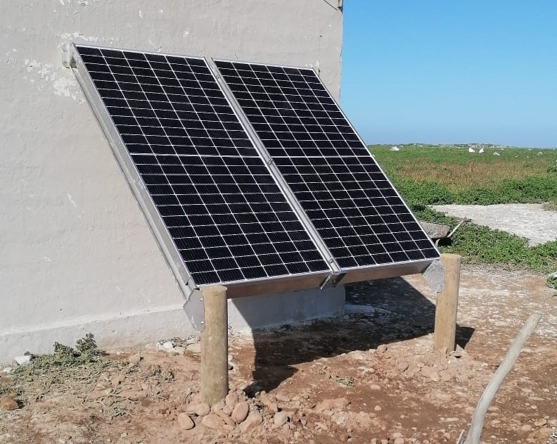
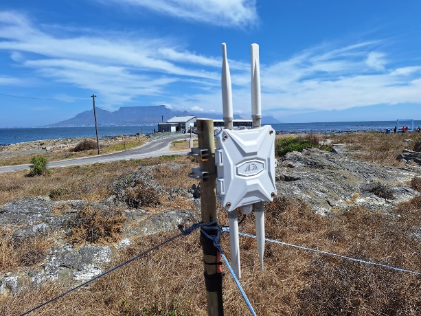
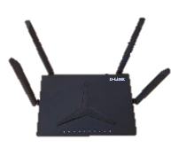
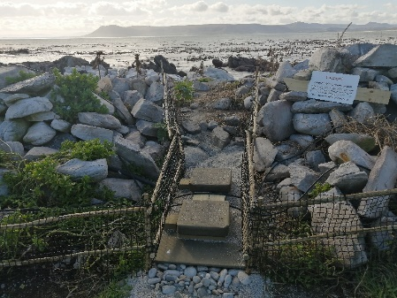
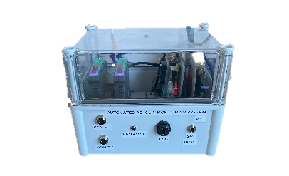
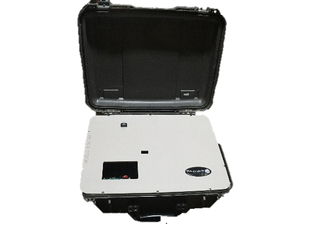
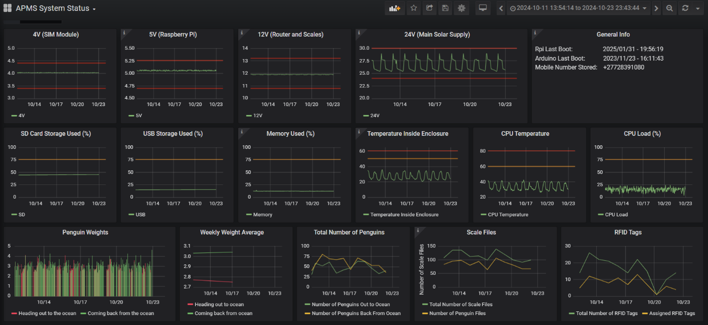

# Overview

To build the APMS, some basic tools are required. A full list can be found at:

               *s3://apmsbirdlife /APMS /Documents/BirdLife_toolkit.xlsx*

See the section AWS S3 CLOUD STORAGE for more information regarding accessing the cloud. Please add to the tool list as/when needed. In this manual, commands to be executed in the command line will either start with ***\$*** and be in bold and italics (for example: ***\$ sudo apt update***) or appear in a code block as below.

``` bash
sudo apt update
```

The APMS consists of the following key components:

-   24V Solar Power Supply

-   4G Router

-   Two scales, mounted on a platform.

-   APMS Main Unit

-   BioMark RFID Reader

The 24V Solar Power Supply provides power for the APMS Main Unit, scales, 4G Router and BioMark RFID Reader. This is site dependent.

{width="400" fig-align="left"}

The primary internet connection is provided via a 4G router. Depending on the cellular signal strength at the site, either an indoor or outdoor router is deployed. We prefer utilizing Teltonika [RUT906](https://www.teltonika-networks.com/products/routers/rut906) or [RUT956](https://www.teltonika-networks.com/products/routers/rut956) routers for two main reasons:

1.  Signal Optimization: They support external antenna cables, allowing the antenna to be mounted higher for improved cellular reception.

2.  Direct Scale Integration: They feature an RS-485 port, enabling a direct connection to the scale indicators. This allows for remote control and maintenance, including remote taring and scale calibration.

::: {layout-ncol="3"}





:::

Two scales are used to increase accuracy and to indicate whether a penguin is heading out to sea, or coming back from the ocean. These scales are mounted on a platform. 

{width="400" fig-align="left"}

All the electronics are housed inside an IP67 rated enclosure, referred to as the APMS Main Unit. The section “APMS Main Unit” describes how to build this box.

{width="400" fig-align="left"} 

The BioMark reader is an external device, used for picking up RFID pit tags. The APMS connects via a USB serial interface, internal to the reader. See the “BioMark” section for more information.


{width="400" fig-align="left"}

The data is downloaded daily, processed, and displayed on a Grafana Dashboard. This is handled by the APMS Server off-site. See \*\*\* for more information regarding the Dashboard.

{width="400" fig-align="left"} 

