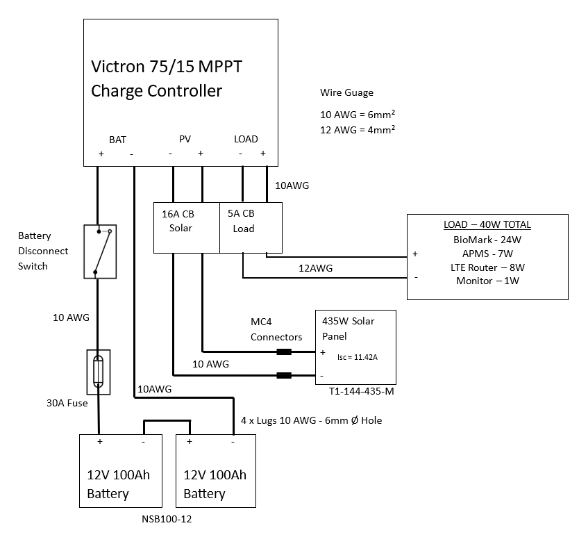
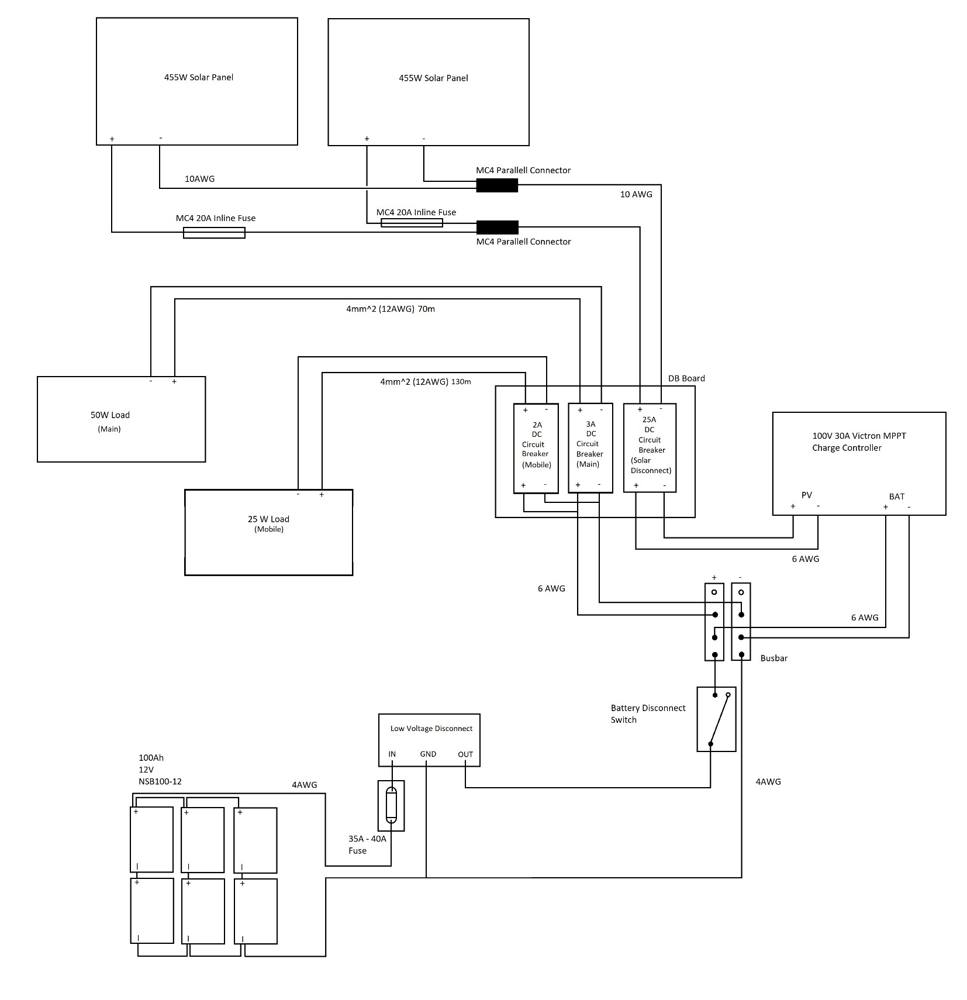

# Solar Power Supply

Each site is different and requires planning to ensure components are correctly sized. A basic system and the larger system at Bird Island are discussed below.

## Basic System

A basic solar system is shown below and can be used for a site that is running 1 BioMark RFID reader, an APMS Main Unit and a 4G Router. This is the setup for Dassen Island, Robben Island, Stony Point and Dyer Island. Face the solar panels North and tilt at an angle of approximately 45 degrees. An up-to date parts list can be found at s3://apmsbirdlife /APMS/Documents/solar_parts_list.xlsx

{width="6.9in" height="6.395833333333333in"} 

## Bird Island Solar System

The system on Bird Island is slightly larger as it is powering two BioMark readers and has provision for a future live feed camera. See Fig. 8 for a wiring diagram.

{width="7.511805555555555in" height="7.770833333333333in"}
