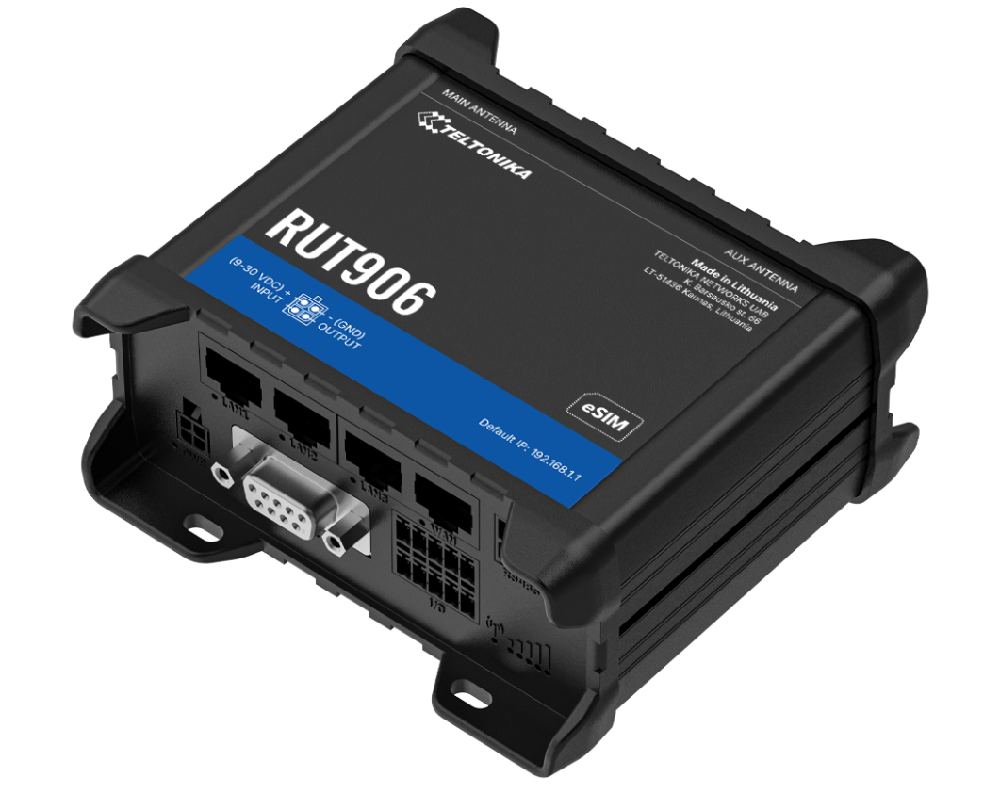

# Internet and WiFi

To monitor the site and upload data daily, a reliable internet
connection is needed. This is accomplished by using a 4G Router. Wi-Fi
has been used and has proven very reliable. If ever needed in future, a
LAN cable can be used instead.

Currently, Vodacom seems to be the strongest and most stable provider at
the different sites. The Vodacom app also makes it easy to load and keep
track of data and SMS bundles. Remember to copy down the IMEI number
from the SIM card before installing it into the router, as this number
is needed for the app.

When installing the APMS on site, take both a Vodacom and MTN SIM card,
and check which one has a better signal. Be sure to test the SIM cards
in a phone, and make sure they can access the internet.
<https://www.speedtest.net/> can be used to test internet connectivity.

Depending on the site, an indoor router or outdoor router can be used,
but we recommend using one of the Teltonika routers which has more
features for maintenance and management and allows dual SIM cards.

To prepare either router for use with the APMS:

-   Get a suitable SIM card, activate it, and load data.

-   Test the SIM in a phone to ensure it works.

-   Insert the SIM card into the 4G router and set up according to
    router manual.

    -   Use "apms" as the SSID and \<ENTER YOUR PASSWORD\> as the
        password

-   Connect to the router from a phone or PC and test the internet is
    working.

## Outdoor Router

For more remote sites, with weaker cell reception, such as Bird and
Robben Island, an outdoor router is used. The router is purchased from
<https://www.outdoorrouter.com/>. Previously used model is: UK CAT6
Outdoor 4G Router (EZR33L-U4).

When ordering, ask to have a 5m DC Cable included, as we do not use 48V
POE. The cable comes with a DC connector that plugs into the circuit
board. (It needs to be bent in a slightly awkward way to fit).

{width="600"
fig-align="left"}

The router runs directly on the 24V Solar Power supply. A circuit
breaker for the router should be installed and will also act as a power
switch, as there is no easy way to power cycle the router.

The contact person is Tammy 
([tammy\@outdoorrouter.com](mailto:tammy@outdoorrouter.com){.email})

Mount the router on a pole or to a wall, using the hardware supplied
with the router.

Note: Check the supplied hardware and ensure that the correct bracket is
on hand before leaving for the site. Make sure to take extra nuts, bolts
and screws and test fit them to the bracket. Use stainless steel for all
fasteners. If drilling in to hard concrete, take an impact drill with,
and have extra Fischer plugs on hand.

After installation, ensure the unit is closed properly and all 4
antennas are screwed on tightly.

## Indoor Router

If the cell signal is strong enough, a cheaper indoor router can be
used. The router currently used is the DLINK DWR-M920, purchased from
Takealot. It runs on 12V DC and has external antennas for the Wi-Fi, as
well as for the cell signal. Cut off the 12V power supply and replace it
with the 12V DC plug (RS: 138-9405). This connector will plug into the
APMS Main Unit (12V DC IN) when the router is to be used.

{width="600" fig-align="left"}

## Teltonika Router

### Description

The Teltonika RUT906 and RUT956 are industrial-grade 4G LTE routers
designed for robust connectivity in demanding remote environments.
Unlike standard commercial routers, they feature external cellular
antenna ports that allow users to connect a SMA cable, enabling a
antenna to be mounted much higher on a mast or structure to maximize
signal strength in poor coverage areas. These routers feature a built-in
RS-485 serial interface. This allows for a direct data connection to
digital scale indicators — such as the modern General Measure GMT-X1
weight transmitter — giving operators the ability to remotely calibrate,
tare, and configure weighing systems from anywhere in the world without
requiring a physical on-site visit.

**Additional Advantages of the RUT906/RUT956:**

-   **Dual-SIM Failover:** They support two SIM cards from different
    network providers, automatically switching carriers if the primary
    network drops to guarantee continuous cloud data transmission.

-   **Ruggedized Design:** Housed in a durable aluminum casing, they are
    built to withstand extreme temperatures, vibrations, and harsh
    environmental conditions typical of field deployments.

-   **Rich I/O and Protocol Support:** Beyond RS-485, they include
    digital/analog inputs and outputs and natively support industrial
    communication protocols like Modbus, MQTT, and NTRIP.

-   **Low Power Consumption:** Optimized for efficiency, making them
    ideal for integration into off-grid, solar-powered battery
    enclosures.

-   **Advanced Remote Management (RMS):** Teltonika’s Remote Management
    System allows for secure VPN access, batch firmware updates, and
    real-time diagnostics of the router and attached devices completely
    over-the-air.

{width="600" fig-align="left"}

### Installation

These routers can take a range of power supplies, from 9 – 30 VDC, and
have reverse polarity protection. Cut off the 12V power supply (plug)
and replace it with the 12V DC plug (RS Components: 138-9405). This
connector will plug into the APMS Main Unit (12V DC IN) when the router
is to be used.

The manuals for these devices can be found here:

-   [RUT906
    Manual](https://wiki.teltonika-networks.com/view/RUT906_Manual)

-   [RUT956
    Manual](https://wiki.teltonika-networks.com/view/RUT956_Manual)

**NB.** These routers are not weather protected and has to be kept
inside the APMS box or some other weather-sealed enclosure.
