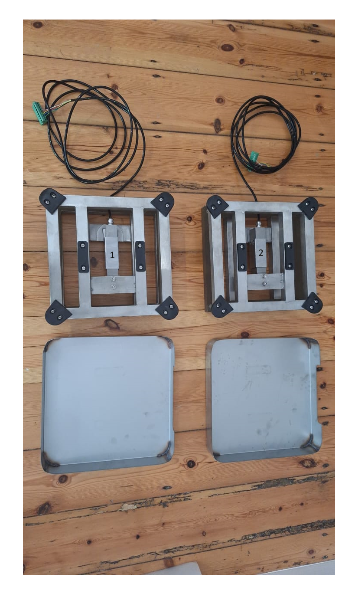
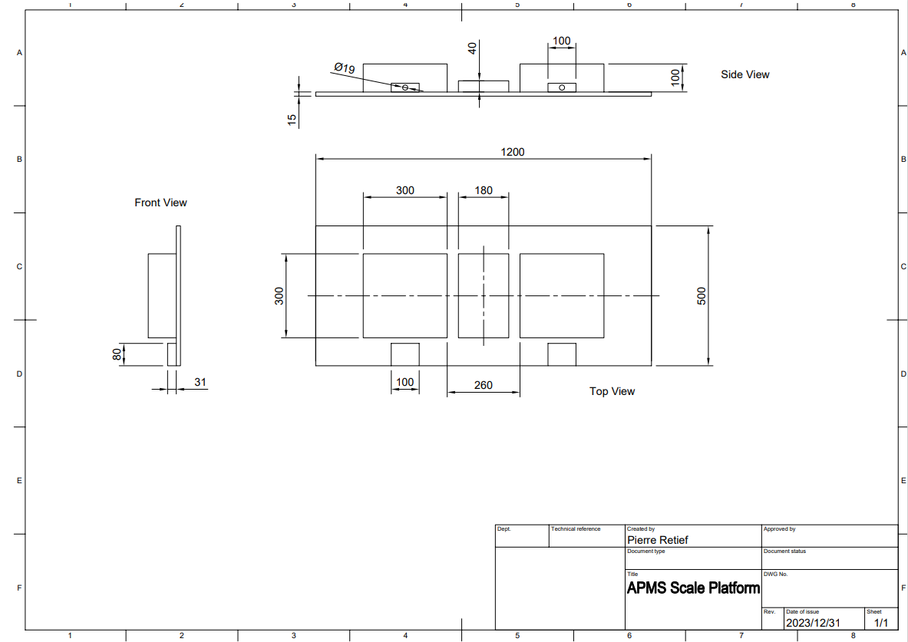
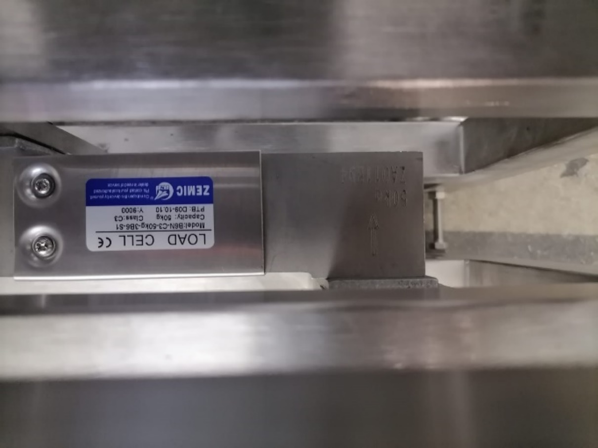
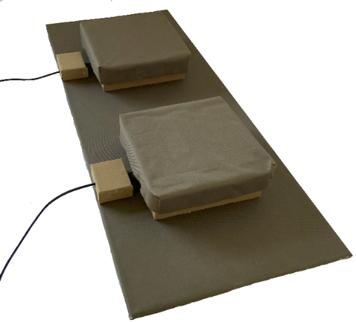
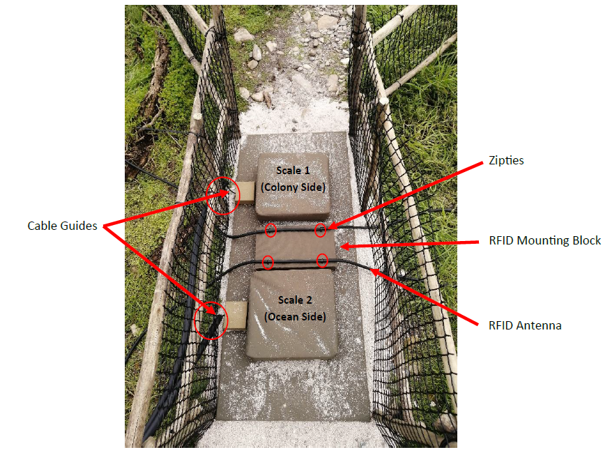
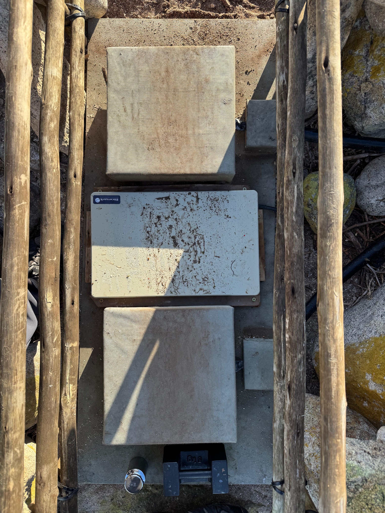
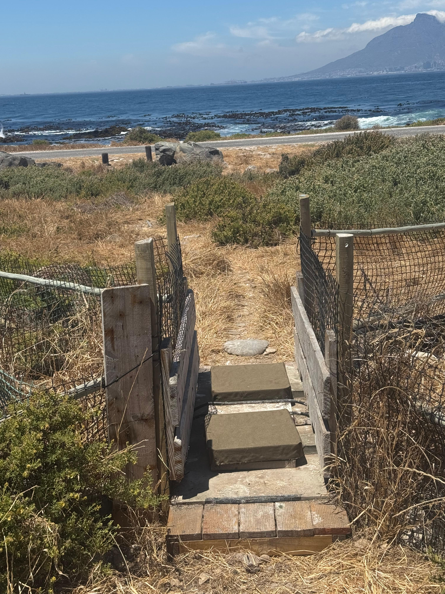

# Scales Platform

The Scales Platform consists of two scales, mounted on a wooden base, with a RFID Antenna running through the middle. There are two "cable guides" to guide the scale cables and keep it in place.

## Overview

The scales are manufactured by R&D WEIGHING (PTY) LTD [(accounts\@rdweighing.co.za)](mailto:accounts@rdweighing.co.za).

Depending on the distance between the scales and the Main Unit, extra scale cable might be needed and you will have to specify this in your order. The company can also solder the extended cable if needed. 5kg and 1kg calibrated weights are also purchased from R&D Weighing and are used for scale calibration. Please find a suitable enclosure for the weights and keep them indoors to prevent corrosion or damage. A parts list can be seen in TABLE 1 - SCALES PLATFORM PARTS LIST and the drawing can be seen in FIGURE 12 - DRAWING OF SCALES PLATFORM.

| Name | Quantity | Description | Where to buy / Part Number |
|:---|:---|:---|:---|
| Scale | 2 | Stainless Steel scale with B6N load cell | [R&D Weighing](https://www.rdweighing.co.za/) |
| Indicator | 2 | (General measure) GMT-X1 Or the Laumas TLB485 | [R&D Weighing](https://www.rdweighing.co.za/) |
| 1 kg weight | 1 | Used for calibration | [R&D Weighing](https://www.rdweighing.co.za/) |
| 5 kg weight | 1 | Used for calibration | [R&D Weighing](https://www.rdweighing.co.za/) |
| Scale Cable | as needed | Extra scale cable (optional) | [R&D Weighing](https://www.rdweighing.co.za/) |
| Base board | 1 | Base of platform. Marine Ply 1200x500x15mm | [TimBuild Woodstock](https://timbuildwoodstock.co.za/plywoods/) |
| Cable guide | 2 | To guide scale cable, wood | Hardware store -- Builders Warehouse |
| RFID block | 1 | RFID mounting block to hold antenna, wood | Hardware store -- Builders Warehouse |
| 6 pin plug | 2 | Plug to connect scale to Main Unit | RS: 111-5758 |
| Canvas | ±4m | To cover everything. Olive/Dark Green | [Ludal Interior](https://www.ludalinterior.co.za/) |

: Scales platform parts list {#tbl-scales-parts}

## Scales

The scales consist of a stainless-steel frame with a type B6N loadcell mounted underneath. A pan rests on top of the frame to provide a flat surface for the penguins to walk over. Note that the scales at Stony Point and Bird Island have older frames that are 90 degrees with respect to the new scales. If the scales need to be replaced in future, new holes can be drilled in the platform. Usually, however, only the load cell needs to be replaced and thus the existing frame can be re-used.

{width="400" fig-align="center"}

The initial systems (Stony Point and Bird Island) used 50kg load cells. For the two newer systems (Dyer Island and Robben Island), a more sensitive 30kg load cell is used. However, it's recommended to use a load cell with a higher load such as the 100kg load cell so that if a person accidentally steps on it in the field it won't break (unless that person is 150% of the load cell's weight rating, i.e., 150kg). The difference in sensitivity between 30, 50 and 100kg load cells are not significant.

{width="700" fig-align="center"}

{width="400" fig-align="center"}

Note: The maximum safe loading weight of the load cell is 150%. Thus, for a 50kg load cell, the max load is 75kg, for the 30kg load cell, the max load is 45kg, and for a 100kg load cell, the max load is 150kg.

## Building the Platform

Start by gathering all the required parts for the platform.

{width="400" fig-align="center"}

Take note of the following while building the platform:

-   Label the scales and indicators immediately upon removing them from their packaging, as the scales and indicators are tied to each other.

-   Cover the wooden base and scales with canvas. The canvas can be glued to the wood and scales using Contact adhesive. Silicon has also been used. The cable guides and RFID block can be screwed down from underneath.

-   The scales are mounted using the threaded holes where the feet used to screw in.

-   Mount the scales to the base using 4 [\*\*\*]{.mark}mm bolts per scale.

-   Scale 1 is positioned on the colony side, and Scale 2 is positioned on the ocean side. To remember this layout, consider a chick’s natural life cycle: a penguin is hatched on land (colony side) and will walk over Scale 1 first when heading out to sea for its very first foraging trip.

-   The distance between the [pans]{.underline} of the scales is set to 26 cm.

-   It is important to ensure the frame of the scale is flush with the base.

-   Cover the cable guides with canvas and secure to the base. Feed the scale cables through the cable guide. See FIGURE 15 - SCALES PLATFORM WITHOUT RFID BLOCK

-   Cover the RFID Mounting Block with canvas and secure it between the scales. Drill holes to allow zip ties to be used to clamp the RFID antenna to the block.

-   Solder a 6-pin socket (RS Components part number: 111-5764) to the end of each scale cable. This will plug into the 6-pin connector on the APMS Main Unit.

-   After the Scale Indicators have been installed and configured, test and calibrate the platform on a solid, level floor. This will confirm the scales are 100% functional before taking it to the field. See INSTALLING THE SCALE INDICATORS and ROUTINE CALIBRATION OF SCALES for more information.

{width="600" fig-align="center"}

{width="600" fig-align="center"}

In 2025, we raised the platform at Robben Island and Stony Point to minimize the build up of debri being kicked in by penguins crossing the scale. The APMS built at Dassen also has the raised platform design and has worked will to keep the scales clean for longer. The platform was raised by approximately 10 cm to create a small step onto which the penguins have to jump, before jumping onto the scales (Fig. 18)

{width="600" fig-align="center"}