# APMS Monitor

A separate circuit, called the APMS Arduino Monitor, or just "Monitor" for short, is used to constantly check different system parameters, and gives the administrator the ability to diagnose system faults remotely.

All the components needed to build the Monitor are listed in Table 2 - APMS Monitor Parts List. A website or RS part number is given, accurate at time of writing this manual.

The circuit diagram can be seen in FIGURE 17 - APMS ARDUINO MONITOR CIRCUIT DIAGRAM

  -------------------------------------------------------------------------------------------------
  **Name**              **Designation**   **Quantity   **RS Part  **Notes**
                                          per board**  Number**   
  --------------------- ----------------- ------------ ---------- ---------------------------------
  Strip board                             1            206-5879   RS Components
  100 x 160 mm                                                             

  Fuse holder           FH1               1            765-2973   Min Order Quantity: 5

  3A fuse               F1                1            668-5963   Min Order Quantity: 10

  Monitor Mounting                        1                       3D Printed. Design files on AWS S3
  Plate                                                           

  PCB Screw Terminal    J1, J2            2            193-0564   Min Order Quantity: 5

  SIM800L-V2 5V         U2                1                       https://www.robotics.org.za/SIM800L-V2

  1uF Capacitor         C1                1            538-1578   Min Order Quantity: 5

  33pF Capacitor        C2                1            194-0457   Min Order Quantity: 10

  10pF Capacitor        C3                1            194-0443   Min Order Quantity: 10

  1000uF Capacitor      C4                1            711-1150   Min Order Quantity: 10

  5.1V Zener            D1                1            544-3597   Min Order Quantity: 20

  10uF 50V Capacitor    C5                1            811-8373   Min Order Quantity: 5

  K7805 Voltage         U3                1            757-7239   RS Components
  Regulator 500mA                                      144-6290            

  22uF Capacitor        C6                1            190-2953   Min Order Quantity: 10

  Arduino Nano Every    U4                1            192-7586   RS Components

  Push Button           SW1               1            135-9445   Min Order Quantity: 20

  10k Trimpot           RV1               1            769-2202   RS Components

  Temperature Sensor    U5                1            811-5595   Min Order Quantity: 10

  NPN Transistor        Q1, Q2            2            739-0385   Min Order Quantity: 10
  KSP2222ABU                                                      

  Resistor 22k          R9                1            135-954    Min Order Quantity: 10

  Resistor 10k          R4, R10           2                       https://www.prototypediy.co.za/

  Resistor 4k7          R8                1                       https://www.prototypediy.co.za/

  Resistor 27k          R3, R6            2                       https://www.prototypediy.co.za/

  Resistor 5k6          R5, R7            2                       https://www.prototypediy.co.za/

  Resistor 6k8          R2                1                       https://www.prototypediy.co.za/

  Resistor 1k2          R1, R11           2                       https://www.prototypediy.co.za/

  LM2596 DC-DC          U1                1                       www.netram.co.za
  Converter                                                       

  Logic Level Converter U6                1                       https://www.netram.co.za

  40 Pin Header Socket  J3                1            674-1252   RS Components
  for Pi                                                          

  36 Pin Male Headers                     5            547-3166   RS Components

  30 Pin Female Header                    2            767-9842   RS Components

  Schottky Diode        D2                1            168-7175   comes in pack of 10

  40 Pin Ribbon Cable                     1                       www.pishop.co.za

  Buzzer                BZ1               1            771-6957   comes in pack of 5

  M2.5 x 8mm machine                      4            914-1567   RS Components
  screws                                                          
  -------------------------------------------------------------------------------------------------

  : **Table 2** - APMS Monitor Parts List

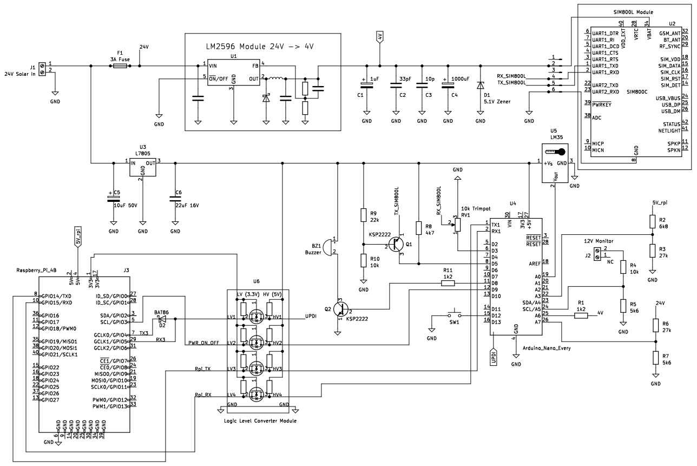{width="700" fig-align="center"}

### Overview

The Monitor uses a separate SIM card and can thus be used to fault find the system even when the main internet is down. The Arduino can be programmed through the Raspberry Pi once configured. Currently, the main features are:

-   Monitors the 4V internal power supply, used to power the SIM card module (only version 1 of the monitor board, version 2 uses a 5V SIM module and hence no longer needed to convert to and monitor 4V).

-   Monitors the 5V power supply, used to power the Raspberry Pi.

-   Monitors the 12V power supply, used for the scales and router (i.e., the indoor or teltonika router).

-   Monitors the 24V solar power supply.

-   Monitors the ambient temperature inside the APMS Main Unit.

-   Alerts the administrator when the Monitor or Raspberry Pi boots up via SMS.

-   Shut down and power up the Raspberry Pi via SMS.

-   Send an APMS status report on request via SMS.

-   Exchanges status reports with the Raspberry Pi every hour.

As the Monitor circuit is still a prototype, with relatively few components, the board is built on a piece of stripboard directly from the circuit diagram. Five boards have been built thus far, one for Stony Point, Bird Island, Dyer Island, Robben Island and Dassen Island. A PCB is being designed for future APMS installations.

As most components are quite standard, it should not be hard to source parts or find suitable replacements.

The circuit board is mounted on a custom designed, 3D printed Monitor Mounting Plate. The mount has been designed to fit the existing DIN rail, for easy insertion/extraction. The mounting plate is printed with ABS plastic to prevent warping in the summer heat. The design file for 3D printing can be downloaded here: [Download](files/Monitor_V_0_5.3mf){download="Monitor_V_0_5.3mf"}

### Programming via the Arduino Software

The heart of the circuit is the Arduino Nano Every microcontroller. This is the successor to the popular Arduino Nano and provides slightly better capabilities for a lower price. The Arduino can be programmed in numerous ways. Two ways are discussed in this manual. The first will be using an unaltered Arduino and the standard Arduino Software, while the second method involves using the Raspberry Pi, together with some hardware modifications to the Arduino.

-   Before building the circuit, it is a good idea to test the Arduino. As the Arduino is straight out of the box, the standard Arduino software will be used for the initial setup.

    -   Install the Arduino IDE Software (https://www.arduino.cc/en/software)

    -   Install the Arduino megaAVR Core:

        -   From the Tools menu, select "Boards"

        -   Select "Boards Manager"

        -   Search for and install "megaAVR"

    -   Download the test sketch from here: [Download](files/monitor_test_sketch.ino){download="monitor_test_sketch.ino"} 
    
    -   Use a Micro USB cable to connect to the Arduino and select the appropriate com port

    -   Click "Upload"

    -   If the upload was successful, the LED will light up and the buzzer will sound when the button is pressed.
    
    - If the upload fails try a different com port, or charge the registers emulation:
        - Tools > Register Emulation > None (ATMEGA4809)
    
**NOTE: If the Arduino has already been modified for UPDI, programming via the USB port will not be possible. First remove the soldered link and disconnect the UPDI wire. See UPDI PROGRAMMING for more details**

### Preparing the Stripboard

The 100x160 mm stripboard needs to be reduced to fit inside the Main Unit.

-   Mark the four corners for drilling with a permanent marker. The locations of the holes are important as they correspond to the holes in the mounting plate. See FIGURE 19 -- PREPARING THE STRIPBOARD

-   The board does not have to be broken at the line, as seen in the picture, and a larger PCB can be obtained by breaking off a smaller piece. Just ensure the spacing between the holes are correct, as in the picture.

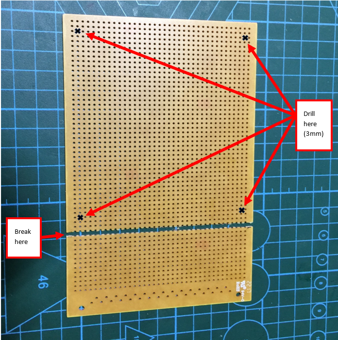{width="400" fig-align="center"}

-   Use the 3mm drill bit to drill the four corner holes in the circuit board.

    -   Do a test fit as shown in fig. 20. Use the four 2.5mm machine screws to secure the blank circuit board to the mounting plate. **Note, do not exert too much force as the screws are going into plastic.**

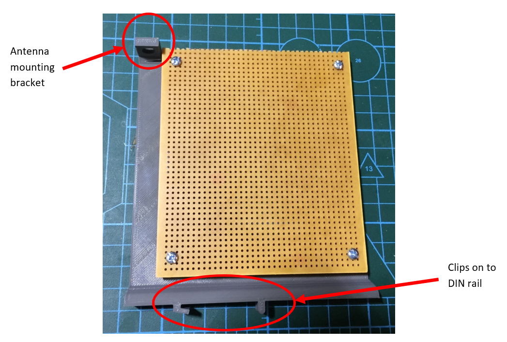{width="400" fig-align="center"}

-   The SIM800L antenna can be installed on the mounting bracket provided.

-   If the signal at the site is particularly weak, an antenna with higher gain can be used. For example:
    - An omnidirectional antenna (RS Part Number: 202-4179).
    - A blade antenna with a SMA extension cable.

-   Remove the blank circuit board from the mounting plate and start building the circuit according to the circuit diagram.

### 4V and 5V Power Supplies

-   Start with the main 24V DC connector and fuse holder.

-   **Skip this step if you are building version 2 of the monitor board. In version 2 of the APMS monitor, we no longer need the LM2596 converter as a different SIM module is used which runs on 5V.** If you are building version 1 of the monitor board, then also add the LM2596 DC-DC converter and then insert a 3A fuse into the fuse holder. Next provide 24V to the main DC connector and adjust the output voltage of the LM2596 DC-DC converter to 4.0 V. 

-   Install the K7805 voltage regulator, capacitors C5 and C6 and check for 5V on the output.

-   Break one of the 30 pin female header strips in half, to obtain two 15 pin strips. Use these two strips as a socket for the Arduino Nano (see fig. 21).

-   Test for 5V between the GND and VCC pins on the Arduino header. Do not install the Arduino yet.

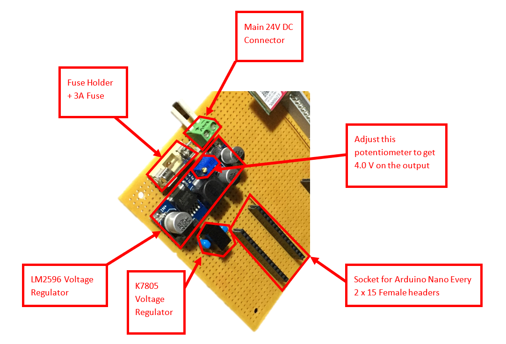{width="600" fig-align="center"}

### SIM800L Power Supply

-   The version 1 Monitor uses a SIM800L module (hereafter referred to SIM800L) and version 2 uses a SIM800L-V2 5V module (hereafter referred to as SIM800L-V2) to send/receive SMS messages. 

-   Four pins are used: VCC, GND, RXD and TXD. VCC requires a supply voltage of 3.4V -- 4.4V for the SIM800L and 5V for SIM800L-V2. The version 1 monitor uses the LM2596 regulator to provide a stable 4.0V, whereas in version 2 of the monitor board the power is converted to 5V by the K7805 voltage regulator.

-   The first three monitors (Stony Point, Bird Island and Dyer Island) all use a smaller green PCB (SIM800L). As this module has been difficult to procure, a larger module with a red PCB was used at Robben Island (SIM800L). As we only use 4 pins, the extra features of the red board are not used. At Dassen Island we used the newer SIM800L-V2 module.

-   Unfortunately, the modules are not directly interchangeable as the RX and TX pins are reversed (see pictures below).

::: {layout-ncol=3 fig-align="center"}
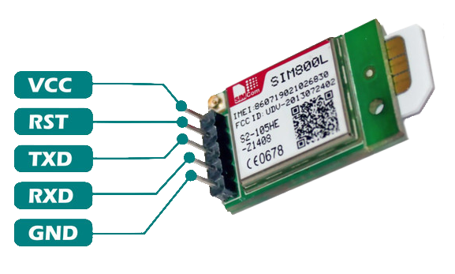{height="200"}

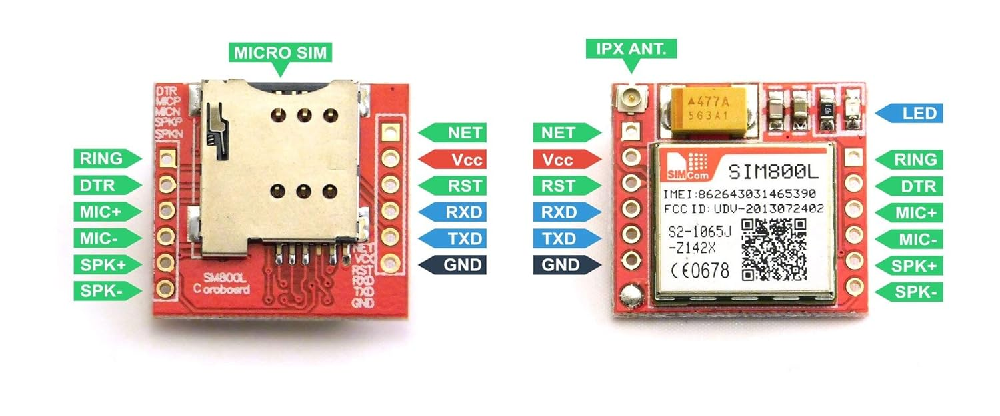{height="200" width="480"}

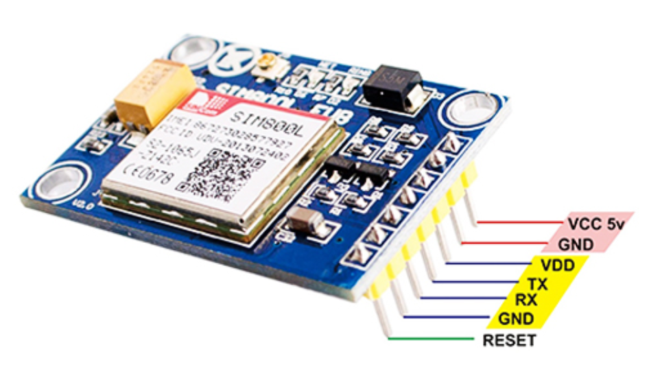{height="200"}
:::

An adapter board can be made, or the Monitor PCB modified, if a green module at the first three sites ever needs to be replaced with a red one.

Install the SIM800L Module header in the top left section of the board, as the module needs to be located close to the antenna slot on the mounting bracket (see fig. 23).

Use female header pins to create a socket for the module. This enables the module to be easily removed for testing or to be replaced if faulty.

-   Install capacitors C1 -- C4 and Zener diode D1.

-   With the SIM800L/SIM800L-v2 **NOT** inserted, confirm on the header that there is 4.0 V between VCC and GND, or 5.0 V if using the SIM800L-v2.

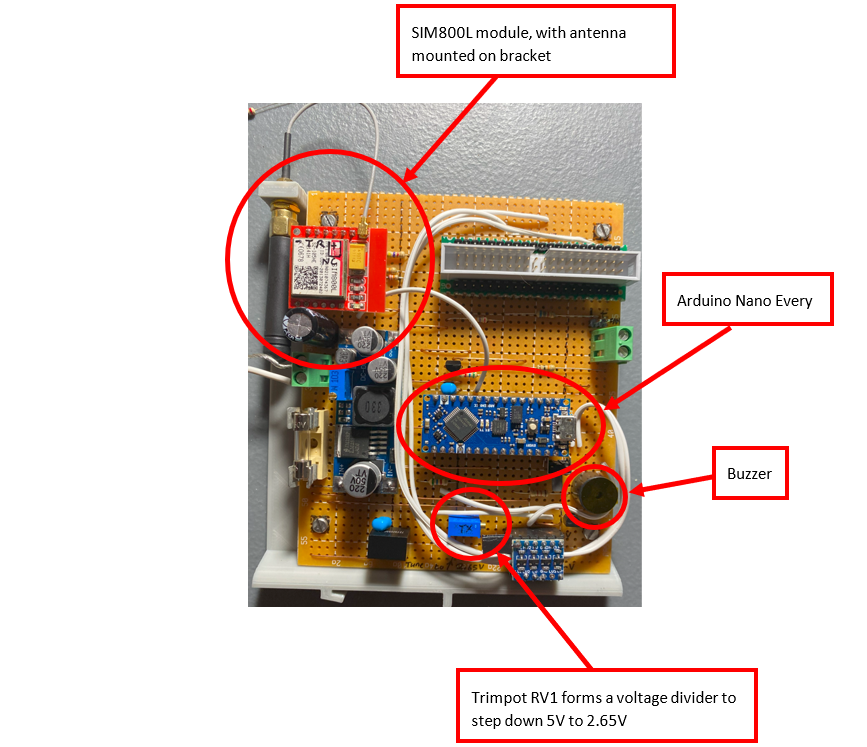{width="400" fig-align="center"}

### Communication Between SIM800L and Arduino 

-   [SIM800L RX and Arduino TX]{.underline}

Since the TX of the Arduino is between 0V and 5V, a simple voltage divider is used to step the voltage down to a level suitable for the SIM800L. Install Trimpot RV1 as per the schematic.

With the SIM800L module and Arduino [not]{.underline} inserted, apply 5V to the voltage divider (pin D3 -- See FIGURE 24 - ARDUINO NANO PINOUT). With 5V applied to D3, a voltage divider is created by trimpot RV1. Adjust the trimpot until the voltage on the centre pin, is 2.65 V. This pin will be connected to the receive line of the SIM800L.

-   [SIM800L TX and Arduino RX]{.underline}

The voltage level of the SIM800L needs to be stepped up for use with the Arduino. To achieve this, a circuit consisting of three resistors (R8, R9 and R10) and one NPN transistor (Q1) is used, as recommended by the SIM800L manual. Install the above-mentioned resistors and transistors and ensure the input of the circuit is connected to the transmit line of the SIM800L.

### Communication Between SIM800L-V2 and Arduino 

-   [SIM800L-V2 RX and Arduino TX]{.underline}

To be completed.

-   [SIM800L-V2 TX and Arduino RX]{.underline}

To be completed.

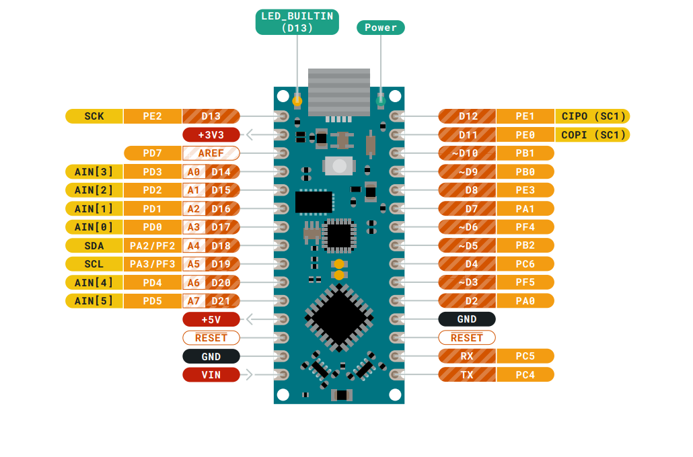{width="600" fig-align="center"}

### Raspberry Pi Connection

The connector used to connect the Monitor to the Raspberry Pi can be seen in fig. 25. To use the connector with stripboard, the pins must either be bent outwards, or a "breakout" board made from a piece of scrap protoboard (fig. 26). Both methods have been used and are effective. A pre-made break-out board can be purchased if available. If a PCB is designed in future, it will be possible to solder the connector directly on the board.

::: {layout-ncol=2 fig-align="center"}
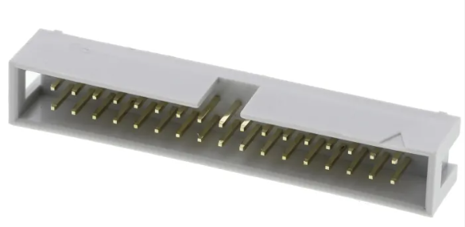{width="400" fig-align="center"}

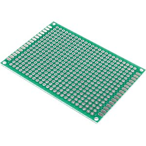{width="400" fig-align="center"}
:::

The Raspberry Pi 40-pin Connector pinout can be seen in fig. 27.

A simple voltage check of 3.3V on pin 1 and 5V pin 2 should confirm orientation if unsure.

The Raspberry Pi GPIO pins and their functions can be seen in TABLE 3 - RASPBERRY PI GPIO PINS AND FUNCTIONS

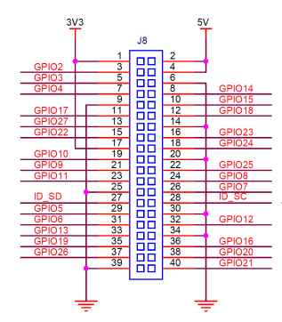{width="400" fig-align="center"}

  -----------------------------------------------------------------------
  Pin                    Function
  ---------------------- ------------------------------------------------
  GPIO3                  Power ON/OFF

  GPIO4                  Raspberry Pi UART3 TX

  GPIO5                  Raspberry Pi UART3 RX

  GPIO14                 Raspberry Pi TX

  GPIO15                 Raspberry Pi RX
  -----------------------------------------------------------------------

  : **Table 3** - Raspberry Pi GPIO pins and functions

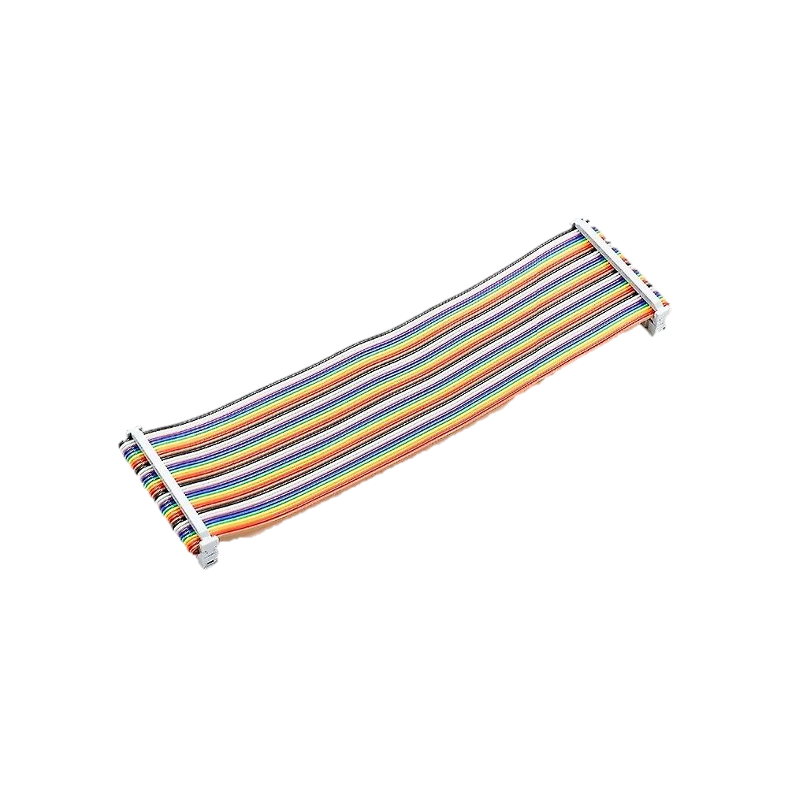{width="400" fig-align="center"}

A 40-pin ribbon cable is used to connect the Monitor to the Raspberry Pi (fig. 28). After building the Monitor, **check the voltages on the other end of the ribbon cable, to ensure it is not above 3.3V, before plugging it into the Pi**.

### Logic Level Shifter

-   Since the Pi uses 3.3 V for communication, and the Arduino 5 V, a logic level shifter is needed. These modules are available cheaply and two 6-pin female headers should be used as a socket for easy install/removal (fig. 29).

-   The level shifter uses the 3.3V on pin 1 of the Raspberry Pi connector for the LV connection and the 5V Arduino supply voltage for the HV connection.

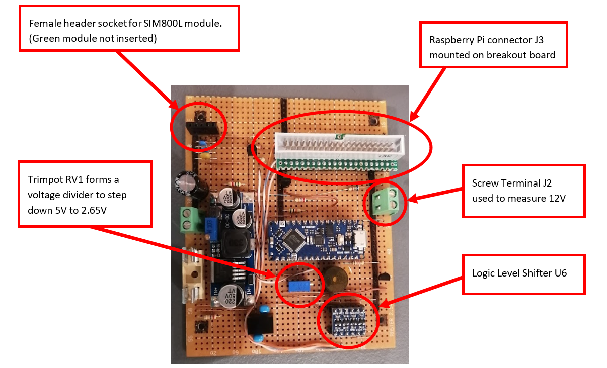{width="600" fig-align="center"}

### UPDI Programming

The Arduino Nano Every uses UPDI (Unified Program and Debug Interface) for programming. This uses only 1 wire for programming, but a more complex communication protocol is needed. To use UPDI a wire needs to be soldered to a pad located on the underside of the Arduino. A link must also be soldered (Fig. 30).

**NOTE: After the link has been made, the board can no longer be programmed via the Arduino software and USB cable. It will be programmed via the Raspberry Pi using the UPDI wire. If the Arduino software needs to be used during fault finding, unsolder the link. The pads can break off with successive heating sessions, so be cautious.**

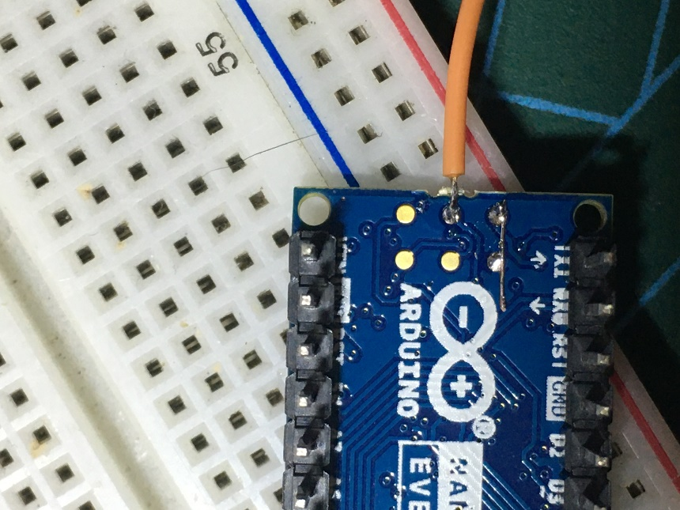{width="400" fig-align="center"}

-   To program the Arduino remotely via the Raspberry Pi, a utility called "pymcuprog" is used. This utility allows the Raspberry Pi to program the Arduino via a serial connection. This serial connection is established using UART3 (RX3 and TX3) on the Raspberry Pi as a serial port (see Table 3 for GPIO pinout).

-   To program the Arduino via a serial port, a hardware modification is required. The pymcuprog documentation
    (<https://pypi.org/project/pymcuprog/>) describes various combinations of diodes and resistors to achieve this, for various setups. After experimentation, using only a Schottky diode (D2) delivered the best results. Note the cathode of D2 is connected to TX3.

-   The UPDI wire is connected to HV1 on the level shifter (Fig. 18).

-   A script has been written to compile and upload the firmware to the Arduino, from the Raspberry Pi, thus the user does not need to use pymcuprog directly. See the section: PROGRAMMING THE ARDUINO MONITOR VIA THE PI.

### Voltage Monitoring

If any of the main supply voltages are outside allowable limits, an SMS will be sent to the operator.

Currently, the following important voltages are monitored:

-   4V: This is the SIM800L supply voltage. This voltage is generated by the LM2596 voltage regulator and is fed to analog input A6 of the Arduino, via resistor R1. 

> Note: In version 2 of the monitor board a different SIM module is used which no longer needs a 4V supply voltage. As a result this is no longer monitored.

-   5V: This is the 5V supply for the Raspberry Pi. The 5V is picked up from pin 2 or 4 on the Raspberry Pi connector (See Fig. 27 for the Raspberry Pi GPIO pinout).

> Note: As this voltage is close to, and might exceed, the Arduino maximum
> safe voltage, a voltage divider consisting of R2 and R3 is used to
> step the voltage down. The Arduino uses A3 to measure this voltage.
> Note that this 5V is separate and should be isolated from the Arduino
> 5V supply. This is in essence measuring the output of the 5V Meanwell
> Power Supply.

-   12V: This is the 12V supply for the scales and the router (if an indoor router is used). This voltage is fed via a wire from the Meanwell 12V Power Supply to screw terminal J2. Install the screw terminal in the top right section of the board to allow for easy connecting when installing the board (Fig. 29). Resistor R4 and R5 is used to step the 12V before connecting it to A5 of the Arduino

-   24V: This is the main solar supply voltage. This supplies power to the BioMark reader, the APMS Main Unit and the Outdoor Router (if one is installed). The voltage is measured at the input of the Monitor and is stepped down via resistor divider R6 and R7 before being connected to A7 of the Arduino.

### Temperature Monitoring

The ambient temperature inside the Main Unit is monitored using a LM35 temperature sensor (U5). The sensor operates on 5V and needs no other components to operate. The output of the sensor is read directly by analog pin A0 on the Arduino. 

### Buzzer and Button

A buzzer and button are included for debugging and future options. Currently the Monitor will beep once initialisation is complete, and the button will power the Raspberry Pi down/up.

-   The buzzer is switched via transistor Q2 with base current being limited by resistor R11.

-   The button is connected directly to pin D12 on the Arduino and makes use of the built-in pull-up resistor, thus requiring no other components. Place the button on the board in a location where it will be easy to press once the board is installed.

### Testing the Monitor Circuit Board

Before testing communication between the Raspberry Pi and the Arduino Monitor, some basic tests must be done to ensure no components will be damaged. A dual variable power supply will be needed to test the various voltages.

Ensure the firmware was uploaded successfully as explained in the section PROGRAMMING VIA THE ARDUINO SOFTWARE

Plug the SIM800L into its socket and connect the antenna.

-   Plug the Arduino into its socket.

-   Plug the Level Shifter into its socket.

-   Plug the 40-pin ribbon cable into the socket on the Monitor but do not plug the other end into the Pi.

-   Power the Monitor via the main 24V DC connector.

-   Observe lights flashing on the SIM800L.

    -   The green light on the SIM800L should flash rapidly at first, and after about 20 seconds, it should start flashing slowly. This indicates that the module was able to connect to the cell network successfully. Try different antennas and orientations for best results.

-   Check that there is 5.0V on the Arduino and Level Shifter supply pins.

-   Check that there is 4.0V on the SIM800L supply pin.

    -   Check that the same 4.0V is measured on pin A6 of the Arduino.

-   Check that none of the pins on the Raspberry Pi connector has 5V on it.

    -   Note pin 2 and 4 will have 5V coming from the Pi when it is connected at a later stage.

-   Supply 12V to connector J2 and ensure the voltage has dropped to below 5V on pin A5 of the Arduino.

-   Measure the stepped-down solar supply voltage on pin A7 of the Arduino. The 24V should have been stepped down to a value less than 5V.

-   Measure the output voltage of the temperature sensor on pin A0 of the Arduino. The sensor outputs 10mV per °C, so at 25°C, the voltage should be about 0.25V.