# APMS Main Unit

The APMS Main Unit consists of all the electronics needed for the
system.

For a complete parts list, see Table 4.

For a system diagram, see Fig. 31.

  -------------------------------------------------------------------------------
  **Name**             **Quantity**   **Description**                **RS Part
                                                                     Number**
  -------------------- -------------- ------------------------------ ------------
  Enclosure            1              Housing for the APMS system    508-2798

  DIN Rail             1              DIN rail for mounting          188-2538
                                      electronics                    

  DC 30V 5A Socket     1              DC panel socket for main 24V   705-1525
                                      solar input voltage            

  DC 30V 5A Plug       1              For cable coming from 24V      705-1519
                                      Solar Supply                   

  USB panel mount      1              To connect to BioMark Reader   111-6761
  socket                                                             

  DC panel socket (12V 1              12V output for LTE Router      111-3725
  1A)                                                                

  DC 12V 1A Plug       1              Plug for Indoor Router         138-9405

  6-pin socket         2              Sockets for scales             111-5764

  6-pin Plug           2              Plugs for scales               111-5758

  USB Cable            1              Mini USB cable to connect to   822-3226
                                      BioMark Reader                 

  12V 30W PSU          1              12V Power Supply for Router    175-7778
                                      and scales                     

  5V 15W PSU           1              5V Power Supply for Raspberry  175-7775
                                      Pi                             

  Fuse Holder          1              Fuse holder                    501-871

  3A Fuse              1              Main Fuse                      668-5963

  USB-RS485 Converter  2              USB to RS485 converter         687-7834

  64GB SD Card         1              Main storage for APMS          Takealot
                                      operating system.              

  64GB USB Flash drive 1              USB Flash drive for data       Takealot
                                      backup                         

  Raspberry Pi 4       1              Main computer for APMS system  182-2096

  Heatsinks            3              For cooling Raspberry Pi       201-2169
                                      processors                     

  Fan                  1              For cooling Raspberry Pi       789-7858
                                      processors                     

  2-pin Female Header  1              Same as used for APMS Monitor  767-9842
  for Fan                                                            

  USB-C cable for      1              Cabe for powering Raspberry Pi 192-4730
  power                                                              

  Mount for Raspberry  1              3D Printed DIN Rail Mount for  Printed
  Pi                                  Raspberry Pi                   in-house

  Mount for Arduino    1              3D Printed DIN Rail Mount for  Printed
  Monitor                             APMS Monitor                   in-house

  3D Printed Fan Mount 1              To mount the cooling fan above Printed
                                      the CPU                        in-house

  Monitor Board        1              Used to monitor health of main Built
                                      system                         in-house

  SIM card             2              Sim card for main system and   Vodacom shop
                                      monitor board                  

  Internal wiring                     Used for various connections   Hardware
                                      inside box                     store

  Ferrules                            For better contact with screw  Takealot
                                      terminals                      

  Heat-shrink                         Insulate connections           Takealot

  M2.5x8 machine       4              Screws to secure the Raspberry 914-1567
  screws                              Pi                             

  M3x16 machine screws 4              Screws to secure the fan       190-462
  -------------------------------------------------------------------------------

  : Table 4 - APMS Main Unit Parts List
  

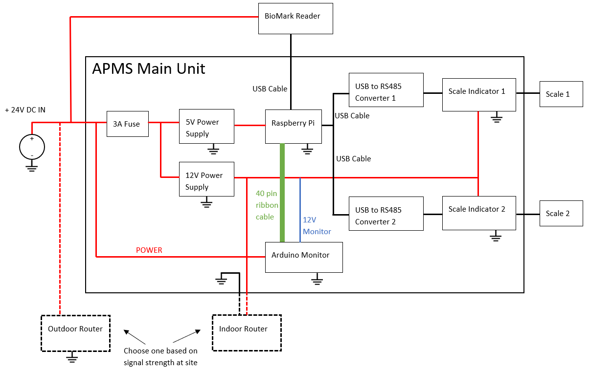{width="600" fig-align="center"}

## Preparing the USB Panel Mount Socket

The USB Panel Mount Socket does not have adequate strain relief. Use Pratley Putty to reinforce the cables. Take note to avoid getting the putty on the threads (Fig. 32).

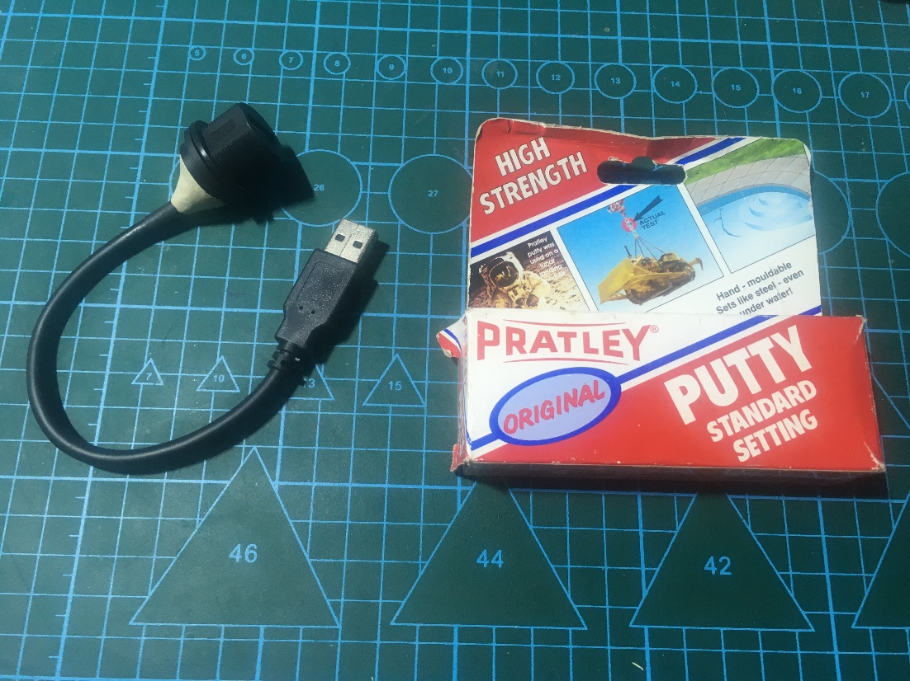{width="600" fig-align="center"}

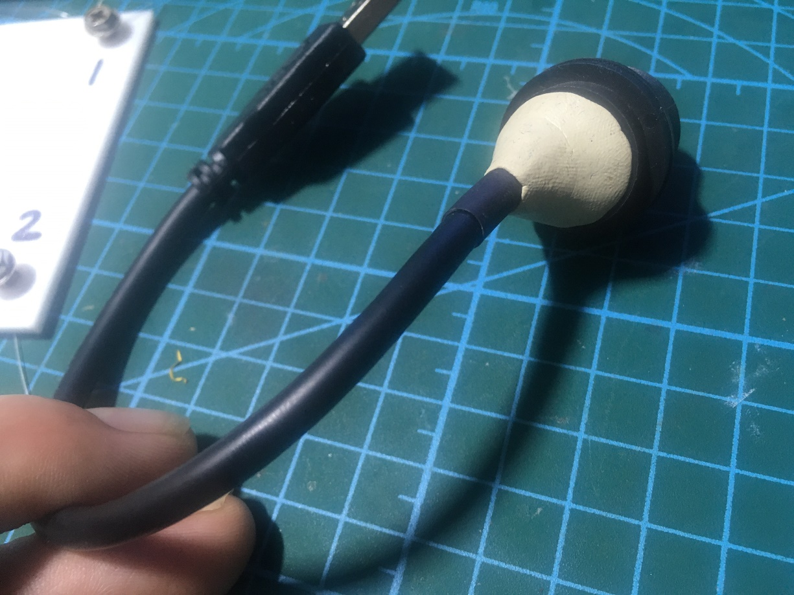{width="400" fig-align="center"}

## Preparing the Main Unit Enclosure

Prepare the enclosure before starting the build. RS Part numbers included in brackets.

-   Open the enclosure (508-2798) and screw down the DIN rail (188-2538) using the screws provided. Note, it takes a fair bit of force.

-   Download and print the template here: [Download APMS template](images/media/apms_template_v1.2.pdf). Check the dimensions with a ruler after printing.

-   Glue/stick the template on to the front of the enclosure and drill the holes as indicated on the template.

    -   The 11mm and 21mm diameter holes are an odd size. Either go one size smaller and enlarge, or use one size larger, with it being a slightly loose fit.

-   Do a test fit of all the sockets: 
    - Main DC socket (705-1525), 
    - USB Panel Mount Socket (111-6761),
    - 12V DC socket (111-3725), and
    - two scale sockets (111-5764)

-   The sockets can be removed to ease in the rest of the build.

-   Use a label maker, or a permanent marker, and label each socket (Fig. 33).

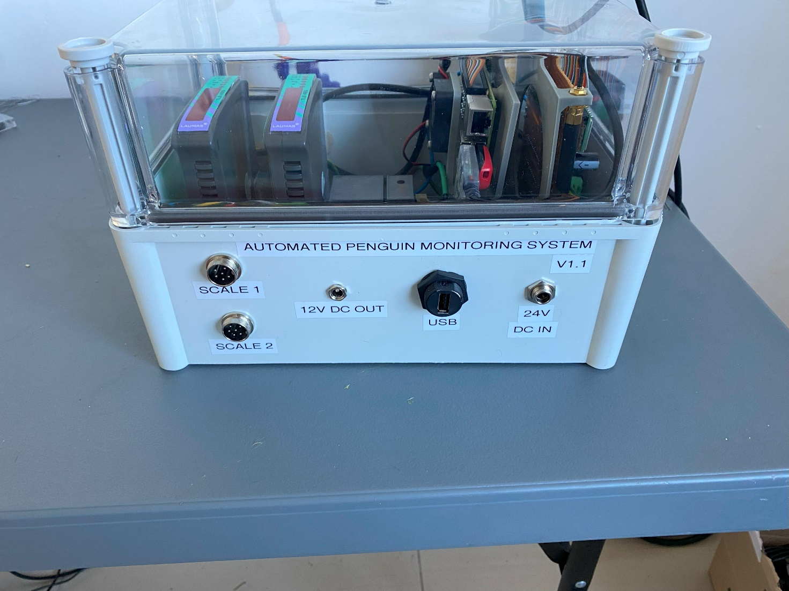{width="400" fig-align="center"}

:::{.callout-note}
There are now two versions of the APMS.

In **version 1.1** the following improvements were made:

 - More robust fan with newly designed fan bracket
 - Use of RS485 converters, instead of RS232
 - Scales are mounted on marine ply, instead of inside boxes

In **version 1.2** the following improvements were made:

 - New APMS Main Unit enclosure that is easier to open
 - New SIM800L-V2 module that has an integrated power supply unit and doesn't need the power to be converted to 4V anymore.
 - New Teltonika RUT906/RUT956 routers which allow remote calibration and taring of scales and extendable SMA cable ports for better cellphone reception.
 - New scale indicators (General Measure GMT-X1) which allow RS485 connection and management capabilities.
 - Tailor-made, custom BioMark RFID antennas to fit perfectly between the two scales. This design makes the antenna much easier to tune and protects the cable from being accidentally kicked out of place (which previously caused a loss of resonance). Additionally, these commercial antennas offer a significantly stronger detection range than the legacy homemade versions.
:::

## Mounting The Raspberry Pi

Use four 2.5mm machine screws to mount the Raspberry Pi on the mounting plate (Figs. 34 and 35).

Add heatsinks (RS: 201-2169) (Fig. 35)

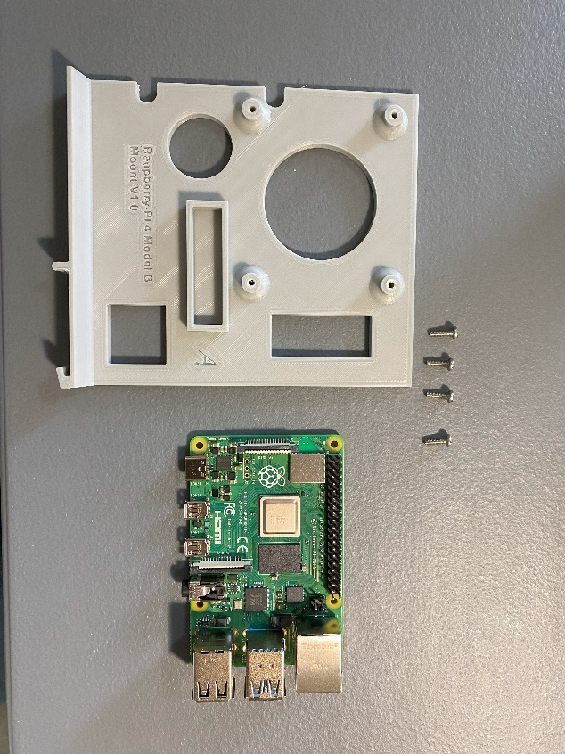{width="400" fig-align="center"}

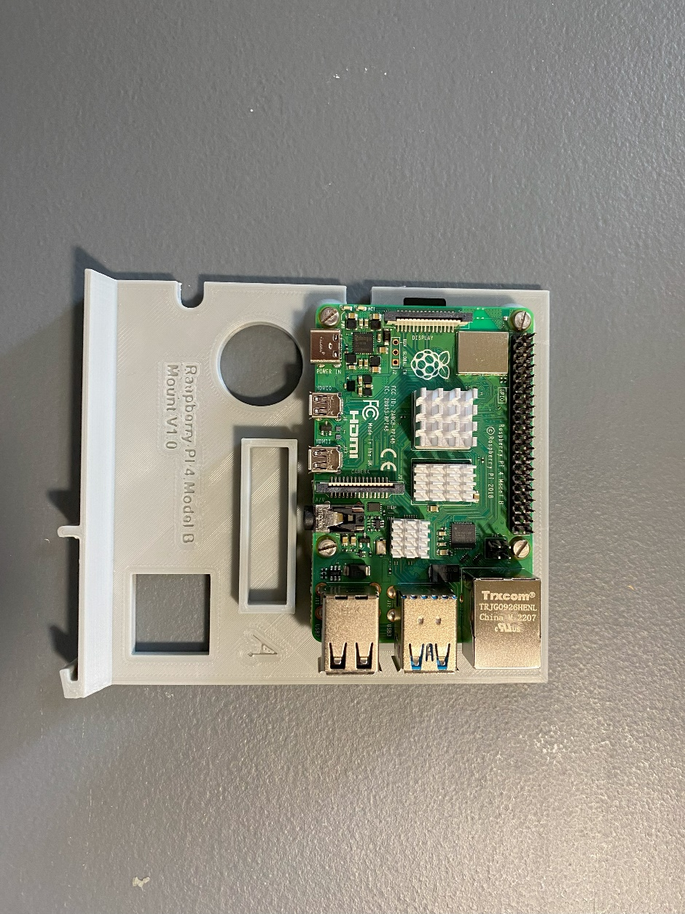{width="400" fig-align="center"}

## Preparing the Fan

Solder a 2-pin female header connector to the ends of fan cable. Use the four M3 screws and mount the fan to the fan bracket (Fig. 36). 

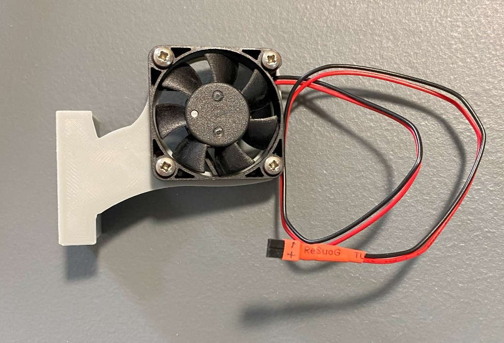{width="400" fig-align="center"}

The fan and bracket fits into the slot provided on the Raspberry Pi mounting plate. The fan bracket slides in with a friction fit to allow easy installation/removal. 

> NOTE: Even though 5V power is provided to the fan from the Monitor, the 5V is retrieved from the Raspberry Pi connector, and not from the 5V supply on the Monitor itself. This is done to prevent the fan stopping should the Monitor fail. The fan is connected to pin 4 and 6 on the Raspberry Pi. 

## Wiring the APMS Main Unit

-   The location of the DIN mounted components, as well as the power wires, can be seen in Fig. 38.

-   The main power wires consist of a ground wire, a 5V and a 12V wire.

-   The APMS uses a DIN mounted Fuse Holder (501-871) with a 3A Fuse (668-5963) to provide protection.

-   Two Meanwell Power Supplies are used to step the 24V DC down to the required voltages:

    -   5V 15W Power Supply (175-7775) for the Raspberry Pi

    -   12V 30W Power Supply (175-7778) for the scales (and indoor
        router if used).

> NOTE the polarity of the two Meanwell power supplies, as they are opposite to each other.

-   Install the 24V DC and 12V DC connectors.

-   Mount the Arduino Monitor, Raspberry Pi, Fuse Holder, 5V Power Supply, 12V Power Supply and the two Scale Indicators on the DIN Rail.

    -   If the Arduino Monitor has not been built yet, use the 3D printed mounting plate is this step.

-   Run a ground wire from the Main 24V DC Connector to the following components:

    -   Arduino Monitor

    -   Input and Output of 5V Power Supply

    -   Input and Output of 12V Power Supply

    -   Raspberry Pi

    -   Two Scale Indicators

    -   12V DC connector

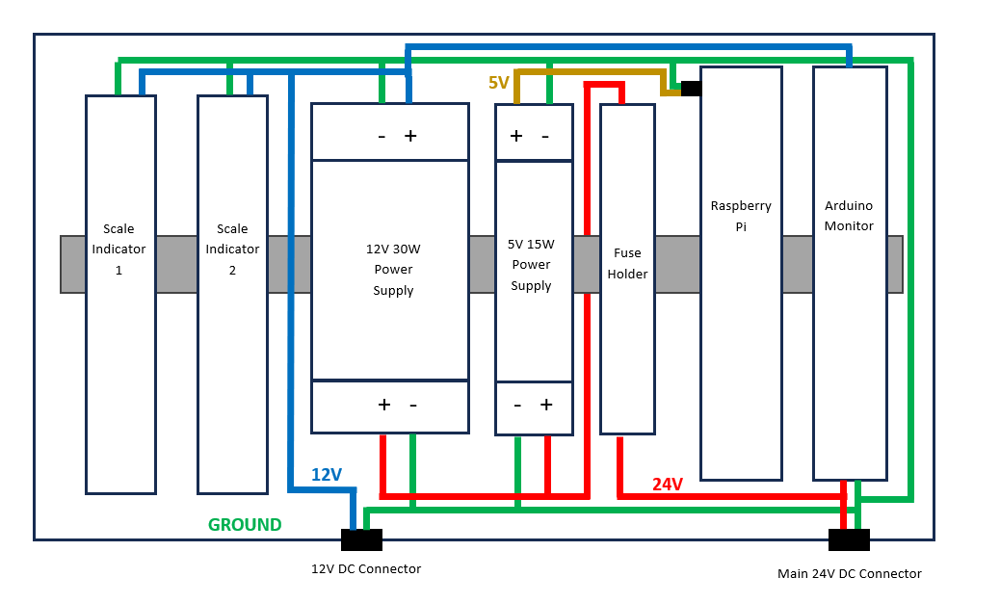{width="700" fig-align="center"}

-   With the ground wire laid out, the locations of the different components are established. The Arduino Monitor, Raspberry Pi and the two Scale Indicators can now be removed to ease the rest of the wiring.

-   Run two positive wires from the Main 24 DC Connector:

    -   One through the fuse holder and to the input of the 5V and 12V Power Supplies,

    -   One to the power connector on the Arduino Monitor.

        -   The Arduino Monitor has its own 3A fuse. This allows the Monitor to continue operating even if a fault caused the main fuse to blow.

-   On the output of the 5V power supply, run a wire for the Raspberry Pi. This positive 5V wire, together with the ground wire created earlier, will be connected to a USB-C cable, to power the PI. Currently, the most cost-effective method to obtain a quality cable with a USB-C connector, is to use a USB-B to USB-C cable from RS Components (192-4730) and to cut off the USB-B connector. Please update this manual when a better alternative is sourced. Keep the cable running to the Pi short to avoid extra cabling in the Main Unit.

-   Run a positive 12V wire from the output of the 12V Power supply to the following locations:

    -   Arduino Monitor 12V monitoring screw terminal

    -   Both Scale Indicators

    -   12V DC Socket

-   Crimp ferrules to the ends of all the power wires.

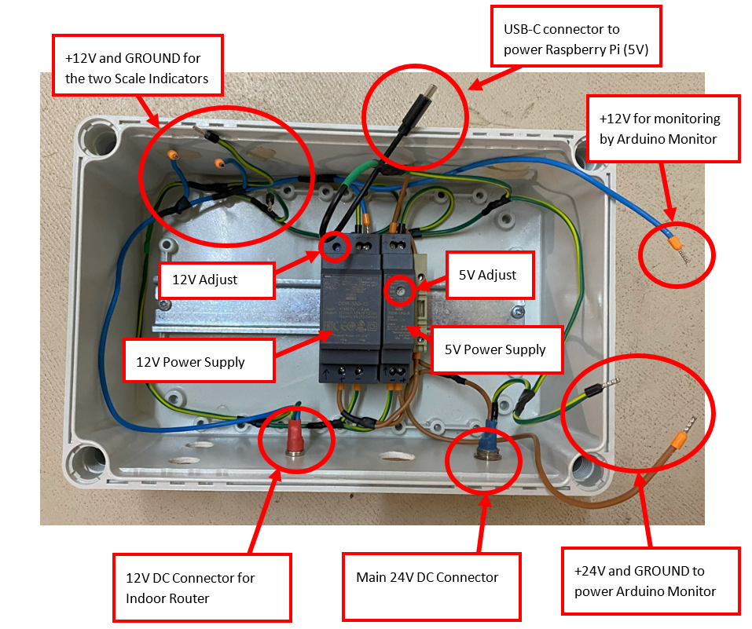{width="700" fig-align="center"}

## Testing the Power Supplies

Before connecting any of the components, it is important to check the output of the power supplies.

-   Insert a 3A fuse into the fuse holder. The APMS Main Unit uses a 3A fuse (668-5963).

-   Connect 24V DC to the main DC connector.

    -   To do this, use the DC plug (RS: 705-1519) and make a temporary power cable for testing.

-   There should be a red light on the fuse holder and a blue light on each power supply.

-   Measure the output of the 5V power supply and set it to 5.1V. The supply can be adjusted by turning the "5V Adjust" potentiometer (see Fig. 40).

-   Measure the output of the 12V power supply and set it to 12.1V. The supply can be adjusted by turning the 12V Adjust potentiometer.

> Please take note of the polarities, as the two Meanwell power supplies are not the same.

## Installing the Scale Indicators

Initially, the scale indicators used in the APMS are made by Laumas, model TLB485. However, we have since switched over to using indicators made by General Measure, model GMT-X1 indicators. The Laumas TLB485 indicators run on 12V, whereas the GMT-X1 indicators run on 24V. Both communicate with the Raspberry Pi via RS485. RS485 USB-to-Serial Converters are used. (RS: 687-7834).

The data is sent as

### Indicator Power and Data

- Laumas TLB485
    -   The Laumas TLB485 scale indicator uses an 8-pin screw connector for power and serial communication. The connector, as well as the layout of the two RS485 Serial Converters can be seen in FIGURE 41 - SCALE INDICATOR CONNECTIONS
    
- General Measure GMT-X1
    - **TO BE COMPLETED**

-   Shorten the cables of the RS485 converters to fit the layout shown.

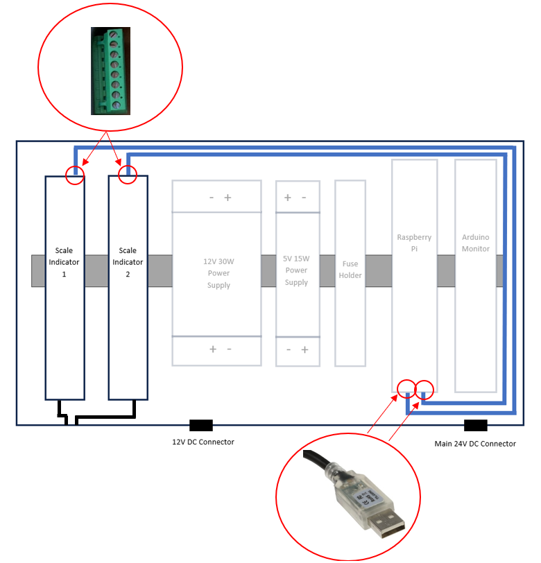{width="700" fig-align="center"}

-   Only the orange and yellow wires of the RS485 converter is used. Strip and crimp ferrules on the end of the wires and connect as in Fig. 42.

-   Connect the GROUND and +12V power wires.

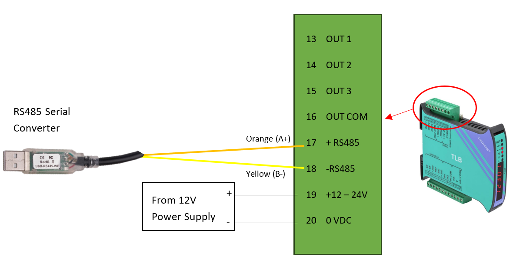{width="400" fig-align="center"}

### Indicator Scale Connection

-   Each scale connects to the APMS Main Unit via a 6-pin socket (111-5764), mounted on the front of the enclosure.

-   A short cable runs from the 6-pin socket to the x-pin connector for the GMT-X1 indicator, or if using a Laumas TLB485 the cable will run from the 6-pin socket connector to the 9-pin connector on the indicator (Fig. 43.2).

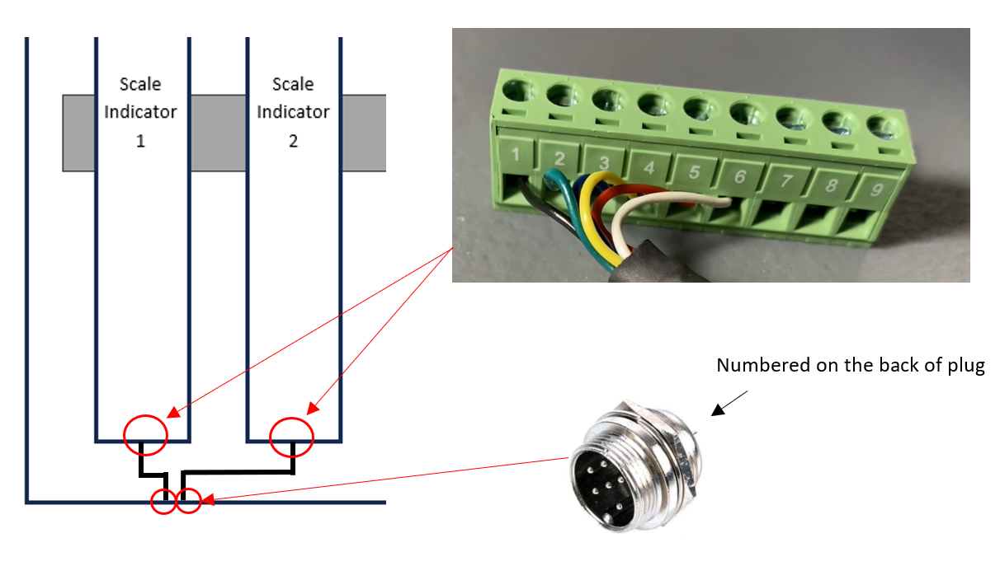{width="400" fig-align="center"}

-   Each pin on the socket (111-5764) is numbered. Match the numbering on the 9-pin connector with that of the socket (only 1 - 6 is used). See Figs. 43 & 44.

-   Solder the wires to the sockets and add ferrules before inserting it into the scale connector screw terminals.

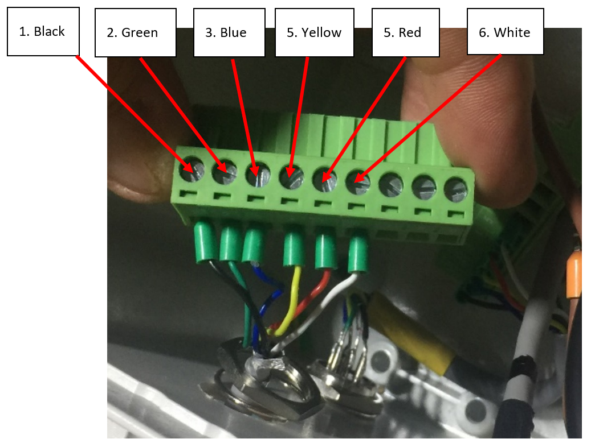{width="400" fig-align="center"}

### Jumper Install (Laumas TLB485 only)

If using the Laumas TLB485 indicators, a jumper needs to be installed if the baud-rate exceeds 9600. As we are communicating with the indicators at a speed greater than 9600 BAUD, two jumpers need to be installed. This is only applicable to TLB45 indicators and not the GMT-X1 indicators. Please see the excerpt from the manual below.

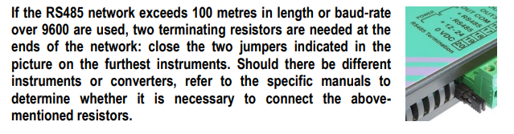{width="600" fig-align="center"}

### Configuring The Scale Indicators

-   Before configuring the scale indicators, check that it has been wired correctly and working properly:

    -   Plug in both the 6- and 9-pin scale connectors.

    -   Plug the scales into their respective scale sockets

    -   Apply power to the Main Unit -- the indicators should light up and show a weight after start-up.

    -   Apply light pressure on Scale 1 and Scale 2 and confirm the correct indicator changes its weight reading.

To configure the scale indicators, the front cover is flipped open and the buttons on the device are used. There are four buttons on each indicator as in Fig. 46.

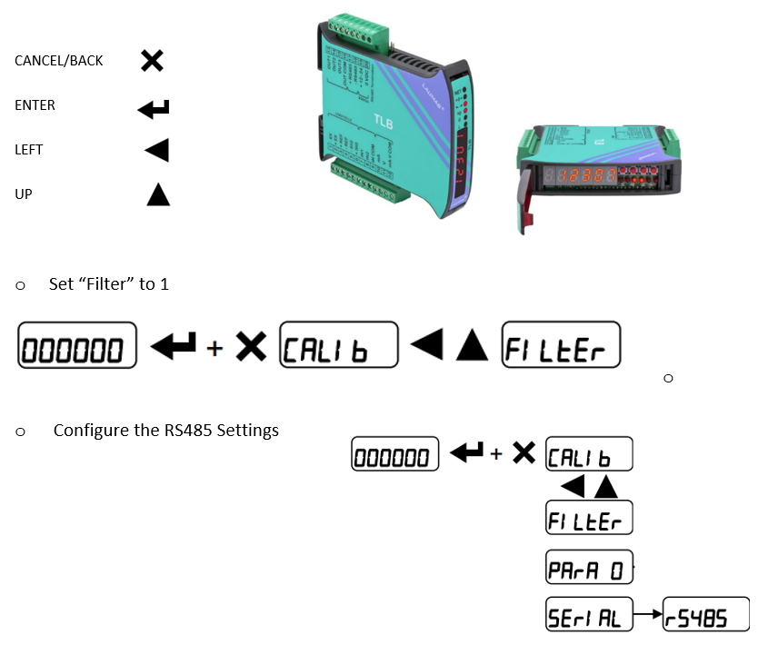{width="600" fig-align="center"}

  ---------------------------------------------------------------------------------------------
  **Name**                       **Value**
  ------------------------------ --------------------------------------------------------------
  Mode                           Continuous

  BAUD rate                      115200

  Hertz                          100

  Parity                         None

  Stop Bit                       1

  Mode                           *nodt*
  ---------------------------------------------------------------------------------------------
  
  The settings above will be checked when testing the scales script (See: [Testing the scales.py Script](10_testing.qmd#Testing the scales.py script))

## Installing the APMS Monitor

If the APMS Monitor has been tested as explained in [Testing the Monitor Circuit Board](04_apms_monitor.qmd#Testing the Monitor Circuit Board), it can be installed in the APMS Main Unit. The Monitor is mounted on a 3D printed mounting plate, as discussed earlier.

-   The Monitor mounting plate clips on to the DIN rail, with the power connector facing the front of the Main Unit, and the 12V monitoring connector facing towards the back (Fig. 47).

-   Connect the power and 12V monitoring wires.

-   Connect the 40-pin Raspberry Pi ribbon cable.

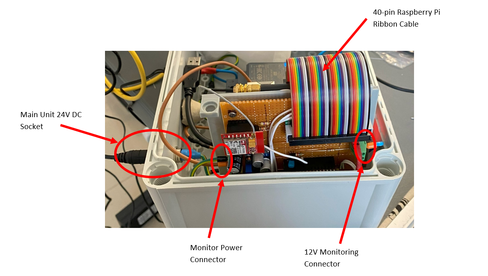{width="400" fig-align="center"}