# AWS S3 Cloud Storage

The software and data are stored on the AWS S3 Server.

## Administrator Details 

To access the software, download a S3 Client, such as S3 Browser. (<https://s3browser.com/>).

The usernames, passwords and other confidential information is stored in a separate document.

There are currently five main objects:

 ---------------------------------------------------------------------------------------------
  **Directory**                           **Description of contents**
 ---------------------------------------- ----------------------------------------------------
s3://apmsbirdlife/APMS/data/              This holds all the scale, rfid and system status data.

s3://apmsbirdlife/APMS/software/          This holds all the necessary software to set up a new system.

s3://apmsbirdlife/APMS/documents/         This holds documentation such as the manual, parts lists etc.

s3://apmsbirdlife/APMS/3D_prints/         This holds the design files for the various 3D printed parts

s3://apmsbirdlife/APMS/website/           This holds the daily plots for the website run by Ninepoint
 ---------------------------------------------------------------------------------------------

:::{.callout-note}
The firmware running on the Raspberry Pi and the code for the Dashboard can all be found on the [APMS BirdLife GithUB](https://www.github.com/apmsbirdlife) repository.
:::

## Creating a User on AWS S3

Each Raspberry Pi has an AWS S3 Username, Access Key and Secret Access Key assigned to it. This enables the data and log files to be uploaded to the cloud every day. When installing an APMS at a new site, a new user for the site must be created. This manual is accurate as of writing in December 2023, but as websites and services change, slight variations might appear in future. Please update this manual when deemed necessary and update the revision number. Further improvement regarding security, such as using IAM Identity Center instead of IAM, using Multi Factor Authentication or using AWS CLI2, are left up to the discretion of the administrator

-   Go to <https://aws.amazon.com/s3/> 

-   Click on "*Sign in to console*" in the top right.

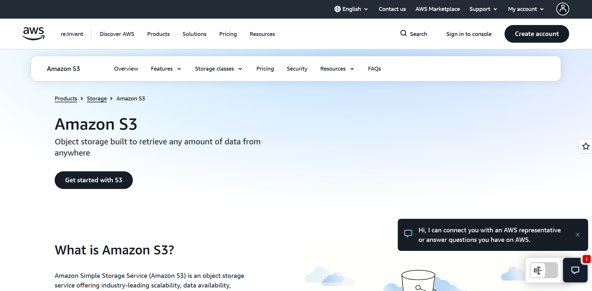{width="600" fig-align="center" style="border: 1px solid black;"}

-   Click "*Sign in using root user's email*".

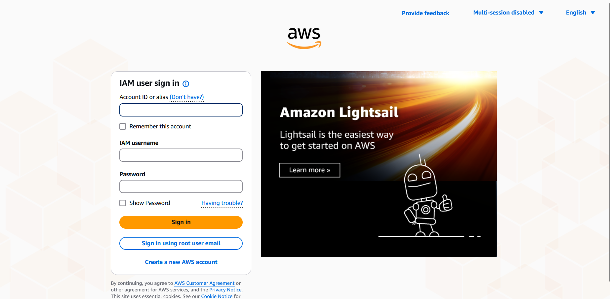{width="600" fig-align="center" style="border: 1px solid black;"}

-   Log using the relevant account details.

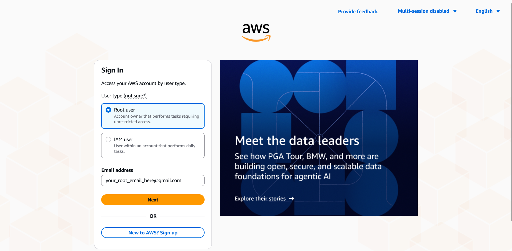{width="600" fig-align="center" style="border: 1px solid black;"}

-   Click on "*IAM*" (NOT "IAM Identity Center").

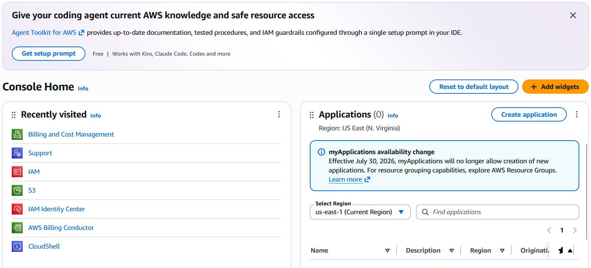{width="600" fig-align="center" style="border: 1px solid black;"}

-   Click on "*IAM Users*" and then in the top right, "*Create User*".

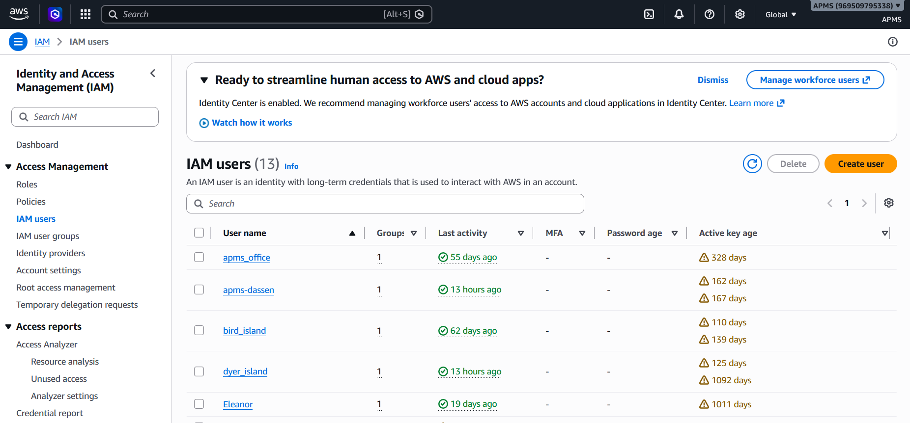{width="600" fig-align="center" style="border: 1px solid black;"}

-   Under "*User name*", enter the site name, all lower case letters. Example: "apms_boulders". Keep all the defaults as is. Click Next to continue.

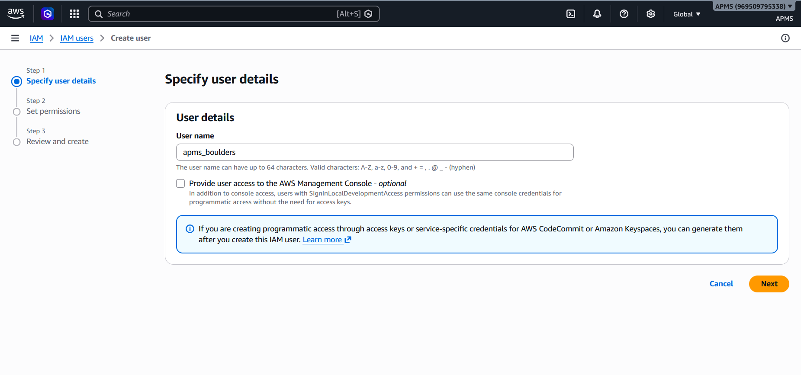{width="600" fig-align="center" style="border: 1px solid black;"} 

-   On the "*Set permissions*" page, select the S3_Full_Access option under user groups and click "*Next*".

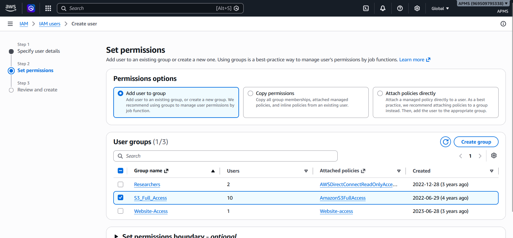{width="600" fig-align="center" style="border: 1px solid black;"}

-   On the "*Review and create*" page, click on "*Create user*".

-   Now view the new user that you created and navigate to "*Security credentials*" and then scroll down to "*Access keys*"

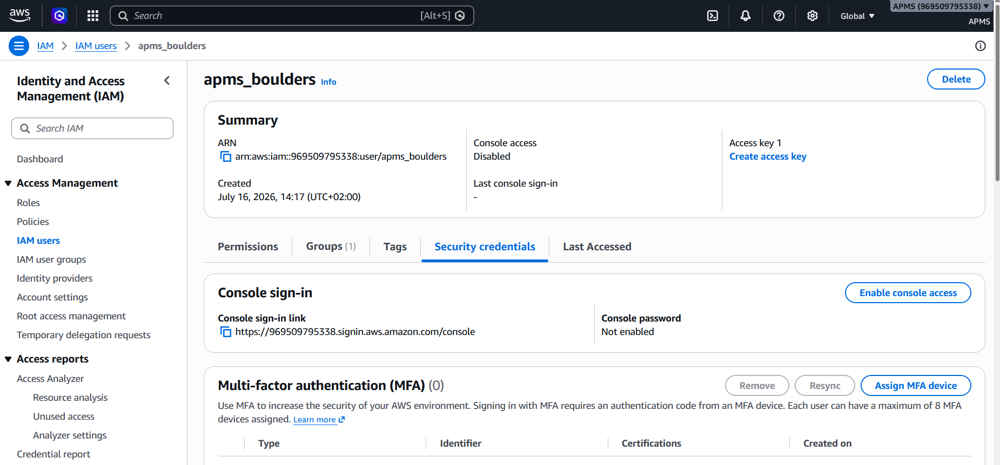{width="600" fig-align="center" style="border: 1px solid black;"}

-   Click on "*Create access key*"

-   Click on "*Command Line Interface (CLI)*", click the "*Confirmation*" and click "*Next*"

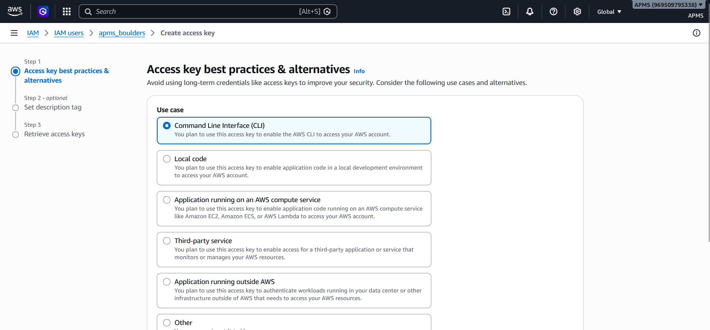{width="600" fig-align="center" style="border: 1px solid black;"}

-   On the "*Set description tag*" page, enter "*APMS upload*" and click on
    "*Create access key*"

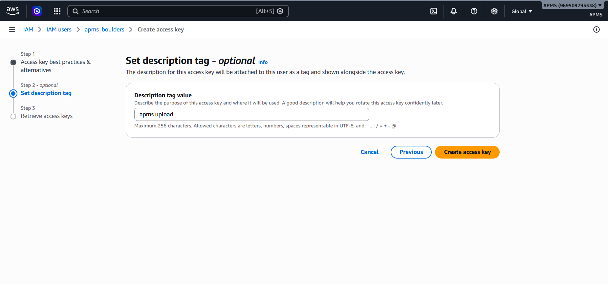{width="600" fig-align="center" style="border: 1px solid black;"} 

-   You have now successfully created a user for the new site and created an access key. Copy down the Access key and Secret access key (Click "*Show*"). You can also download the .csv file containing this information. Please keep this information very secure as it has full read/write access to the cloud. Also, please note that you will not be able to view this information at a later stage, so make sure it is stored safely. If this information is lost, and is needed in future, create a new user as described in this section.

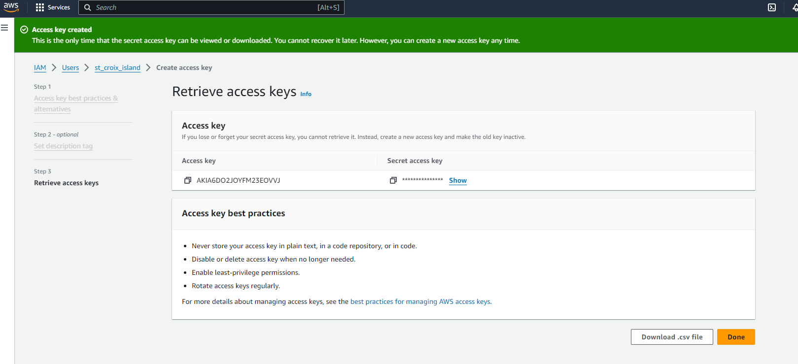{width="600" fig-align="center" style="border: 1px solid black;"} 

This access key and secret access key will be needed when the APMS is
configured. See [Configuring the APMS](07_raspberry_pi.qmd#Configuring the APMS).