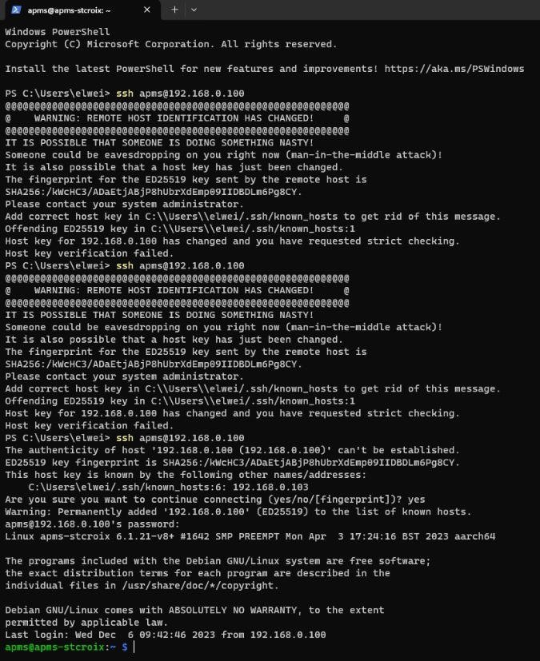
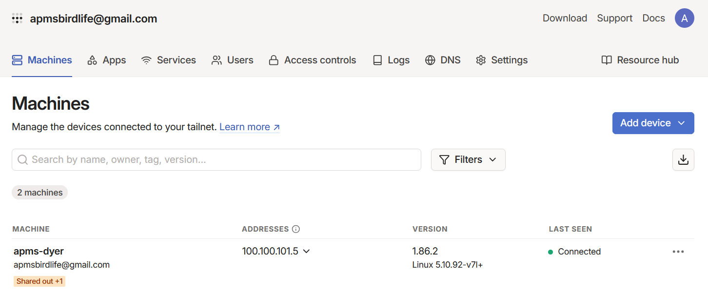
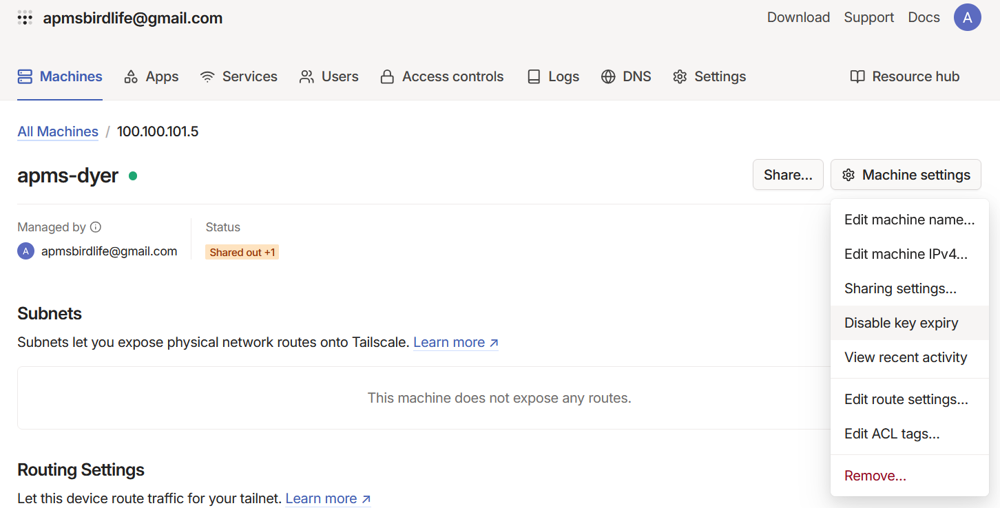
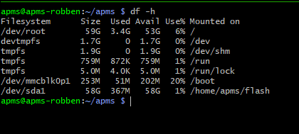
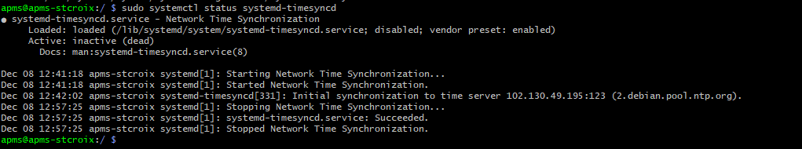

# Raspberry Pi Operating System

The Raspberry Pi operating system must be installed first, together with all required libraries and applications. A microSD card, SD card reader and a computer running Windows is needed for this step. If the operating system is being installed on a spare Raspberry Pi, a USB-C cable and 5V 3A power supply will be needed to power the device.

## Prepare the micro SD card

-   Get a new SD card (currently using a 64GB SanDisk) and insert it into the MicroSD card reader.

-   Download the Rpi Imager and Rpi OS from the cloud (APMS/software/RaspberryPi)
    -   The Imager can also be downloaded online here: [Download RPi Imager v1.7.4](https://github.com/raspberrypi/rpi-imager/releases?page=3#release-v1.7.4).
    -   One way to do this is to download S3 Browser and navigate to the relevant software folder ([[https://s3browser.com/]{.underline}](https://s3browser.com/) )
    -   If you don't have access to the AWS S3 cloud, you can also download it from here: [Download Pi OS bullseye](https://os.watch/raspberrypios/2023-02-21). Make sure it's the “2023-02-21-raspios-bullseye-arm64-lite.img” version.

-   Install and run Raspberry Pi Imager (Version 1.7.4 for Windows used for this manual)

    -   Choose OS  
    -   Select "Use custom" 
    -   Select the raspberry pi image you downloaded
    -   All our APMSs are running on *Raspi OS Bullseye 2023-02-21* "2023-02-21-raspios-bullseye-arm64-lite.img"

-   CHOOSE STORAGE and select the SD card.

-   Click on the settings cog.

    -   Choose a hostname. Example: "apms-dyer" or "apms-boulders"

    -   Select "Enable SSH"

        -   "Use password authentication"

    -   Select "Set username and password"

        -   username: apms 
        -   password: \<ENTER YOUR PASSWORD>

    -   Select "Configure wireless LAN"

        -   **SSID**: apms 
        -   **Password**: \<ENTER YOUR PASSWORD> 
        -   **Wireless LAN country**: ZA

    -   Select "Set locale settings"

        -   **Time zone**: ZA

    -   Leave all other settings unchanged and click on **SAVE**

-   Click on **WRITE**

-   Click **YES** after confirming you selected the correct storage device

    -   Wait for RaspiOS to finish installing and click **CONTINUE** after installation.

-   Eject the USB card and insert it into the Raspberry Pi. The MicroSD card slot is located on the underside of the Pi.

## SSH into the pi (locally)

-   Ensure the WiFi router has been set up and has the correct SSID name for the Pi to connect to. See [Internet and WiFi](02_internet.qmd#Internet and WiFi)

-   Power the Raspberry Pi via the USB-C connector. Use a suitable power supply that is capable of deliver 3A of current.

    -   The Raspberry Pi will power up when the APMS main unit is powered.

    -   If not using an APMS main unit, power the Pi with a 5V 3A power supply and USB-C cable. There will be a solid red light on the Pi when booting is complete.

-   On a PC, connect to the WiFi router. This can be done via WiFi or a LAN cable.

-   Connect to the router's admin page in a browser to find the IP of the new Raspberry pi.

    -   The IP address of the router can usually be found on the back of the router or in the router's manual.

    -   Alternatively, after connecting to the Wi-Fi, open Powershell and run:
```bash
ipconfig
```
    
    -   Under "Wireless LAN Adapter Wifi", find the IP address under "Default Gateway".

    -   To connect to the router, In an internet browser, type the IP address, found in the previous step, into the address bar.

    -   The default username and password can usually be found on the back of the router or in the router's manual. Commonly, the username is "admin" and the password is either "admin" or left blank.

    -   After connecting to the router's admin page, look for the IP address of the Raspberry Pi. You would typically find this information in a section called "Connected Devices" or something similar. The Raspberry Pi should appear under the name "apms" or something like "apms-boulders".

-   After obtaining the IP of the Raspberry Pi, SSH into the pi: 

    -   The username will be "apms"

    -   The password is the same password you set when you flashed the Raspberry Pi SD card with the Raspberry Pi Imager (see: [Prepare the micro SD card](07_raspberry_pi.qmd#Prepare the micro SD card)).
    
```bash
# ssh [username]@[IP address]
# example:
ssh apms@192.168.0.111
```

-   A message similar to the following might appear

```bash
PS C:\\Users\\phil\> ssh <apms@192.168.0.103>
The authenticity of host \'192.168.0.103 (192.168.0.103)\' can\'t be established.
ED25519 key fingerprint is SHA256:/kWcHC3/ADaEtjABjP8hUbrXdEmp09IIDBDLm6Pg8CY.
This key is not known by any other names
Are you sure you want to continue connecting (yes/no/fingerprint)?
```

-   Type yes and if asked for a password, enter the password for the raspberry pi.

-   While trying to SSH into the PI from another PC, especially after changes were made, you might encounter the following message:

<!-- {width="700" fig-align="center"} -->

-   Edit the "known_hosts" file: 

```bash
sudo nano ~/.ssh/known_hosts
```
-   Remove the line containing the IP of the Raspberry Pi:

-   Save the file and exit. (Hold **CTRL** and press **x**. Type press **y** to save, then press **Enter** to exit)

## Update the Raspberry Pi Operating System

-   Check the time is correct by running:

```bash
date
```

-   If incorrect, run:
```bash
sudo raspi-config
```
    -   Select: Localisation options > Timezone > Africa > Johannesburg
    -   Use the right arrow key to move to **FINISHED** and press **Enter**

-   Update package list:
```bash
sudo apt-get update
```
    -   Say "yes" to any messages that appear

-   Install latest packages: 

```bash
sudo apt-get upgrade
```
    -   Say "yes" to any messages that appear
    
:::{.callout-note}
Downloading software via the 4G router could be costly and unnecessary if a local WiFi hotspot is available. To use local Wifi for initial setting up, the following changes to the above steps must be made:

 - When setting up the Raspberry Pi in Rpi Imager, use the WiFi settings of the local WiFi network.
 
 - To find the IP address of the Raspberry Pi, the easiest option is to plug a monitor and keyboard into the Pi. Power up the Pi and log in using the username and password set up during the installation. In the terminal of the Pi, run:
 
 ```bash
 ifconfig 
 ```
 
 - The IP address can be found under “wlan0” -> “inet”
      
 - To change the WiFi setting on the Raspberry Pi back to the 4G router run: 
 
 ```bash
 sudo raspi-config
 ```
 
 - Then select “System Options” -> “Wireless LAN“
:::

## Install applications and libraries

-   The following Linux applications are needed for the APMS. The currently used version is listed next to each application. If a future version becomes incompatible, try the listed version instead.

| Library | Version | Description |
| :--- | :--- | :--- |
| **git** | `2.34.1` | Used to download and update the firmware |
| **ntpdate** | `4.2.8` | To update the system time via NTP |
| **tmate** | `2.4.0` | Used to SSH into the Pi, via the internet |
| **python3** | `3.9.2` | Programming language used to run most of the firmware |
| **minicom** | `2.8` | Useful program for monitoring the serial port |
| **pip** | `20.3.4` | Program used to install python packages |
| **vnstat** | `2.6` | Program to monitor internet usage |

-   To install the latest versions of all the applications above:

    -   Update the package list: ***\$ sudo apt-get update***
    
    ```bash
    sudo apt-get update
    ```

-   Install the packages:

```bash
sudo apt-get install git ntpdate tmate python3 minicom pip vnstat
```

-   Answer **Yes** to any questions that may appear.

-   If installing an older version, add =\[version\] for example: ***\$ sudo apt-get install ntpdate=4.2.8***

-   The following python packages are also needed.


| Library | Version | Description |
| :--- | :--- | :--- |
| **pyserial** | `3.5` | Used for serial communication |
| **vcgencmd** | `0.1.1` | Used to monitor CPU temperature |
| **psutil** | `5.9.5` | Used to monitor disk space and CPU usage |
| **pmcuprog** | `3.19.4.61` | Microchip PIC microcontroller programmer utility |


-   To install the python packages, use pip: ***\$ pip install pyserial vcgencmd psutil pmcuprog*** and answer Yes to any questions that may appear:

```bash
pip install pyserial vcgencmd psutil pmcuprog
```

-   If installing an older version, add "=\[version\]" for example: ***\$ pip install psutil=5.9.5***

## SSH into the Pi (via Tailscale)

[Tailscale](https://tailscale.com/) is a tool that lets you securely connect computers, servers, and devices over the internet as if they were on the same local network, using a peer-to-peer encrypted VPN built on [WireGuard](https://www.wireguard.com/). 

To install Tailscale on your laptop or work computer, go to the [Tailscale Download](https://tailscale.com/download) page, select your operating system, and follow the on-screen installation prompts. Once installed, log in with your identity provider (like Google, Microsoft, or GitHub) to connect your device to your private mesh network. 

Next, you will install it on the the Raspberry Pi. 

 - First ensure that you have enabled SSH on Raspberry Pi. To check, run:

```bash
sudo raspi-config
```

 - Navigate to *Interface Options* > *SSH* and enable it.
 
 - On the Pi, run the following commands:

```bash
cat /etc/resolv.conf
curl -fsSL https://tailscale.com/install.sh | sh
sudo tailscale up
```

 - You should see a link in the terminal after running `sudo tailscale up` which will allow you to authenticate in your browser.
 
 - If you get the error message below after running `sudo tailscale up`, then `sudo reboot` and try the steps above again:
`failed to connect to local tailscaled (which appears to be running as tailscaled, pid 24600). Got error: 503 Service Unavailable: no backend`

 - Install Tailscale on your laptop and log in with same account that you created or are using. For the weighbridge systems, we are using the apmsbirdlife@gmail.com account.
 
 - In order to remote into the pi, you need to have tailscale running (connected) on and signed in on the computer from which you want to connect to the raspberry pi. Once your device(s) is connected to your private tailscale network (called a tailnet), you should see it when you click on ‘Machines’ in the ‘*Admin Console*’ (see Fig. 49). You can view your machines/devices at any time on the [Admin Console](https://login.tailscale.com/admin/machines). You will also find the IP address for each device and some other information here.
 
  {width=600 fig-align="center" style="border: 1px solid black;"}
 
 - Sharing a device with co-workers can be done by hovering your mouse over the machine you wish to share and then clicking on ‘Share’ (Fig. 50). Type in the email address you want to share it with and then send. Your co-worker should have tailscale installed on their laptop and then once they’re ready, open the email that you sent to them and follow the instructions to add the device to their tailnet.
 
{width=600, fig-align="center" style="border: 1px solid black;"}
 
 - In the ‘Admin Console’ click on the device you added to your tailnet and then on the right, click ‘*Machine Settings*’ and navigate down to ‘*Disable key expiry*’ and select it. This will allow your key to remain active indefinitely (as opposed to expiring after 6 months).
 
 - You should now be ready to SSH into the raspberry pi from your laptop. Open the terminal and run: ssh apms@<tailscale IP>. For example: ssh apms@100.100.101.5
 
## Managing Background Services with tmux

When managing Raspberry Pi devices remotely, closing your terminal window will normally terminate any active commands. To keep your monitoring sessions open in the background, use `tmux` (Terminal Multiplexer). This is especially useful for tracking system logs without losing your place.

For instance, you can use `journalctl` to monitor your scales and RFID services simultaneously and continuously:

```bash
# Monitor scales and RFID services in real-time
sudo journalctl -u scales.service -u rfid.service -f
```

If you want to only view one of the services, e.g. just the scales script, run the following:
```bash
sudo journalctl -fu scales
```

---

### Managing tmux Sessions

Use the following commands to create, view, and manage your background sessions.

#### Start a New Session
To start a new session, it is best to give it a descriptive name (e.g. stony-monitor):
```bash
tmux new -s stony-monitor
```

#### List Available Sessions
To see all `tmux` sessions currently running on the Raspberry Pi:
```bash
tmux ls
```

#### Attach to an Existing Session
If you get disconnected, reconnect to the Pi via SSH and resume your session:
```bash
tmux a -t stony-monitor
# OR
tmux attach #if only one session is running
```

#### Kill a Session
When you are completely finished and want to close the session entirely:
```bash
tmux kill-session -t stony-monitor
```

---

::: {.callout-tip}
### Essential tmux Shortcuts

All `tmux` commands start with a prefix key combination: `CTRL + b`. Press and release the prefix keys first, then press the shortcut key.

* **Detach from Session**  
  Hold `CTRL` and press `b` $\rightarrow$ Release keys $\rightarrow$ Press `d`
* **Split Screen Vertically**  
  Hold `CTRL` and press `b` $\rightarrow$ Release keys $\rightarrow$ Press `%`
* **Split Screen Horizontally**  
  Hold `CTRL` and press `b` $\rightarrow$ Release keys $\rightarrow$ Press `"`
* **Create New Window**  
  Hold `CTRL` and press `b` $\rightarrow$ Release keys $\rightarrow$ Press `c`
* **Close Window Pane**  
  Hold `CTRL` and press `b` $\rightarrow$ Release keys $\rightarrow$ Press `x`
* **Switch to Next Window**  
  Hold `CTRL` and press `b` $\rightarrow$ Release keys $\rightarrow$ Press `n`
* **Enter "Scrolling" Mode**  
  Hold `CTRL` and press `b` $\rightarrow$ Release keys $\rightarrow$ Press `[`  
  *(Press `q` to exit scrolling mode and return to the live prompt)*
:::

## Set up the USB Flash Drive

A 64GB USB Flash drive is used as a backup for the APMS data. Every morning, the data gets backed up to the flash drive, before being transferred to the cloud. To configure Flash drive, a NTFS partition must be created.

-   SSH into the Pi as described earlier in this manual.

-   Insert the USB Flash drive into any of the available USB ports on the Pi.

-   Unmount the flash drive (if mounted): 
```bash
umount /dev/sda1
```
-   Run fdisk on the drive: 

    -   Create a new empty DOS partition: press 'o' and enter

    -   Create a new partition: press 'n' and enter -- use all the default options

    -   Change partition type: press 't' and enter -- choose 7 - 'HPFS/NTFS/exFAT'

    -   Save and exit: press 'w' and enter
```bash
sudo fdisk /dev/sda
```

-   Format disk: 
```bash
sudo mkntfs -f -L "apms_backup" /dev/sda1
```

-   Create mounting point 
```bash
mkdir /home/apms/flash
```

-   Mount:
```bash
sudo mount /dev/sda1 /home/apms/flash
```
-   To check the USB Flash drive has been properly mounted, run: 
```bash
df -h
```

-   Partition sda1 should be mounted at /home/apms/flash and should show the size of the drive (Fig. 51).

{width="600" fig-align="center"}

## Turn off automatic time updating

To prevent the Raspberry Pi from updating its system clock at an inopportune time, automatic time updating must be disabled. A script called `update_system_time.py` will handle the updating of the system time. (See the section: [Set up the Crontab](11_crontab.qmd#Set up the Crontab) for more details).

-   SSH into the Pi as described earlier in this manual.

-   To stop time-sync process, run:
```bash
sudo systemctl stop systemd-timesyncd
```

-   To prevent the process from starting at boot, run:
```bash
sudo systemctl disable systemd-timesyncd
```

-   To check it is indeed off, run:
```bash
sudo systemctl status systemd-timesyncd
```

-   It is important to ensure that *"update_system_time.py"* is set up to configure the time

{width="700" fig-align="center"}

## Disable Serial Console

The Raspberry Pi communicates with the Monitor via serial, using GPIO14 and GPIO15. The Raspberry Pi Serial Console must be disabled to allow this serial port to be used:

-   Run the following:
```bash
sudo raspi-config
```

-   Select "**Interfaces**"

-   Select "**Serial Port**"

-   Select "**NO**" to login shell

-   Select "**YES**" to enable serial support

-   Save and exit

## Configure UART3

UART3 is used to program the Arduino Monitor.

Enable serial port for programming by adding the following:

-   Edit /boot/config.txt: 
```bash
sudo nano /boot/config.txt
```

-   Add "**dtoverlay=uart3**" after "**enable_uart=1**"

-   Save the file and exit. (Hold CTRL and press x - Then press 'y' to save - then press Enter to exit)

-   Reboot:
```bash
sudo reboot
```

## Configure GPIO3 for Power ON/OFF

To enable GPIO3 to be used to power the Raspberry Pi on/off, the config file must be edited:

-   Edit the config file. Run:
```bash
sudo nano /boot/config.txt
```

-   Add "**dtoverlay=gpio-shutdown**" to the bottom of the file.

-   Save the file and exit. (Hold CTRL and press x - Then press 'y' to save - then press Enter to exit)

-   Reboot:
```bash
sudo reboot
```

## Configure Git and Download Firmware

-   SSH into the Pi as described earlier in this manual.

-   Install git (If you have not installed it already): 
```bash
sudo apt-get install git
```

-   Configure git:
```bash
git config --global user.name "apms"
git config --global user.email <apmsbirdlife@gmail.com>
```

:::{.callout-tip}
All the firmware is stored on the [APMS BirdLife Github](https://www.github.com/apmsbirdlife/apms) page.
:::

-   Generate an SSH key pair: 
```bash
ssh-keygen -t rsa -b 4096 -C apmsbirdlife@gmail.com
```

-   Press Enter for any questions that appear.

-   Start SSH agent: 
```bash
eval $(ssh-agent -s)
```

-   Add the private key to the agent to manage keys: 
```bash
ssh-add ~/.ssh/id_rsa
```

-   If you are one of the admins for the APMS BirdLife GitHub page, then go to [GitHub](http://www.github.com) and log in using the details provided above.

    -   Click on the user image (top right of the page) and choose "**Settings**".

        -   "**Settings**" &rarr; "**SSH and GPG keys**" &rarr; Click on "**New SSH key**"

        -   Under "**Title**", put "APMS \[site_name\]" Example: "APMS St Croix". If replacing a pi, delete the previous one first.

-   In the "**Key**" field, copy the contents of the following file: `~/.ssh/id_rsa.pub`. To do this, run the command: 
```bash
cat ~/.ssh/id_rsa.pub
```

-   Click "**Add SSH Key**" .

-   Go back to the Raspberry Pi terminal and authenticate: 
```bash
ssh -T git@github.com
```

    - Type "yes" if asked to continue.

-   Go to the home folder and clone the repository:
```bash
cd ~
git clone git@github.com:apmsbirdlife/apms.git


-   All the APMS firmware should now be downloaded to `~/apms/.` Go to the directory, then make sure you are on the correct branch: 
```bash
cd ~/apms
git checkout main
```

-   To update to the latest firmware, go to `~/apms/` and run:
```bash
git pull
```

## Finding the RS485 Serial Numbers

Each scale is connected to the Raspberry Pi via a RS485 converter. Each converter has a unique serial number and that is how the Pi can determine which scale is which. This is why it is important to label the indicator, scale and RS485 converter as "scale 1" or "scale 2". These should not be mixed and matched once the system has been set up.

-   To identify the serial number of each converter, a simple script was created. The script will be run twice, once for each converter. Run the script and follow the on-screen instructions:
```python
python3 ~/apms/tools/find_rs485_serial_number.py
```

-   Note down the serial number for each converter as it will be used when configuring the APMS. See [Configuring the APMS](07_raspberry_pi.qmd#Configuring the APMS).

## Configuring the APMS

-   All the parameters that can and must be set for the system to work properly can be found in the config file: `~/apms/config.json`

-   A new system needs a config file to be created, an existing system will already have the file.

-   To check if the config file already exists, list the contents of the apms directory and see if the file is present: 
```bash 
ls ~/apms/
```

-   If a config file already exists, it can be edited with:
```bash 
sudo nano ~/apms/config.json
```

Save the file and exit. (Hold **CTRL** and press **x** -- Then press '**y**' to save -- then press Enter to exit)

-   For a new system, the file `config_template.json` can be used.

    -   Make a copy of the template: 
    ```bash
    cp ~/apms/config_template.json ~/apms/config.json
    ```

    -   To edit the config file, run: 
    ```bash
    sudo nano ~/apms/config.json
    ```

    -   Refer to the table below when editing the config file. [The values given in bold are defaults and do not need to be changed.]{.underline}

The table below shows the parameters and their descriptions.

| Parameter | Description |
| :--- | :--- |
| **SITE_NAME** | Unique site name. All lowercase, no spaces. <br>Example: `"stony_point"` |
| **SITE_CODE** | Unique 3-letter site code. All capital letters. <br>Example: `"STO"` for Stony. |
| **SCALE_1_SERIAL_NUMBER** | Unique serial number for the first RS485 converter. <br>See: [Finding the RS485 Serial Numbers](07_raspberry_pi.qmd#Finding the RS485 Serial Numbers) |
| **SCALE_2_SERIAL_NUMBER** | Unique serial number for the second RS485 converter. <br>See: [Finding the RS485 Serial Numbers](07_raspberry_pi.qmd#Finding the RS485 Serial Numbers) |
| **AWS_S3_DATA_PATH** | This should be `"s3://apmsbirdlife/APMS/data/[site name]/"`. <br>Example: `*"s3://apmsbirdlife/APMS/data/stony_point/"*` |
| **AWS_ACCESS_KEY** | The access key you obtained when the user was created. <br>See [Creating a User on AWS S3](06_aws_s3.qmd#Creating a User on AWS S3) |
| **AWS_SECRET_ACCESS_KEY** | The secret access key you obtained when the user was created. <br>See [Creating a User on AWS S3](06_aws_s3.qmd#Creating a User on AWS S3) |
| **AWS_BUCKET** | Name of AWS S3 Bucket: **"apmsbirdlife"** |
| **APMS_ABS_PATH** | Absolute path where APMS is installed: **"/home/apms/"** |
| **DATA_PATH** | Path where raw data is stored: **"/home/apms/data/"** |
| **LOGS_PATH** | Path where log files are stored: **"/home/apms/logs/"** |
| **ERROR_PATH** | Path where error files are stored: **"/home/apms/error/"** |
| **USB_PATH** | Path when USB Flash drive is mounted: **"/home/apms/flash/"** |
| **USB_PARTITION** | USB Flash drive partition: **"/dev/sda1"** |
| **EMAIL_ADDRESS** | APMS main email address: **"apmsbirdlife@gmail.com"** |
| **EMAIL_PASSWORD** | This is the password to the main email address: **"dayammxlcvvwmdza"** |
| **EMAIL_ADDRESS_ADMIN** | Email address of APMS administrator: **"philip.faure@birdlife.org.za"** |
| **SCALE_SAMPLING_FREQ** | Sampling frequency of scales (samples per second): **100** |
| **SCALE_BAUD_RATE** | RS485 Serial Converter BAUD rate: **115200** |
| **MIN_PENGUIN_WEIGHT** | This is the minimum penguin weight (in kg) expected to be encountered in the field: **1.9** |
| **MAX_PENGUIN_WEIGHT** | This is the maximum penguin weight (in kg) expected to be encountered in the field: **4.3** |
| **MAX_DEAD_WEIGHT** | Maximum weight allowed (in kg) for sand/debris on the scales before warning: **0.5** |
| **SCALE_EMPTY_TIME** | Duration (in seconds) the scales must be empty before the event stops: **3** |
| **RFID_SERIAL_NUMBER** | This is the serial number of the serial converter inside the BioMark RFID reader: **"0001"** |
| **RFID_BAUD_RATE** | This is the BAUD rate of the BioMark serial converter: **115200** |
| **SERIAL_PORT_INTERNAL** | This is the name of the serial port used for communication with the Monitor: **"/dev/ttyS0"** |
| **INTERNAL_BAUD_RATE** | This is the BAUD rate for communication between the Pi and the Monitor: **115200** |
| **MAX_SCALE_ERROR_COUNT** | This is the number of times a scale can fail before it gets disabled: **3** |
| **CPU_TEMP_WARNING** | CPU temperature (in °C) at which to send out warning message: **60** |
| **CPU_TEMP_DANGER** | CPU temperature (in °C) at which Raspberry Pi will start throttling the CPU: **70** |
| **UPLOAD_HOUR** | Hour of day to do the data transfer to the cloud. 1 = 1:00, 19 = 7pm etc: **1** |
| **UPLOAD** | This variable is set to **1** to allow daily data uploads to the cloud (0 to disable): **1** |

-   After editing, Save the file and exit.

    -   Hold **CTRL** and press **x**. Then press '**y**' to save, then press Enter to exit

-   The configuration file has now been created.
