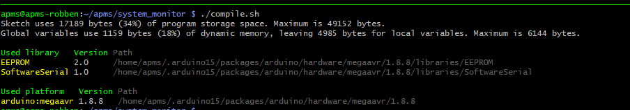
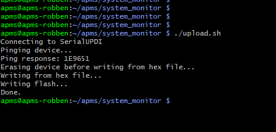

# Programming the Arduino Monitor via the Pi

As discussed in [UPDI Programming](04_apms_monitor.qmd#UPDI Programming), the Arduino is programmed via UPDI.

## Initial Setup

-   Before soldering the link and connecting the UPDI wire, compile and upload the test sketch as discussed in [Programming via the Arduino Software](04_apms_monitor.qmd#Programming via the Arduino Software).

-   Ensure the Monitor Circuit Board has been fully tested before plugging it into the Pi. See [Testing the Monitor Circuit Board](04_apms_monitor.qmd#Testing the Monitor Circuit Board).

-   Ensure the Serial Console has been disabled as discussed in [Disable Serial Console](07_raspberry_pi.qmd#Disable Serial Console).

-   Ensure UART3 has been configured as discussed in [Configure UART3](07_raspberry_pi.qmd#Configure UART3).

-   Ensure GPIO3 has been configured to power the Raspberry Pi on/off as discussed in [Configure GPIO3 for Power ON/OFF](07_raspberry_pi.qmd#Configure GPIO3 for Power ON/OFF).

-   Provide 24V DC to the Main Unit, providing power for the Raspberry Pi and Arduino to boot up.

-   SSH into the Pi.

-   Ensure the latest firmware has been downloaded: 
```bash
cd ~/apms
git clone
```

-   To compile the firmware, arduino-cli must be installed. Run:
```bash
cd ~
curl -fsSL https://raw.githubusercontent.com/arduino/arduino-cli/master/install.sh | sh
```

Add to path:

-   Edit bashrc: 
```bash
nano ~/.bashrc
```

-   Add the following to the bottom: `export PATH=\$PATH:/home/apms/bin`

-   Save the file and exit. (Hold **CTRL** and press **x** -- Then press '**y**' to save -- then press Enter to exit)

-   Type: 
```bash
source ~/.bashrc
```

To install the AVR core, run:
```bash
arduino-cli core install arduino:megaavr
```

To set up the config file, run:
```bash
arduino-cli config init
```

The Software Serial port buffer must be increased:

-   Determine the version number. Run: 
```bash 
ls ~/.arduino15/packages/arduino/hardware/megaavr/
```

-   The run the following:

```bash
sudo nano ~/.arduino15/packages/arduino/hardware/megaavr/[VERSION NUMBER]/libraries/SoftwareSerial/src/SoftwareSerial.h
```

-   Look for the line `#define _SS_MAX_RX_BUFF 64 // RX buffer size` and change 64 to 100

-   Save the file and exit. (Hold **CTRL** and press **x** -- Then press **y** to save -- then press Enter to exit)

## Compiling and Uploading

-   SSH into the Pi

-   Go to the Monitor firmware directory: 
```bash 
cd ~/apms/system_monitor
```

-   Compile the firmware: 
```bash 
chmod +x .compile.sh
chmod +x .upload.sh
./compile.sh
```

{width="700" fig-align="center"}

-   Upload the firmware to the monitor: 
```bash 
./upload.sh
```

-   The output can be seen in the below screenshot.

-   If the upload fails, check the UPDI wire and link, Schottky diode and the wiring of the level shifter.

-   The Monitor should reboot and send an SMS to the operator.

{width="600" fig-align="center"}