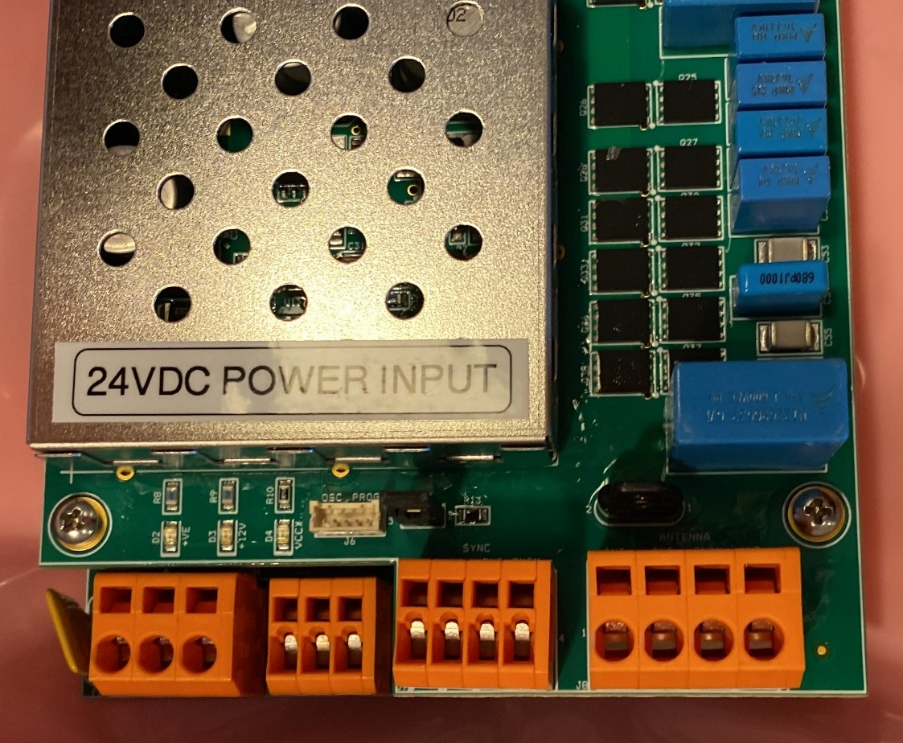
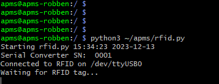
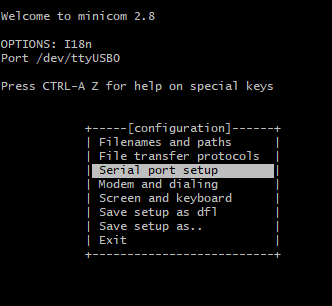
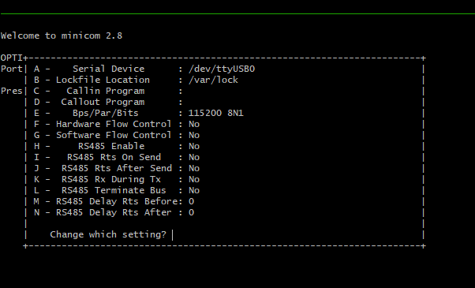
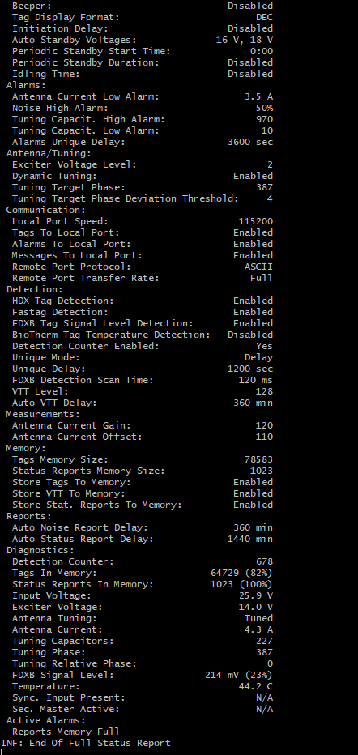
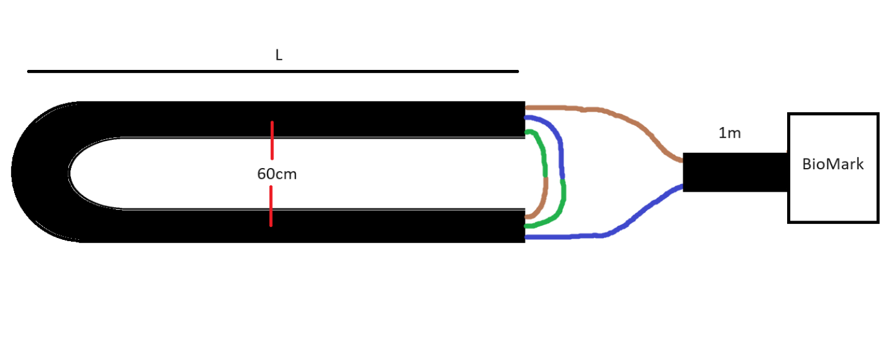
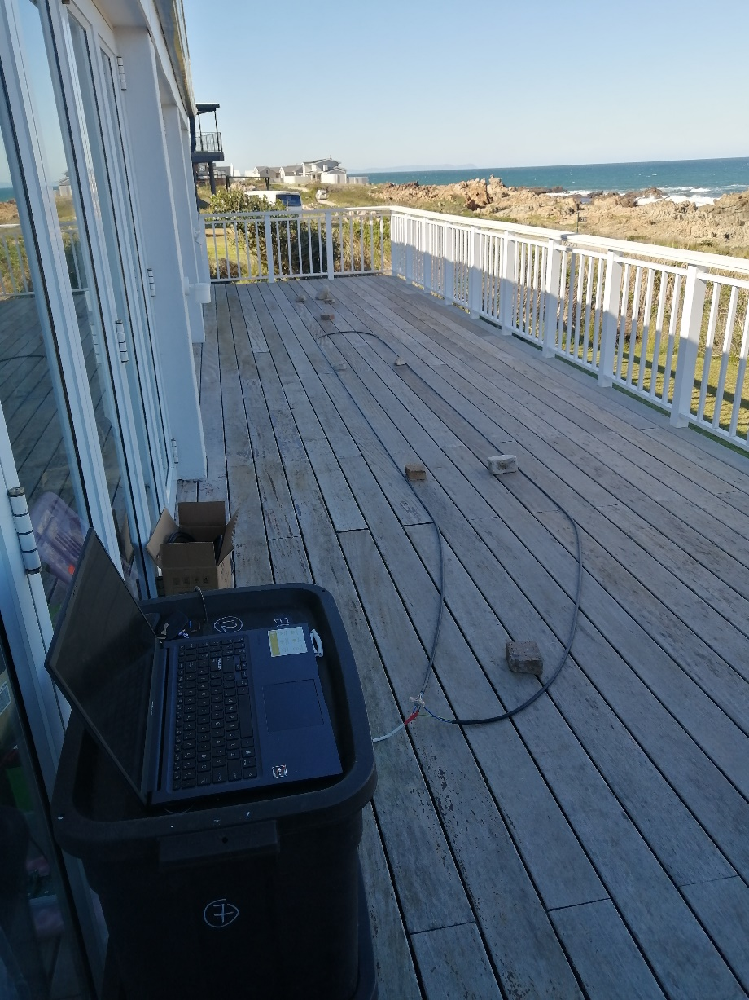
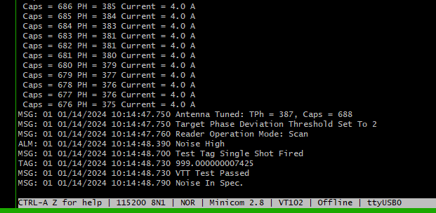

# BioMark Reader

The BioMark RFID Reader is a device used to record penguins that have been PIT-tagged. The device outputs the tag number via a serial-to-USB converter, accessible via a mini-USB port on the device.

The reader has many different configurations and the latest BioMark manual should always be followed.

## Overview

Below is some information of the currently used model, for reference. The Raspberry Pi reads the tags via a USB cable, plugged into the front of the APMS Main Unit.

For the reader to operate, it needs 24V power and an RFID antenna connected. For the pinout, see Fig. 55.

To make an antenna, see [Making a BioMark Antenna](09_biomark.qmd#Making a BioMark Antenna). As of 2026, we have been using antenna's custom made by BioMark to fit perfectly in between our scales. 

{width="600" fig-align="center"}

The BioMark reader can be configured either via the BioMark Software (Device Manager) or via the Raspberry Pi terminal. Both methods described here use a USB-A to mini-USB cable to connect to the Reader.

It is also possible to connect to reader via a RS232 or Bluetooth connection. Refer to the BioMark documentation for more information if this is required.

Application Firmware Version v 1.7.1

## Connect to BioMark via Device Manager

-   BioMark Device Manager, can be installed on a Windows PC to configure the system. Currently version 1.2.15.1 is being used and can be found on the S3 account or downloaded here:
      - [Download Device Manager 1.2.15.1.zip](_book/files/DeviceManagerStandalone_1.2.15.1.zip)

-   The Windows 10 and Windows 11 driver for the serial converter (*CP210x_Universal_Windows_Driver_11.3.0*), used by the BioMark Reader, can be found on the S3 account or downloaded here:
      - [Download Windows Driver](_book/files/CP210x_Universal_Windows_Driver_11.3.0.zip)

-   Please refer to the IS1001 Reader User Manual and the Device Manager Software Manual for instructions on how to connect and configure the reader. Both can be found at:

    -   [Download IS1001 Reader User Manual](_book/files/IS1001_Reader_User_Manual_Rev_11.pdf)

    -   [Download Device Software Manual](_book/files/Device-Manager-Software-Manual-v1.1.pdf)
    
-   Refer to the section [Configuring the BioMark Reader](09_biomark.qmd#Configuring the BioMark Reader) for the required settings.

## Connect to BioMark via Raspberry Pi Terminal

-   To connect to the BioMark Reader from the Raspberry Pi terminal, ensure that both the BioMark Reader and Raspberry Pi are powered up.

-   SSH into the Pi

-   Check that the RFID service is not running in the background and stop the service if it is:

    -   Check with: 
    ```bash
    systemctl status rfid
    ```

    -   If active, stop the service: 
    ```bash
    sudo systemctl stop rfid
    ```

-   Connect the USB cable to the mini-USB port on the BioMark reader and to any of the USB ports of the Raspberry Pi. If an APMS Main Unit has been built, the front USB port can be used.

-   After the USB cable is plugged into the Pi, the BioMark serial converter will be assigned to a device file. This will either be "ttyUSB0", "ttyUSB1" or "ttyUSB2", depending on what other USB devices are plugged in. To determine which device file to use, run the rfid script: 

    ```bash
    python3 ~/apms/rfid.py
    ```

    -   Find the device file name as indicated in Fig. 56 below.

{width="600" fig-align="center"}

-   Close the script: Hold **CTRL** and press **c**

-   To connect to the BioMark reader from the Pi, a program called Minicom will be used. This was installed when the Raspberry Pi was set up. See [Install applications and libraries](07_raspberry_pi.qmd#Install applications and libraries).

    -   Run: 
    
    ```bash
    minicom -D /dev/[device file]
    ```

        -   Example: `minicom -D /dev/ttyUSB0`

    -   Once inside minicom, disable "Hardware Flow Control":

    -   Hold **CTRL** and press **a** - Then press **o** to bring up the options menu, go to "**Serial port setup**" and press Enter. See screenshot below

{width="600" fig-align="center"}

-   Ensure "Hardware Flow Control" is off (It must have "no" next to it) - see Fig. 58.

    -   If "Hardware Flow Control" is on, turn it off by pressing "**f**".

{width="600" fig-align="center"}

-   Press **Enter** to save and return to the Options menu.

-   Press **Esc** to exit the Options menu

-   Type "**rfs**" and press **Enter**. The current configuration should be printed to the screen.

-   You will not see the letters "**rfs**" until you press **Enter**.

-   An Example for Robben Island can be seen in Fig. 59.

{width="600" fig-align="center"}

-   If you see the configuration page as above, it means you have successfully connected to the BioMark Reader and can now send/receive commands in the console.

## Configuring the BioMark Reader

After successfully connecting to the BioMark Reader as discussed above, the system can be configured.

-   If using the "Device Manager" software, please refer the BioMark documentation and use the settings provided below.

-   If connecting via a Raspberry Pi terminal, use the commands below to set the BioMark parameters.

-   **Before executing any commands, it is always a good idea to run "rfs" and check that a status report is received. This confirms the reader is working properly and clears the serial buffer of any garbage characters that may be present.**

The settings given below are used for a BioMark Reader connected to an APMS.

-   If connecting to the BioMark Reader via the Raspberry Pi terminal (minicom), the commands given in the table below can be used to configure the system. Keep the default for all other settings. Compare the values in the table with the values obtained from executing "rfs", and change the settings as needed.

  ------------------------------------------------------------------------
  Setting                          Value                    Command
  -------------------------------- ------------------------ --------------
  Operation Mode                   "Scan"                   **ROM1**

  Network Mode                     IS1001 Standalone        **RNMS**

  Exciter Sync. Mode               Standalone               **RSM0**

  Beeper                           Disabled                 **RBS0**

  Tag Display Format               DEC                      **RDFD**

  Exciter Voltage Level            3                        **AVE3**

  Dynamic Tuning                   Enabled                  **ADT1**

  Tags To Local Port               Enabled                  **CTL1**

  Remote Port Protocol             ASCII                    **CPRA**

  Fastag Detection                 Enabled                  **DFH1**

  Detection Counter Enabled        Yes                      **DCS1**

  Unique Mode                      Delay                    **DUMD**

  Unique Delay                     1200 sec                 **DUD1200**

  Auto VTT Delay                   360 min                  **DTD360**
  ------------------------------------------------------------------------

-   After changing all the necessary parameters, run "rfs" again to confirm all the settings are correct.

-   Take a test tag and move it close to the antenna. The tag should be picked up and displayed in minicom. If so, you have successfully configured the BioMark reader.

-   Exit minicom

    -   Hold **CTRL** and press **a** - Then release keys - Then press '**q**' and then **Enter** to exit.

## Making a BioMark Antenna

An experimental antenna has been made with some success. We no longer use these antennas and all systems have been upgraded with a tailormade antenna custom made for our system by BioMark. These custom made antennas have a better detection range, are easier to tune, and won't lose resonance if the cables are moved. To test a new antenna, first ensure a connection to the BioMark Reader has been made, as discussed previously.

As the wire being used might be slightly different, the basic method will be described below. The antennas at Dyer Island and Robben Island were made using the same 3-core wire as used to run power from the solar supply to the APMS. The main idea behind making an antenna is to make multiple loops and cutting it down to the correct length to achieve resonance.

-   Start with a length of wire, L, strip both ends and connect the wires as shown in Fig. 60.

{width="700" fig-align="center"}

-   The length to start at is a bit of a guess. The three core wire used for the latest antennas ended up being approximately 15-16 m. Thicker wires or more loops will result in a shorter length.

-   Add a "fly-lead" of approximately 1m to join the antenna and the BioMark reader.

-   During the test, lay the wires parallel, 40-60 cm apart, and connect the antenna to the BioMark reader. See Fig. 61 as an example.

{width="600" fig-align="center"} 

-   Once the antenna is connected and you have logged into the BioMark via minicom (or the Device Manager software), the antenna can be tested. In the BioMark console, send the command "aft". This is "Antenna Full Tune". The reader will try to tune the antenna by adding capacitance and give a final "caps" value between 0 and 1023. As the antenna cable is too long at the start, the number should be low.

-   Cut a piece of the cable off, connect in the same fashion and test again. The number might remain the same until the antenna starts getting close to resonance.

-   Repeat this process until a caps value of approximately 512 is reached.

-   Be careful not to cut too much off, as the number starts growing rapidly once it gets close to resonance.

-   At this stage, the antenna current should also have increase. (above 3 A)

-   Test the range of the new antenna with a test tag. Use the same test procedure when placing an antenna in the field.

-   Solder the wires and insulate using heat shrink to prevent moisture from corroding the joints

Note, when testing in the field, the caps number will vary wildly as the antenna shape is changed. The important thing is that the antenna tunes, and a tag is picked up from a decent distance. A screenshot of an antenna tested in the field (caps = 688) can be seen in Fig. 62.

{width="600" fig-align="center"}
