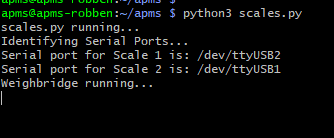
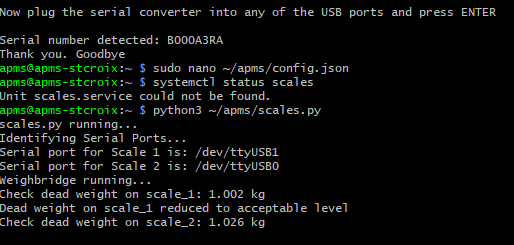
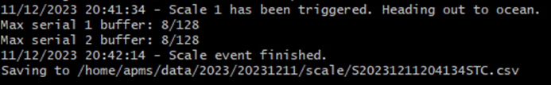
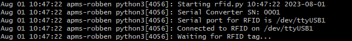
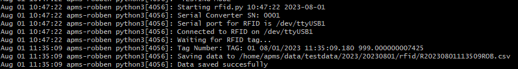
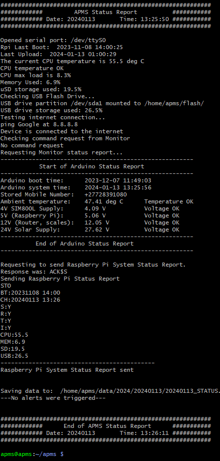
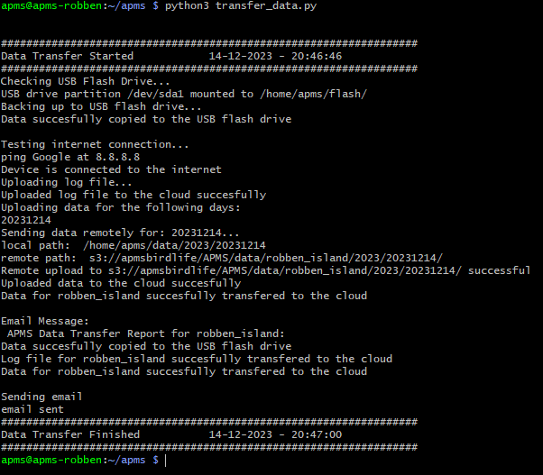

# Testing Each Script

Each part of the system can now be tested individually.

-   The main scripts are:

    -   scale.py

    -   rfid.py

    -   system_status_check.py

    -   transfer_data.py

    -   apms_email.py

    -   log.py

## Testing the scales.py script

Before testing, ensure the APMS is configured - See [Configuring the APMS](07_raspberry_pi.qmd#Configuring the APMS).

-   Plug both scales into their respective sockets.

-   Power up the APMS Main Unit

-   SSH into the Pi.

-   Check if the scales service is running in the background and stop the service if it is:

    -   Check with: 
```bash
systemctl status scales
```

    -   If active, stop the service: 
```bash
sudo systemctl stop scales
```

-   Ensure the indicators show weight readings of close to 0.000 kg (It should be within 1g after calibration)

-   Check the scale frequencies:

``` bash
python3 ~/apms/test_scale_frequency.py
```

-   Currently the scales are set to 100 Hz.

-   Check that the scale frequencies are within 1% (between 99 Hz and 101 Hz)

-   Run the scales script:

``` bash
python3 ~/apms/scales.py
```

-   You should see the following on the screen:

{width="600" fig-align="center"}

-   Put a [1kg]{.underline} weight on [scale 1]{.underline}.

-   As it is less than the weight of a penguin, and less than the weight specified in the config.json file, it should detect a high dead weight.

-   Check that it is indeed [scale 1]{.underline} showing the high dead weight (Fig. 64).

-   Remove the [1kg]{.underline} weight. A message should state the dead weight has reduced (Fig. 64).

-   Repeat for scale 2

{width="600" fig-align="center"}

-   Place a [5kg]{.underline} weight on [scale 1]{.underline}.

    -   As this weight is greater than the minimum penguin weight, an event should be started. As scale 1 was triggered first, it should indicate a penguin heading out to the ocean.

    -   Wait a few seconds and remove the 5kg weight. After removing the weight, there will be a slight pause and then the event should finish, and the data stored to a file. This pause is the time period set in the config file for "SCALE_EMPTY_TIME".

    -   A screenshot is shown below:

{width="600" fig-align="center"}

-   Repeat for [scale 2]{.underline}. This time, the system should detect [scale 2]{.underline} being triggered first, displaying a message that a penguin is coming back from the ocean. Remove the weight and wait for the event to finish.

The testing of the scales is now complete. The files generated in the above tests can be checked for accuracy after uploading them to the cloud using the `transfer_data.py` script (see section below).

## Testing the rfid.py script

The APMS picks up RFID tags via an external RFID reader made by BioMark (Model IS1001).

-   Before testing the rfid script, please ensure the BioMark Reader has been fully configured and the BioMark antenna installed. See [Configuring the BioMark Reader](09_biomark.qmd#Configuring the BioMark Reader).

-   Connect a cable between the mini-USB port on the BioMark Reader and the front USB port of the APMS main unit.

    -   If an APMS main unit is not being used, the Raspberry Pi will have to be powered by a 5V power supply and any USB port on the Pi can be used to connect to the BioMark Reader.

-   Power up the BioMark Reader and APMS main unit.

-   SSH into the Pi.

-   Check that the rfid service is not running in the background and stop the service if it is. Check with: 

```bash
systemctl status rfid
```

-   If active, stop the service: 
    
```bash
sudo systemctl stop rfid
```

-   Run the rfid script: 

```bash
python3 ~/apms/rfid.py
```

-   You should see the following on the screen (Fig. 66). Note that the RFID reader could be assigned to "*ttyUSB0"*, "*ttyUSB1"* or "*ttyUSB2"*.

{width="600" fig-align="center"}

-   Take a test tag and move it close to the antenna. The tag should be registered and saved to a file. This file can also be checked after uploading to the cloud. The tag should be read and printed out (Fig. 67).

{width="700" fig-align="center"}

## Testing the system_status_check.py script

The `system_status_check.py` script automatically runs every hour, at 10 past the hour. The script is used to monitor the health of the entire APMS. See Fig. 68 for a screenshot after running the script manually. The main features of the script are:

-   Send an SMS to the operator if the Raspberry Pi has rebooted.

-   Check Last time data was uploaded and backfill data if needed.

-   The script will check when last the data was uploaded to the cloud and if more than a day, the data transfer script will be executed to upload all outstanding data.

-   Check CPU temperature

-   If the CPU temperature exceeds the WARNING or DANGER thresholds, an email will be sent to the operator. Thresholds are set in the configuration file. See [Configuring the APMS](07_raspberry_pi.qmd#Configuring the APMS) and adjust `CPU_TEMP_WARNING` and `CPU_TEMP_DANGER` variables.

-   Checks CPU load and memory usage
-   Checks USB Flash drive is mounted and storage available
-   Tests the internet connection
-   Check if a BASH command has been received from Monitor and executes it (still in development)
-   Receives status report from Arduino Monitor (Used for Dashboard)
-   Sends a report to the Arduino Monitor

    -   Used when requesting a status report from the Monitor, via SMS.

All the information is logged to a daily system status file. This file will normally have 24 entries, one for every hour. On occasion, the request for a status report from the Monitor might fail. The operator should receive an email alert. If this happens, wait one hour and check if the next status report is received (at 10 past the hour). If not investigate.

The daily status file can be viewed with the `cat` function and files are located at:

~/data/[YEAR]/[YYYYMMDD]/[YYYYMMDD]*_STATUS.txt

For example: `cat ~/data/2023/20231230/20231230_STATUS.txt`

This file is uploaded to the cloud daily and most of the info on the Dashboard is obtained from this file.

To test the system_status_check.py script, do the following:

-   Run the script:

``` bash
python3 ~/apms/system_status_check.py
```

A typical output is shown in Fig. 68.

{width="600" fig-align="center"}

## Testing the transfer_data.py script

The APMS system stores data in three places. Initially, the raw files are saved to the internal micro-SD card of the Raspberry Pi. Every morning at 1AM the new data is transferred to the USB Flash drive and to the cloud. This upload time can be changed in the config file (`UPLOAD_HOUR`) If there is no internet connection or if the connection fails during data transfer, the *last_upload.txt* file will not be updated. The *last_upload.txt* file (located at *~/logs/last_upload.txt)* is checked by the `system_status_check.py` script that runs every hour.

The APMS uses AWS S3 for cloud storage. It is the responsibility of the administrator to manage the storage space available on the USB Flash drive and the internal micro-SD card. Both these parameters can be viewed on the dashboard and an alert is set for when either one reaches 75% capacity.

-   Ensure there are some data files to transfer and that the APMS has been configured. If you have already completed the testing of the [scales](10_testing.qmd#Testing the scales.py script) and [rfid](10_testing.qmd#Testing the rfid.py script) scripts, there should be some test files to transfer.

-   Run the data transfer script: 
```bash
python3 ~/apms/transfer_data.py
```

-   You should see something similar to the screenshot in Fig. 69.

{width="600" fig-align="center"}

-   Every time data is successfully uploaded, the file *~/logs/last_upload.txt* is updated.

-   To verify today's date and time was added to the bottom of the file after the transfer, run:

```bash
cat ~/logs/last_upload.txt
```

-   To check if the data transferred to the USB Flash drive:

    -   Ensure it is mounted. See [Set up the USB Flash Drive](07_raspberry_pi.qmd#Set up the USB Flash Drive).

    -   List the files in the scale and rfid data directory. For example, to list the files for today, the 15^th^ of December 2023. Adapt the lines below for the day the test was conducted.

```bash
ls ~/flash/2023/20231215/scale/
ls ~/flash/2023/20231215/rfid/
```

-   To check if the data transferred to the cloud:

    -   Open an S3 Client, such as S3 Browser.

    -   Check the scale and rfid data directory. For example, the scale and rfid directories for Stony Point, for the 15^th^ of December 2023, can be found at:

        -   *s3://apmsbirdlife/APMS/data/stony_point/2023/20231215/scale/*

        -   *s3://apmsbirdlife/APMS/data/stony_point/2023/20231215/rfid/*

## Testing the apms_email.py script

The apms_email.py script is a useful script that can be run from the command line to send an email. The script is also capable of sending a file as an attachment. It is important to check this script is working, as it will be used to email the operator in case of a fault.

The syntax is as follows: `python3 apms_email.py "body of email" \[path to attachment file\]`

example:

``` bash
python3 ~/apms/apms_email.py "this is the body of the email" ~/attachment.zip
```

If the script was not successful, examine the email information in the APMS configuration file. See [Configuring the APMS](07_raspberry_pi.qmd#Configuring the APMS)

## Testing the log.py script

The `log.py` script is crucial and should be used whenever a calibration is done, something unusual is detected with the system, when any structural/firmware/hardware changes are made, or when any general work is carried out. The log script will make a backup of the existing log file whenever a log entry is added. The backed-up log files can be found at: **~/logs/backup**

To use the log script:

-   SSH into the Pi.

-   Run the log script:

``` bash
python3 ~/apms/log.py
```

-   Follow the onscreen commands to log an entry

If this is the first log entry, a new log file will be created (~/logs/log.txt)

-   View the log file to check the entry was added

``` bash
cat ~/logs/log.txt
```

-   Edit the log file if a change needs to be made:

``` bash
sudo nano ~/logs/log.txt
```

The log entries are displayed on the Dashboard. 

## Assigning an RFID Tag to a Penguin

After the scale file is analysed and a list of penguins is generated, RFID tags can be assigned. For each penguin, a "crossing time" is calculated. A penguin crossing is defined as the period between first stepping on the scales until stepping off the scales. A single "crossing time" is calculated as halfway through the penguin crossing.

For each penguin, the crossing time is compared to the RFID timestamps to check if an RFID tag was picked up close to when the penguin crossed the scales (`RFID_TO_PENGUIN_INTERVAL` in the config file). By default, `RFID_TO_PENGUIN_INTERVAL` is set to 60 seconds.

The location of the RFID antenna is set in the config file for each site. Look for `'RFID_LOCATION': 'MIDDLE_ONLY'` near the bottom of `config.py`. The default is `'MIDDLE_ONLY'`, as this is the configuration for all new sites. This is not the case for older sites (see later in this chapter).

When `'MIDDLE_ONLY'` is given as the RFID antenna location, and no other RFID tags were recorded during the penguin's crossing, the algorithm can assign an RFID tag number to the penguin based on the following two scenarios:

1. **The tag is picked up during the jump from one scale to the other:** If a tag is picked up within the time period when the penguin is jumping from one scale to the other, the tag number is assigned to that penguin. This is also valid for a group of penguins, as we assume they move in single file over the scales. This is why it is important to ensure they move in single file when setting up the site: to avoid a penguin overtaking another and causing the event to be discarded or, worse, an incorrect RFID tag assigned to a penguin.
2. **The tag was picked up somewhere during the penguin's crossing (no other penguins crossing):** Sometimes, due to various circumstances, the antenna will pick up the tag too early, or even after the jump. If, however, we know the antenna is placed in between the scales, and no other penguins were crossing at the same time, we assume the tag belongs to that penguin.

Below is an example of two penguins heading out to the ocean. They each trigger the BioMark RFID reader as they jump from Scale 1 (colony side) to Scale 2 (ocean side), and thus both have RFID tag numbers assigned to them.

As a final "basic check", the algorithm checks for the following parameters set in the config file:

* The tag was picked up close to when a penguin was crossing (`RFID_TO_PENGUIN_INTERVAL`, default: 60 sec)  
* **AND** the tag was the only one for a certain period of time (`RFID_ISOLATION_INTERVAL`, default: 5 minutes)  
* **AND** it was the only scale file generated for a certain period of time (`SCALE_FILE_ISOLATION_INTERVAL`, default: 60 seconds)  
* **AND** there was only one penguin in the above-mentioned scale file.

## Error Handling

Penguins are wild animals and do not always walk nicely over the scales. Numerous situations can give rise to a scale file not being processed. A fault with the scale could also lead to data files that cannot be processed by the algorithm. 

When the algorithm discards a file, it moves it to an "error" directory with the name of the error. These files can then be viewed separately to learn more. The error directories are located in the "processed" folder at:

`~\APMS_DATA_PROCESSING\DATA\PROCESSED\[SITE NAME]\[YEAR]\[YYYYMMDD]\[ERROR DIRECTORY]`

Note that even though these are called "error" directories, it does not mean there is a hardware fault. For instance, if another animal triggers the scale, the algorithm detects that and moves it to the `NO_PENGUINS` error directory. Many of these errors are triggered based on parameters set in the config file.

When a site is not performing as expected, viewing these directories can often give clues as to what is wrong.

This system can be expanded, with different error states added as required. (Adding a visualization of this to the APMS Dashboard is a recommended future addition.)

### Error Directory Reference

| Error Directory | Reason |
| :--- | :--- |
| `TIMING_JUMP` | Large time difference between samples in scale file (> 1 second). |
| `FREQUENCY_ERROR` | Scale sampling period is not correct. Configured via `MAX_AVG_SAMPLING_PERIOD` and `MIN_AVG_SAMPLING_PERIOD`. |
| `NO_SUB_EVENTS` | No sub-events found in scale file. |
| `UNEQUAL_NUM_PENGUINS` | Number of penguins determined for Scale 1 differs from Scale 2. |
| `NO_PENGUINS` | List of penguins for Scale 1 and Scale 2 are both empty. |
| `DIRECTION_ERROR` | Different number of penguins going out to the ocean than coming back. |
| `PENGUIN_WEIGHT_ERROR` | Algorithm could not determine a weight from the provided data. |
| `WEIGHT_TOO_HIGH` | Weight was recorded as > 3x max penguin weight. Configured via `MAX_PENGUIN_WEIGHT`. |
| `OVERLOAD` | Weight exceeded scale maximum. Configured via `SCALE_OVERLOAD`. |
| `DUPLICATE_TIMESTAMPS` | Weights with the exact same timestamp found in scale file. |
| `LARGE_PENGUIN_WEIGHT_DIFFERENCE` | Large difference in weight between Scale 1 and Scale 2. Configured via `MAX_SCALES_DIFFERENCE_ALLOWED`. |
| `NO_DEAD_WEIGHT_EVENTS` | No periods found where the scale was reading a stationary dead weight. |
| `LARGE_DEAD_WEIGHT` | Weight on empty scale before/after event is higher than allowed. Configured via `MAX_DEAD_WEIGHT`. |
| `LARGE_DEAD_WEIGHT_DIFFERENCE` | Difference between dead weight before hopping on vs. after hopping off is too large. Configured via `MAX_DEADWEIGHT_DIFF`. |
| `NEGATIVE_JUMP_TIME` | Calculation of time taken to jump between scales returned a negative result. |
| `NEGATIVE_TIME_ON_SCALE` | Calculated time of jumping onto scale occurs *after* jumping off scale. 


## Testing the ON/OFF Button

Ensure the system is ready to be powered down before starting this test. Stop the rfid and scale services.

To test the ON/OFF button, simply press it. The Raspberry Pi should start shutting down if it was on. The lights will flash and eventually a solid red light will be seen. If the Raspberry Pi was off, it should boot up.

If it does not work, check the wiring of the button on the Monitor, as well as the configuration of GPIO on the Pi. See [Configure GPIO3 for Power ON/OFF](07_raspberry_pi.qmd#Configure GPIO3 for Power ON/OFF) for more info. Another way to isolate the fault is to power down the Pi via the Monitor command: `CMD:P`. If this works, the Pi has been configured properly and the problem lies elsewhere.

## Testing the update_system_time.py script

To prevent the system clock updating at random times, the updating of the system clock is handled by the update_system_time.py script. This is to prevent the clock updating while penguins are crossing. Causing timing errors. Files with timing errors will be rejected by the data processing algorithm, so to reduce the chance of this happening, a better time for updating the clock is chosen

This script runs every Monday, at 12:00. This is set in the crontab (see: [Configure the Crontab](11_crontab.qmd#Configure the Crontab)). The script checks that no penguins cross the scales for 10 minutes and then updates the time. Even though this is not foolproof, it provides a safer moment in time to update the clock.

To test, run the `update_system_time.py` script:

``` bash
sudo python3 ~/apms/update_system_time.py
```

The script will run, wait for 10 minutes, and update the system time.

To view previous times when the clock was updated, view the log file at: `~/logs/update_time.log`

## Configure Scripts as Services

For a new system, the rfid and scales scripts need to be configured to run in the background, as processes.

There are 2 main service files: scales.service and rfid.service. The service files are located at `~/apms/services/`. To perform these operations, ensure you SSH in locally, not via Tailscale.

Copy the 2 service files to the appropriate directory:

``` bash
sudo cp ~/apms/services/*.service /etc/systemd/system/
```

Start and enable each service:

``` bash
systemctl start scales
systemctl enable scales
systemctl start rfid
systemctl enable rfid
```

Check that the services are active by running:

``` bash
systemctl status scales
systemctl status rfid
```

Reboot the Pi:

``` bash
sudo reboot
```

Wait a minute and try to SSH in remotely (via the internet). If this works, you have successfully configured tmate as a service. SSH into the Pi, either locally or via tmate and check that the scales and rfid services are running.

``` bash
systemctl status scales
systemctl status rfid
```
