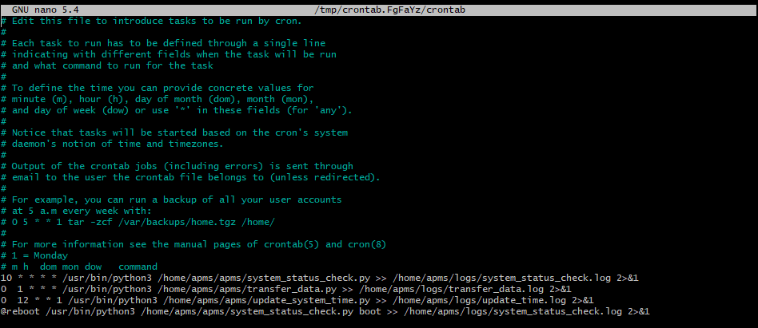
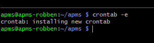

# Configure the Crontab

The crontab is a task scheduler and is responsible for the following:

-   Check the system every hour.

-   Transfer APMS data to the cloud every day.

-   Update the system clock once a week, and at boot.

The crontab sends the output of each script to a log file. See `~/logs/`

## Setting up the Crontab

To configure the crontab:

-   Run: 
```bash
crontab -e
```

-   If a message comes up asking to choose a text editor, choose `nano`.

-   Copy and paste the following into the text editor, at the bottom of the file. See Fig. 70 as an example.

```bash
10 * * * * /usr/bin/python3 /home/apms/apms/system_status_check.py >> /home/apms/logs/system_status_check.log 2>&1
0 1 * * * /usr/bin/python3 /home/apms/apms/transfer_data.py >> /home/apms/logs/transfer_data.log 2>&1
0 12 * * 1 /usr/bin/python3 /home/apms/apms/update_system_time.py >> /home/apms/logs/update_time.log 2>&1
@reboot /usr/bin/python3 /home/apms/apms/system_status_check.py boot >> /home/apms/logs/system_status_check.log 2>&1
```

{width="600" fig-align="center"}

-   Save and exit. (Hold **CTRL** and press **x** - Then press **y** to save - then press **Enter** to exit)

-   A message should state that the crontab has been successfully updated (Fig. 71).

{width="600" fig-align="center"}

## Testing the Crontab

To test whether the crontab is working correctly, view the log files of the scripts:

```bash
cat ~/logs/system_status_check.log
cat ~/logs/transfer_data.log
cat ~/logs/update_time.log
```