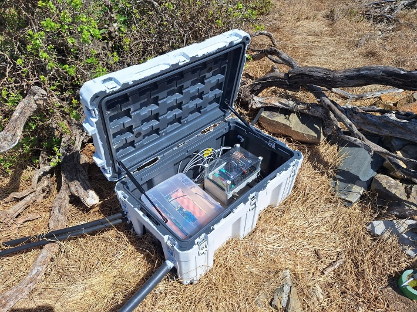
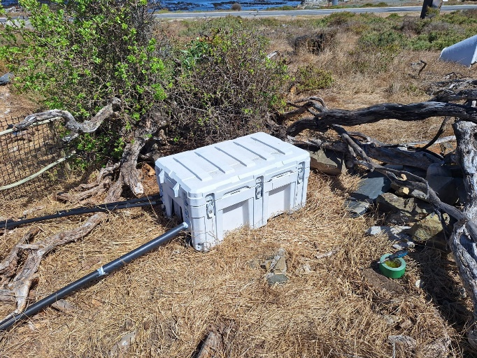
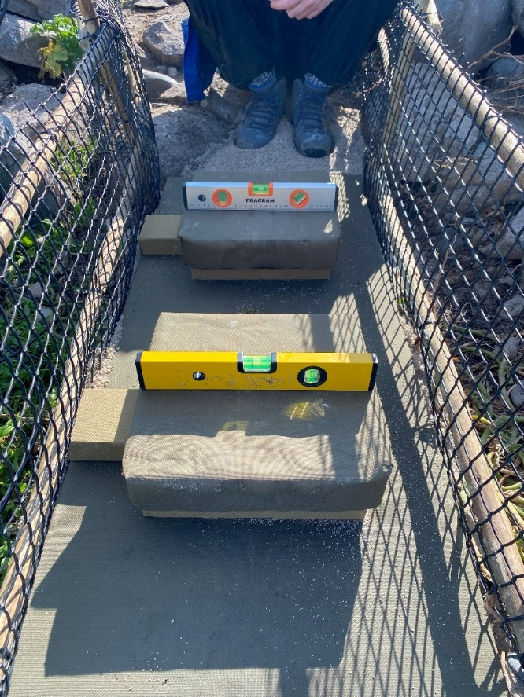
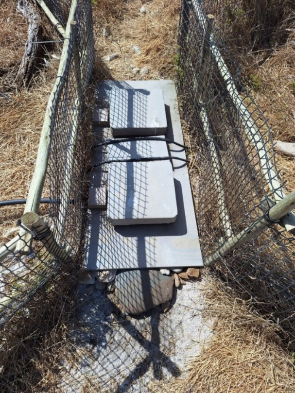
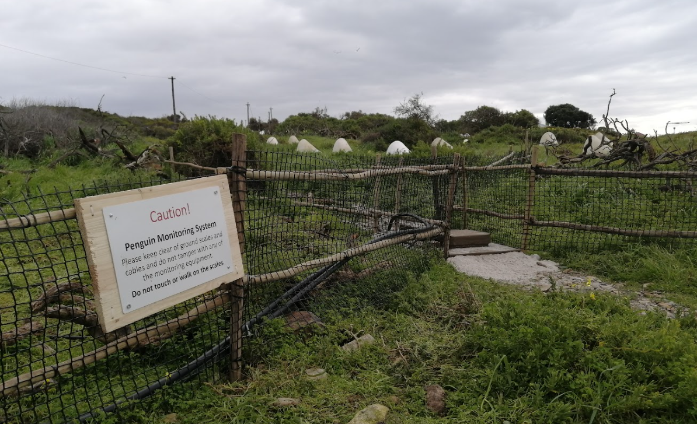

# Commissioning a New System in the Field

At this stage, it is assumed that a 24V solar power supply is available and that the entire system (Main Unit, Monitor, Scales, and BioMark RFID reader) has been assembled and bench-tested. This section describes what to evaluate when choosing a new field site and how to house all the electronics.

## APMS Location

When selecting an installation site for the APMS, ensure the following:

- **High Traffic:** Choose a path with a high rate of penguins crossing both to and from the ocean.
- **Cable Length (Scales to Main Unit):** Keep distance manageable. A 10m extension cable has been field-tested and works reliably.
- **Power Distance:** Account for the cable run between the 24V solar power supply and the Main Unit.
- **Cellular Signal:** Verify strong 4G/LTE coverage at the exact location where the 4G router and APMS Monitor will operate (test via [Speedtest.net](https://www.speedtest.net)).
- **Camouflage & Low Disturbance:** Minimize disturbance to the surrounding area. Penguins are sensitive to environmental changes and may bypass the weighbridge if a path looks unfamiliar. Ensure every inch of the scales platform is covered in dark green canvas to blend into the habitat.

## APMS Enclosure

Different site conditions require different housing strategies:

- **Stony Point:** Housed in a large steel box alongside the BioMark RFID reader.
- **Dassen Island, Dyer Island & Robben Island:** Uses a rugged 125L Skitch box. This provides enough interior volume for the APMS Main Unit, BioMark circuit board, and 4G indoor router. 
  - Drill entry holes for scale cables, the RFID antenna cable, and power lines. 
  - Pass cables through grommets or feed irrigation piping directly into the box. 
  - Seal cable entry points with silicone to prevent water ingress.
  - Where possible, angle entry pipes slightly **upward** into the box so water cannot run down the exterior pipe into the enclosure.
- **Bird Island:** Uses a smaller Skitch box with the BioMark reader housed in a separate enclosure.

::: {.callout-tip}
### Enclosure Heat & Mounting
Paint the exterior of plastic enclosures white to reflect solar radiation and lower internal temperatures. In high-wind locations (such as Bird Island), bolt the enclosure down securely to a solid base.
:::

{width=600 fig-align="center"}

{width=600 fig-align="center"}


## Wiring the Skitch Box

Once the box is positioned and irrigation entry pipes/grommets are installed, begin internal wiring:

1. **Power Feed:** Pass the 24V DC power wires from the solar supply through the irrigation pipe into the box. Split this feed to power both the APMS Main Unit and the BioMark Reader.
2. **Main Unit Power:** Solder a DC plug (`RS: 705-1519`) onto the incoming 24V power line and plug it into the Main Unit.
3. **BioMark Power:** Wire the BioMark reader through an inline circuit breaker, which also serves as a manual power switch.
4. **Router Power:** If using an indoor router, plug it into the 12V DC OUT socket. If using the Teltonika router, wire it to the 24V supply. Always check the power requirements of any device you install.
5. **RFID Antenna:** Feed the BioMark antenna cable into the box and connect it to the terminal block on the BioMark board.
6. **Data Link:** Connect a mini-USB cable (`RS: 822-3226`) from the mini-USB port on the BioMark reader to a USB-A port on the front of the Main Unit.

## Installing the Scales Platform

1. **Leveling:** The scales platform must be level. Use a spirit level across both dimensions of the frame. Use surrounding sand and rocks to create a flat, stable foundation.
2. **Cable Protection:** Run all scale cables inside irrigation piping back to the enclosure to protect them from weather and animal damage (especially where cable splices exist).
3. **Free Pan Movement:** Ensure the canvas-covered scale pans rest cleanly on their load cells without touching surrounding rocks, twigs, or vegetation. Contact with external objects will distort weight measurements.

{width=600 fig-align="center"}

4. **Antenna Placement & Tuning:** Lay out the BioMark RFID antenna loop. Avoid running the antenna wire parallel to power cables, and never let the antenna wire overlap itself. Perform a full frequency tune on the BioMark reader and verify detection distance using a test PIT tag.

{width=600 fig-align="center"}

5. **Calibration:** Once the platform is level and the RFID antenna is verified, calibrate the scales following the instructions in the section: [Routine Calibration of Scales](14_maintenance.qmd#Routine Calibration of Scales).

## Warning Sign Installation

A warning sign alerts visitors and field staff to keep clear of the sensitive monitoring equipment.

::: {.callout-warning}
### Security Consideration
While a sign deters accidental disruption, it can also draw unwanted attention to equipment in publicly accessible areas. The decision to erect a sign depends on local site security.
:::

* **Sign Graphics File Location:** `[TODO: Insert file path]`
* **Supplier Information:** `[TODO: Insert supplier info]`

{width=600 fig-align="center"}

## Final Checks and System Startup

Before powering on, verify the following pre-flight checklist:

- [ ] Solar power supply outputting stable 24V DC.
- [ ] All enclosures securely closed and latched (BioMark, APMS Main Unit, Router, Skitch Box).
- [ ] BioMark reader fully wired, configured, and seated in its final position.
- [ ] BioMark antenna zip-tied to mount, tuned, and field-tested with a PIT tag.
- [ ] Arduino Monitor active and SIM800L antenna oriented in final position.
- [ ] Router online with active cellular connection.
- [ ] Field site cleared of all metal tools, loose wire, and debris.
- [ ] Warning sign secured (if applicable).

### System Startup Sequence

To start the system cleanly, perform a full reboot to ensure all background scripts launch via `crontab` and `systemd`:

1. Establish an SSH connection to the Main Unit (locally via LAN or remotely via `Tailscale`).
2. Issue a system reboot:

```bash
sudo reboot
```
3. Wait a few minutes and ssh into the system via `Tailscale`.
4. Use the tmux commands to create windows to monitor the rfid and
    scales script

Example:

-   Hold **CTRL** and press **b** - Then release keys - Then press **%** to split screen vertically

-   Hold **CTRL** and press **b** - Then release keys - Then press **"** to split screen horizontally

-   Write the first entry into the log to state system is live: 

```bash
python3 ~/apms/log.py
```