# APMS Data Processing

The data processing section consists of the data processing script, the code necessary to display the data on the Dashboard and a script to generate graphs for a website. Instructions below are given for Linux, but the data_processing.py script can also be run on Windows.

## Overview

The data processing script has the task of taking in raw scale and RFID data and producing a csv file containing a list of penguins. The script can be used to process multiple days over any given date range. For the example below, only one day's data from one site is discussed. This process is repeated for all the days of all the sites requested.

## Install Python Packages

Install the latest version of Python if it is not installed already

```bash
pip install matplotlib
pip install pandas
pip install boto3
pip install scipy
```

## Download the Software from GitHub

To process and display the penguin data, download the code from [GitHub](https://www.github.com/apmsbirdlife).

-   See the section [Configure Git and Download Firmware](07_raspberry_pi.qmd#Configure Git and Download Firmware) to authenticate. Clone the directory from GitHub into the `home` folder. This will automatically create a directory called `apms_data_processing`.

Run the following code to clone and download the software:

```bash
cd ~
git clone git@github.com:apmsbirdlife/apms_data_processing.git
```

## Editing the config file

All the main parameters for data processing and the Dashboard must be set in the config file. An example file is included, called "config_example.py". Edit this file and change the parameters as required. Many of the settings can be left with their default values. Rename the newly edited "config_example.py" file to `config.py` when you are done. Ensure this file is stored in ~/apms_data_processing, together with all the rest of the code.

## Data Processing Script Usage

To use the script, it is assumed that you have:

 - Set up access to the cloud, as described in [AWS S3 Cloud Storage](13_data_processing.qmd#AWS S3 Cloud Storage)

 - Configured the config.py file as described in [Editing the config file](13_data_processing.qmd#Editing the config file)

To process data using the script, use the following syntax:

```bash
python3 process_data.py SITE DATE RANGE
```

where:

-   [SITE] can be left blank to process data for all sites, or a site name can be given.

    -   The following site names can currently be used:

        -   "stony_point"

        -   "bird_island"

        -   "dyer_island"

        -   "robben_island"
        
        -   "dassen_island"

-   [DATE RANGE] can either be left blank, or a date range such as "20230601-20231101" can be given, or the number of days back, e.g. "5". If left blank, it will process only the previous day's data.

Some examples

*Process the last 7 days' worth of data for Stony Point:*

```bash
python3 process_data.py stony_point 7
```

*Process yesterday's data for Bird Island:*

```bash
python3 process_data.py bird_island
```

*Process yesterday's data for all the sites:*

```bash
python3 process_data.py
```

*Process data from the first of September 2023 till the first of November 2023, for Dyer Island:*

```bash
python3 process_data.py dyer_island 20230901-20231101
```

This will create a CSV file for each day. The CSV file will be stored in the "processed" directory. An example of a CSV file and where it is stored, is shown below in the following directory path:

~/apms_data_processing/data/processed/stony_point/2023/20231227/stony_point_20231227_processed_data.csv

## How the Script Works

Below are the basic steps for the script to process penguin data for the previous day.

1.  Download the previous day's scale and RFID data from the cloud (Amazon S3).

    a.  This gets stored in ~/apms_data_processing/data**/downloaded_raw/**. 

2.  Copy the raw files to ~/apms_data_processing/data**/processing/** directory for further processing.

3.  Each CSV scale file contains data for both scales and can be seen as one event.

4.  For each scale, the event is broken up into sub events.

5.  The penguins in each sub event are added to the list of penguins for that scale.

6.  The lists from both scales are compared and the direction and weight of each penguin are determined.

7.  The penguins for each event are added to the list of penguins for the day.

8.  The list of penguins for the day is compared to a list of RFID tags for the day.

9.  Penguin weights are linked to RFID tags where appropriate.

10. A CSV file is generated with a list of penguins and their weights. The list contains the following:

    a.  Time of crossing

    b.  RFID tag (if assigned)

    c.  Penguin weight

    d.  Weight difference between scale 1 and scale 2

    e.  Direction ("out to ocean" or "back from ocean")

## Downloading the Raw Data

The data of the requested days are automatically downloaded when executing the `process_data.py` script.

While testing, if data has already been downloaded, set the `DOWNLOAD_ALL` variable to `False` in the `config.py` file. Both Scale and RFID data is downloaded.

The data is downloaded to: ~/apms_data_processing/data**/download_raw/**

## Scale Files

The Scale Files are CSV files, containing the raw data sampled by the scales. The weights are sampled at 100 times per second. It consists of 3 columns, a timestamp and the weights of the two scales. The timestamp is in seconds (seconds since 1 Jan 1970). The weights are in kg, to the third decimal (1 gram accuracy). The weights are sampled at 100 Hz (the scales are capable of up to 300 Hz and this could be used if higher resolution is required). An example can be seen below. Note that when hovering around 0.000 kg, negative values are possible. Also note the timestamp between samples is not exactly 10 ms (100Hz). The samples are spaced out evenly by using the first and last time stamp, before processing starts. The frequency is checked and should be above 99% (ie 99Hz) to be processed.

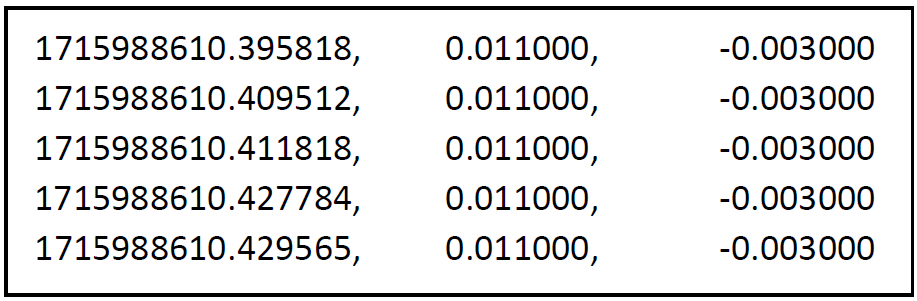{width="400" fig-align="center"}

A Scale File is created when a weight, greater than the minimum penguin weight, is applied to one of the scales. This minimum weight (`MIN_PENGUIN_WEIGHT`) is set in the APMS config file. See: [Configuring the APMS](07_raspberry_pi.qmd#Configuring the APMS). The Scale File ends when the scale is empty for longer than a preset time (`SCALE_EMPTY_TIME` in the APMS config file). The same amount of time before the scale was triggered is also added to the end of the file.

The scale files are unique in that their filenames contain a wealth of information. A typical scale file filename looks like this: 

**S20231206033841ROB.csv**

-   Where:

    -   The "S" signifies it's a scale file (RIFD files start with "R")

    -   The date the follows in the format "YYYYMMDDHHMMSS"

    -   In our example 03:38:41 on the 6^th^ of December 2023

    -   Followed by the site code.

        -   STO = Stony Point

        -   BIR = Bird Island

        -   DYE = Dyer Island

        -   ROB = Robben Island
        
        -   DAS = Dassen Island

## Determining the Direction of a penguin

An example of a Scale File is shown below. The top picture is Scale 1 (Colony Side) and the bottom picture is Scale 2 (Ocean Side). This shows two penguins, jumping on Scale 1 first, then Scale 2. They are thus heading out to the ocean. This is how the penguin direction is determined.

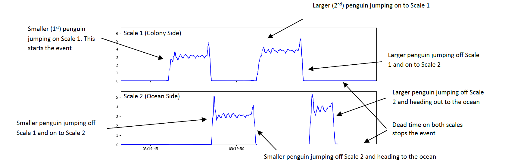{width="700" fig-align="center"}

## Determining the Weight of a penguin

Each Scale File consists of two events, one for each scale. The data is analysed and a separate penguin list is generated for each scale. The two lists are then compared and if certain checks are passed, they are combined to form a penguin list for the entire Scale File.

**This hinges on the fact that we assume penguins will cross the scales in single file and not go past each other. This is why it is important to ensure the weighbridge and path is narrow enough to funnel them one by one.**

Each scale event is broken up into sub events which are then analysed. Below is a simple case with two sub events per scale. In this case, each sub event contains only one weight. Every sub event has deadweight before and after it. There will thus be one more deadweight than sub events, in the event.

The example above is shown again, indicating the different weights identified

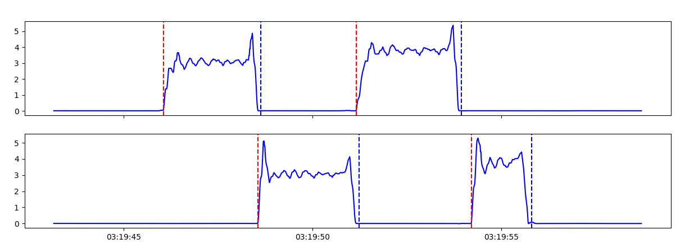{width="600" fig-align="center"}

-   The weight inside each sub event is then identified and analysed.

The weight is categorised as one of the following:

-   **Too Short:** Too little time spent on scale. This weight is not used.

-   **Static Weight:** Deadweight or animal stationary. Average taken.

-   **Dynamic Weight:** Not Static. Oscillatory. Explained below.

The first weight of the example above has been extracted from the sub event and can be seen below. It is a *Dynamic Oscillatory weight* and the peaks are identified and used to determine the weight.

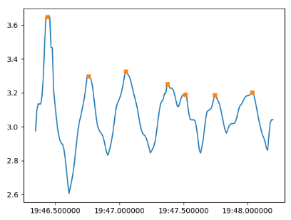{width="400" fig-align="center"}

As noted in \[REFERENCE\], as the penguin is walking, one can assume the penguin's vertical velocity will be the same between two points one period apart. We will choose the peaks as they are easy to identify. The mass of the penguin during the event is constant and as the momentum is given by mass times velocity, and the velocity is the same at the peaks, we can say the momentum of the penguin in the vertical direction is the same at the peaks. There is thus no change in momentum between the peaks, i.e, the [impulse is zero]{.underline}. The impulse is given as the integral of the force on the penguin, with respect to time.

$$J = \ \int_{}^{}{F_{net}(t)\ dt}$$

The net force on the penguin, at any point in time, is the force of the scale on the penguin, minus the force of gravity on the penguin. (As these are the only two forces acting on the penguin, ignoring air resistance).

Also, the force of gravity on the penguin does not change as

$$F_{g} = m_{penguin}*g$$

both of which we assume are constant during the event.

If we take the impulse as zero between the peak at $t_{1}$ and $t_{2}$, as discussed above, we get:

$$0 = \ \int_{t1}^{t2}{{(F}_{scale}(t) - F_{g})}dt$$

Where $F_{scale\ }(t)\ $is the force of the scale on the penguin.

We know the force of the penguin on the scale is opposite in sign but equal in magnitude to the force of the scale on the penguin.

$${\ \ F}_{penguin - on - scale} = - {\ \ F}_{scale}$$

Our scales provide $m(t)$, the mass on the scale, recorded every 10ms.

We know

$$F_{penguin - on - scale}(t) = m(t)*g$$

We thus get:

$${\ \ F}_{scale} = \  - m(t)*g$$

Substitution then gives *\
*$$0 = \ \int_{t1}^{t2}{\left( - m(t)*g - m_{penguin}*g \right)dt}$$

Solving for the mass of the penguin, $m_{penguin}$ , we get:

$$m_{penguin} = \frac{\int_{t1}^{t2}{m(t)\ dt}}{t_{2} - t_{1}}$$

This integral is computed numerically and this is how the mass of the penguin is determined using two peaks.

The penguin gives many steps and thus the mass is recalculated between the peaks and an average is taken. More sophisticated techniques can be used but this first approach gave adequate results (See: Weideman *et al.* in prep).

After all the sub events have been analysed for Scale 1 a penguin list is created. The same process is then repeated for Scale 2. The two penguin lists are then compared. If they contain the same number penguins and if the difference in weight readings for the penguins are low enough (`MAX_SCALES_DIFFERENCE_ALLOWED` setting in the config file), they will be added to the total penguin list for the Scale File. The output of the algorithm for the two penguins above, can be seen below (Fig. 80).

The time given is when the penguin first steps on the scale (Scale 1 if going out to the ocean and Scale 2 if coming back from the ocean) As there were no RFID tags picked up, the penguin ID 's are given as 0 and 1. This will be replaced by an RFID tag number if applicable. See [Assigning an RFID Tag to a penguin](13_data_processing.qmd#Assigning an RFID Tag to a penguin).

Another example can be seen below, of three penguins walking over the scales. The top graph is Scale 1 (Colony Side) and the bottom graph is Scale 2 (Ocean Side). Note the peak on Scale 1 when both penguins were on the scale. On Scale 2, one can see that one penguin was busy jumping off as another was jumping on.

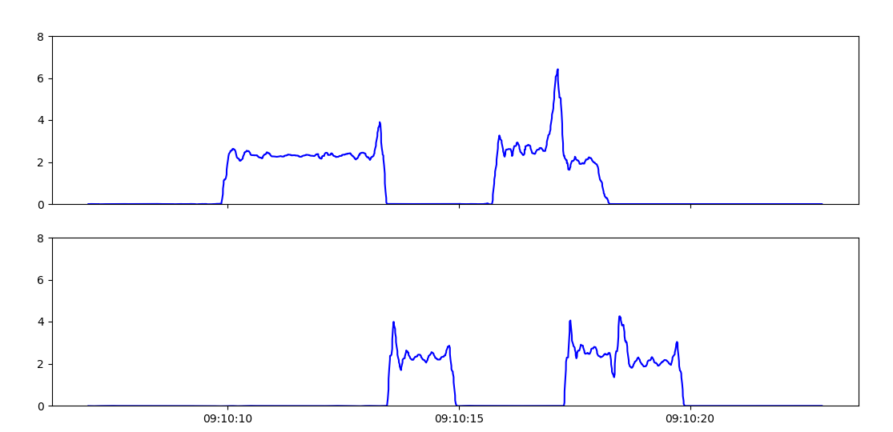{width="700" fig-align="center"}

{width="700" fig-align="center"}

| Penguin ID | Weight (kg) | Weight Type | Date Time (UTC+2) | Direction | Scale Diff (kg) |
|:---:|:---:|:---:|:---:|:---:|:---:|
| 0 | 2.322 | avg_dynamic | 2023-12-05 09:10:12 | Out to ocean | -0.0071 |
| 1 | 2.624 | avg_dynamic | 2023-12-05 09:10:17 | Out to ocean | -0.0373 |
| 2 | 2.053 | avg_dynamic | 2023-12-05 09:10:18 | Out to ocean | -0.0318 |

: Automated weighbridge measurements for penguins featured in Fig. 81. {#tbl-penguin-weights}

## Assigning an RFID Tag to a penguin

After the scale file is analysed and a list of penguins is generated, RFID tags can be assigned. For each penguin a "crossing time" is calculated. A penguin crossing is defined as the period between first stepping on the scales until stepping off the scales. A single "crossing *time*" is calculated as halfway through the penguin crossing.

For each penguin, the crossing time is compared to the RFID timestamps to check if an RFID tag was picked up close to when the penguin crossed the scales. (`RFID_TO_PENGUIN_INTERVAL` in the config file). By default, `RFID_TO_PENGUIN_INTERVAL` is set to 60 seconds.

The location of the RFID antenna is set in the config file for each site. Look for `rfid_location : middle_only` near the bottom of `config.py`. The default is `middle_only`, as this is the configuration for all new sites. This is not the case for older sites, see later in this chapter.

When `middle_only` is given as the RFID antenna location, and no other RFID tags were recorded during the penguin's crossing, the algorithm can assign a RFID tag number to the penguin based on the following two scenarios

1.  The tag is picked up during the jump from one scale to the other.

If a tag is picked up within the time period when the penguin is jumping from one scale to the other, the tag number is assigned to that penguin. This is also valid for a group of penguins, as we assume they move in single file over the scales. This is why it is important to ensure they move in single file when setting up the site, to avoid a penguin overtaking another and causing the event to be discarded or worse, an incorrect RFID tag assigned to a penguin. See example below (Fig. 82).

2.  The tag was picked up somewhere during the penguin's crossing. No other penguins crossing.

Sometimes, due to various circumstances, the antenna will pick up the tag too early, or even after the jump. If, however, we know the antenna is placed in between the scales, and no other penguins were crossing at the same time, we assume the tag belongs to that penguin.

Below is an example of two penguins heading out to the ocean. They each trigger the BioMark RFID reader (red line in Fig. 82) as they jump from Scale 1 (colony side) to Scale 2 (ocean side) and thus both have RFID tag numbers assigned to them.

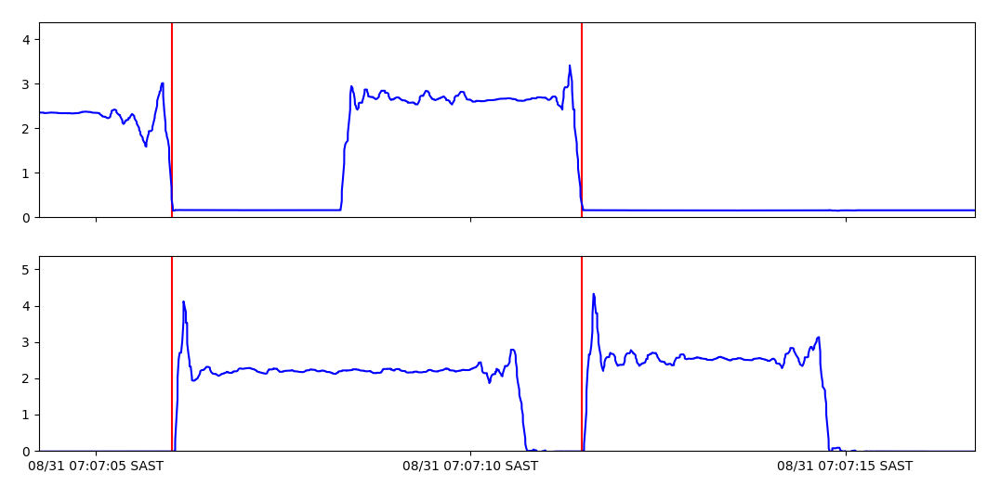{width="700" fig-align="center"}

:::{.callout-note icon=false}
## Basic Validation Configuration Checks

The algorithm verifies all of the following conditions before accepting a reading. These parameters can all be configured in the config file:

* **`RFID_TO_PENGUIN_INTERVAL`** *(Default: `60 sec`)*  
  Tag detected close to the penguin crossing time.
* **`RFID_ISOLATION_INTERVAL`** *(Default: `5 minutes`)*  
  Tag was the only one detected within this window.
* **`SCALE_FILE_ISOLATION_INTERVAL`** *(Default: `60 seconds`)*  
  Only one scale file generated within this window.
* **Single Penguin Rule** *(Enforced by algorithm)*  
  There must be only one penguin recorded in the generated scale file.
:::

## Error Handling

Penguins are wild animals and they do not always walk nicely over the scales. Numerous situations can give rise to a scale file not being processed. A fault with the scale could also lead to data files that can not be processed by the algorithm. When the algorithm discards the file, it moves it to an "error" directory with the name of the error. These files can then be viewed separately to learn more. The error directories are in the "processed" folder. See below for the path.

***\~\\apms_data_processing\\data\\processed\\ \[site name\] \\ \[YEAR\] \\ \[YYYYMMDD\] \\ \[ERROR DIRECTORY\]***

Note that even though these are called "error" directories, it does not mean there is a fault. For instance, if another animal triggers the scale, the algorithm should detect that and move it to the "no_penguins" error directory. Many of these errors are based on parameters in the config file. See [Configuring the APMS](07_raspberry_pi#Configuring the APMS).

When a site is not performing as expected, viewing these directories can often give clues as to what is wrong.

This can be added to, with different error states added as required. The current error directories are as follows:

| Error Directory | Reason |
|:---|:---|
| timing_jump | Large time difference between samples in scale file (greater than 1 second). |
| frequency_error | Scale sampling period is not correct. Set in config file: `MAX_AVG_SAMPLING_PERIOD` and `MIN_AVG_SAMPLING_PERIOD`. |
| no_sub_events | No sub events found in scale file. |
| unequal_num_penguins | Number of penguins determined for Scale 1 differs from the number determined for Scale 2. |
| no_penguins | List of penguins for scale 1 and scale 2 are both empty. |
| direction_error | Different number of penguins going out to the ocean than coming back. |
| penguin_weight_error | Algorithm could not determine a weight from the provided data. |
| weight_too_high | Weight was recorded as more than 3x max penguin weight. Set in config file: `MAX_PENGUIN_WEIGHT`. |
| overload | Weight exceeding scale maximum. Set in config file: `SCALE_OVERLOAD`. |
| duplicate_timestamps | Weights with the same timestamp found in scale file. |
| large_penguin_weight_difference | Large difference in weight between scale 1 and scale 2. Set in config file: `MAX_SCALES_DIFFERENCE_ALLOWED`. |
| no_dead_weight_events | No periods found where the scale was reading a stationary dead weight. |
| large_dead_weight | Weight on empty scale before or after event is higher than the allowed "dead weight". Set in config file: `MAX_DEAD_WEIGHT`. |
| large_dead_weight_difference | Difference between the dead weight on the scale before the penguin jumps on and after it jumps off is too large. Set in config file: `MAX_DEADWEIGHT_DIFF`. |
| negative_jump_time | Time calculation of time taken to jump from one scale to the other gave a negative result. |
| negative_time_on_scale | Time of penguin jumping on to the scale is [after]{.underline} time of penguin jumping off scale. |

: Summary of scale error directories and their definitions. {#tbl-error-directories}


## APMS Dashboard

The APMS Dashboard allows the operator to view the health of the system at each site. The Dashboard uses the processed data files to display penguin data. The data processing script must thus be fully functioning before setting up the Dashboard. See [Data Processing Script Usage](13_data_processing#Data Processing Script Usage). The instructions that follow explains how to install the dashboard on a machine running Ubuntu.

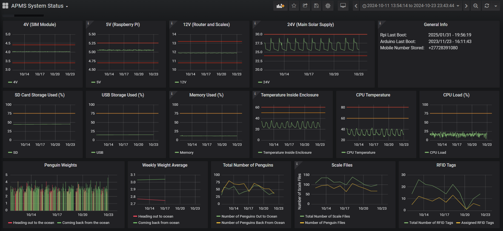{width="700" fig-align="center"}

### Install Ubuntu

To install Ubuntu, use the Rufus application and write an Ubuntu image to it. The current versions are stored on the cloud, replace in future with newer versions if needed.

-   Rufus can be downloaded here: [Rufus download](https://rufus.ie/en/)
    -   The software is also saved here on the server: *s3://apmsbirdlife/APMS/software/Rufus_and_Ubuntu/rufus-4.1.exe*

-   Ubuntu can be found at [Download Ubuntu](https://ubuntu.com/download/desktop)

-   Download both rufus and the Ubuntu image to a local directory on
    your machine.

-   Get a Flash Drive. **Note all data will be deleted on this Flash
    Drive.**

-   Run Rufus and select the Flash Drive under "*device"*.

-   Under "*boot selection"* click "*SELECT*" and select the Ubuntu
    image you downloaded.

-   Leave all the other settings as they are and click "*START"*. This
    will create the Ubuntu Flash Drive.

Insert the Flash Drive into the machine where Ubuntu will be installed, reboot and follow the onscreen instructions to install Ubuntu. After successfully installing Ubuntu, you will restart and go into the Desktop. For more information on installing Ubuntu, see this online [tutorial](https://ubuntu.com/tutorials/install-ubuntu-desktop#1-overview).

### Install Influx DB

InfluxDB is the database that will hold all the processed data, for displaying on the Dashboard.

The instructions below will be executed from a terminal.

-   To open a terminal from anywhere on Ubuntu, press **CTRL + ALT + t**

Run the following commands to install and configure InfluxDB: 

```bash
# Update local package index
sudo apt-get update

# Install the InfluxDB database service
sudo apt install -y influxdb

# Start the InfluxDB service immediately
sudo systemctl start influxdb

# Enable InfluxDB to launch automatically on system boot
sudo systemctl enable influxdb

# Install the InfluxDB command-line client CLI tool
sudo apt install -y influxdb-client
```

### Install Grafana Server

Grafana is the graphical interface to display the data in the database, what the user see's and interacts with. To run the Grafana Dashboard, a Grafana server should be installed and configured.

```bash
# Update local package index
sudo apt-get update

# Install the Grafana server package
sudo apt-get install -y grafana

# Start the Grafana server service immediately
sudo systemctl start grafana-server

# Enable Grafana server to launch automatically on system boot
sudo systemctl enable grafana-server.service
```

### Set up the Dashboard

To display anything on the Dashboard, the data must first be processed. This is explained in Data Processing Script Usage.

The script `dashboard.py` is then used to read the processed data into InfluxDB, with it eventually being displayed on Grafana. The IP address is needed to configure the Grafana dashboard. To find the IP address of the machine where Grafana is running, go into a terminal and type:

```bash
ifconfig
```

Below is an example showing the output of `ifconfig` and where to find the IP address.

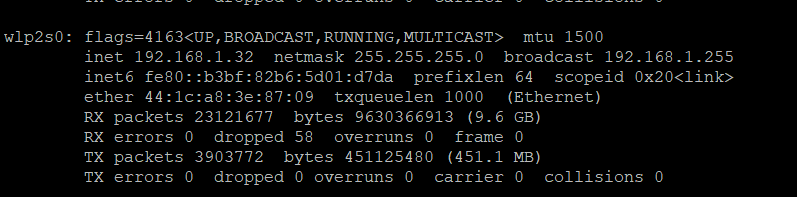{width="600" fig-align="center"}

Add this IP address to the `HOST_IP` parameter in the configuration file.

The usage of the dashboard script is the same as `process_data.py`. That is: `python3 dashboard.py SITE DATE_RANGE`. See* [Data Processing Script Usage](13_data_processing.qmd#Data Processing Script Usage) for examples.

In a browser of any computer on the network, including the one where Grafana has been installed type the IP address, followed by ':3000'. For example: <http://192.168.1.32:3000>.

This will open the Grafana page. If prompted for a password, enter "admin" for username and "admin" for password. This password can be changed if required.

Grafana must now be configured to display data from InfluxDB. Click on settings, then "Add data sources". Select InfluxDB and under "URL" enter the IP address of the server, or just <http://localhost> if it is the same machine as where InfluxDB is installed.

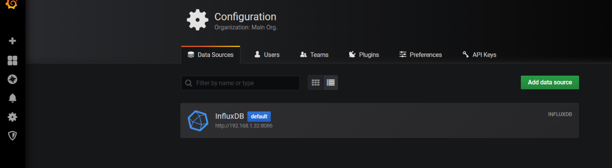{width="600" fig-align="center"}

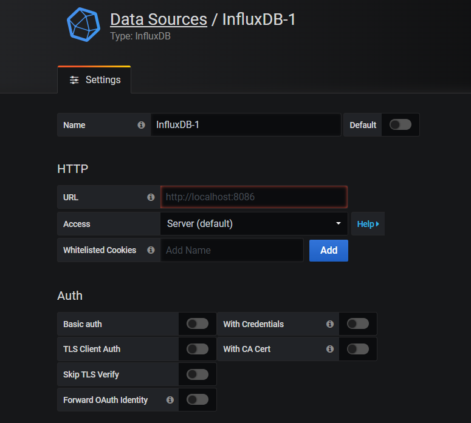{width="400" fig-align="center"}

The final step is to load the APMS Dashboard. Click on the PLUS found in the top left area and click "Import". In the text box provided, copy and paste the JSON code from the APMS_Dashboard.JSON file located at: ~/apms_data_processing/APMS_Dashboard.JSON.

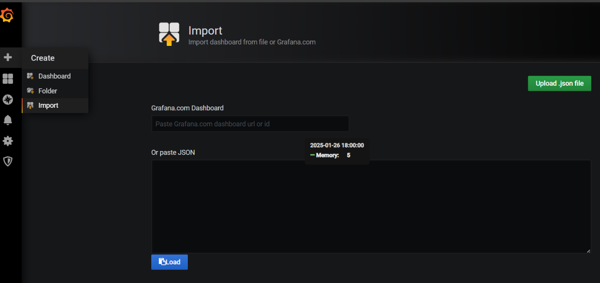{width="600" fig-align="center"}

Click Load. If data has been loaded into the database as described earlier, using the `dashboard.py` script, it should be displayed on the Dashboard.

### Automatic Dashboard Update

The script `process_and_display.sh` can be added to the crontab to enable the system to process the data from all the sites and load it to influx. For more information regarding the crontab, see [Configure the Crontab](11_crontab.qmd#Configure the Crontab). Note that whenever new sites are added or removed that this file has to be edited to reflect those changes.

Edit the Crontab: 

```bash
crontab -e
```

Add this line to the bottom: 

```bash
0 6 * * * /usr/bin/bash ~/apms_data_processing/process_and_display.sh
```

This will run the script at 6 AM every morning and update the dash.