# Maintenance

When visiting a site always remember to log everything you do, even though it might seem insignificant.

Check the following an:

-   Tighten stay ropes (where applicable)

-   Check outdoor router antennas and masts are secure (where applicable)

-   Check for water ingress into the Skitch Box

-   Check RFID antenna is still in good condition

-   Check the height at which an RFID test tag is picked up.

## Cleaning and Checking the scales

-   Clean the scales whenever visiting the site. As long as very little pressure is applied to the scales themselves, the system does not need to be turned off and no penguins will be registered

-   Check around the scales and ensure no branches or debris are touching the scale pans. Anything touching the pans on the sides will alter the weight reading. Sand on top of the scales (if not too excessive) is not a problem.

-   Check that the canvas is still in good condition and not torn/peeling off. Replace as necessary.

## Routine Calibration of Scales
R&D Weighing recommends the scales be calibrated every 3 to 4 months to ensure accuracy. However, some sites may require you to calibrate it more often, and when the equipment starts getting older it's recommended to calibrate more frequently. Version 1 of the APMS used the Laumas TLB485 scale indicators whereas as of 2026 BirdLife has moved on to using the General Measure GMT-X1 indicators which has more functionalities. Below are the calibration instructions for both of these. Always stop the `scales.py` script before starting with calibrations.

```bash
sudo systemctl stop scales
```

### Calibration Data Sheet

A data sheet for field use can be downloaded from here: 

  - [APMS Calibration Datasheet (PDF)](_book/files/APMS_Calibration_datasheet.pdf) 
  
  - [APMS Calibration Datasheet (Word)](_book/files/APMS_Calibration_datasheet.docx) 

### General Measure GMT-X1 Indicators
To check if the system needs to be calibrated, place a 1kg and 5kg (6kg combined) weight on each scale and observe the readings on the scale indicators. If the reading is out by more than 5g, recalibrate. The wind can have a huge influence on the scales and thus [only calibrate on good weather days]{.underline}.

There are two scales at every site: Scale 1 (colony side) and Scale 2 (ocean side). Both are zeroed (tared) and calibrated in exactly the same way, one after the other. Follow the steps below in order and record every reading on the data sheet as you go, do not rely on memory.


#### Record BEFORE readings (no calibration yet)

First ensure the `scales.py` script has been stopped before recording weight readings. With the scale in its current, uncalibrated state, record the reading shown for each of the following, in this order:

- No weight on scale 1 --- record the reading.

- No weight on scale 2 --- record the reading.

- Place the 1 kg weight on scale 1 --- record the reading.

- Place the 1 kg weight on scale 2 --- record the reading.

- Remove the 1 kg weight. Place the 5 kg weight on scale 1 --- record the reading.

- Place the 5 kg weight on scale 2 --- record the reading.

- Place the 1 kg and 5 kg weights together on scale 1 (i.e., 6 kg) --- record the reading.

- Place the 1 kg and 5 kg weights together on scale 2 (i.e., 6 kg) --- record the reading.

- Remove all weights from the scale.

#### Clean the scales

Remove any sand build up, sticks or debris that are on or around the scales. To do this, remove the scale pans and sweep out the sand that's accumulated with your fingers or with a paint brush. Take care when you work around the cables as strong pressure on the cables can break or damage them and then the entire scale/loadcell would need to be replaced.

#### Zero (tare) the scales

We will first zero scale 1 (colony side) and then the exact same steps will be done for scale 2 (ocean side).

1.  Press the Enter button (**ENT**) to open the menu.

2.  Press the right arrow to go to **2xx Weight&CAL** and press Enter (**ENT**).

    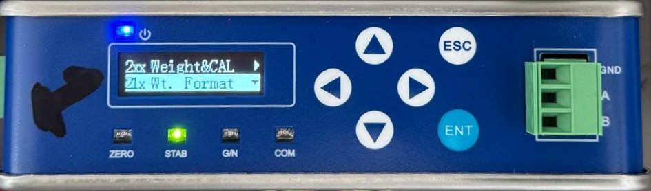{width="550" fig-align="center"}

3.  Press the down arrow to go to **22x CAL Zero** and press Enter (**ENT**).

    {width="550" fig-align="center"}

4.  It should now display **221 Auto Capture** --- press Enter (**ENT**).

    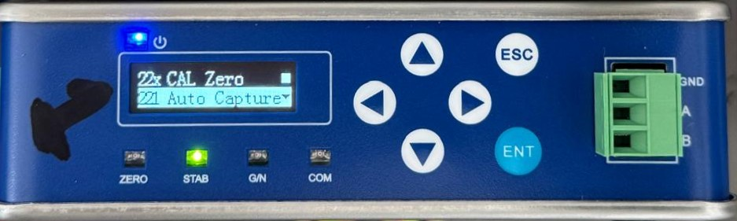{width="550" fig-align="center"}

5.  It should now display the weight reading in millivolts. Wait for a drop in the wind, or for the green stable weight reading light (**STAB**) to come on, then press Enter (**ENT**) immediately to set the new zero point.

    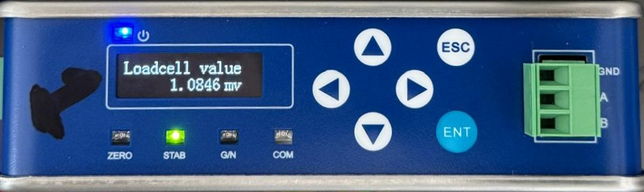{width="550" fig-align="center"}

6.  You should see **Set Successfully** displayed on the screen and it should then return to the **22x CAL Zero** menu. Press Escape (**ESC**) to go back to the previous menu (**2xx Weight&CAL**) for calibration (Step 5 below).

    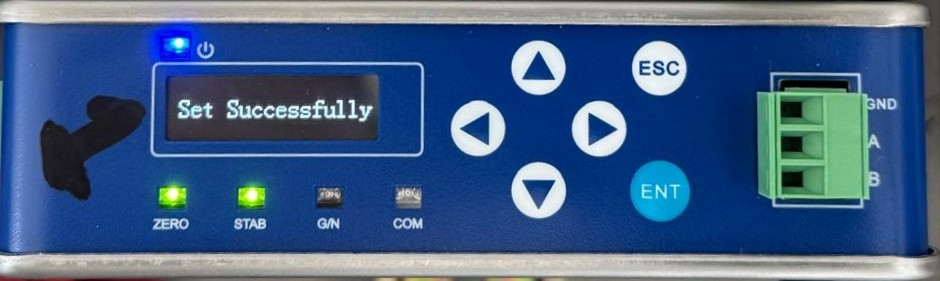{width="550" fig-align="center"}

7.  Once you have zeroed (tared) scale 1, **repeat the exact same steps for scale 2.**

#### Calibrate the scales

We will first calibrate scale 1 (colony side) and then the exact same steps will be done for scale 2 (ocean side).

1.  In the **2xx Weight&CAL** menu, go down to **23x CAL Weight** and press Enter (**ENT**).

    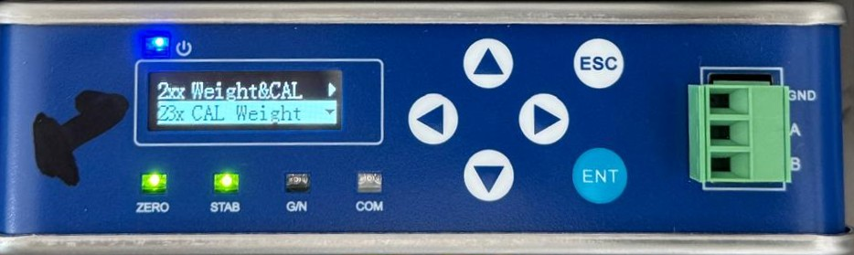{width="550" fig-align="center"}

2.  You should now see **231 Weight CP1** displayed on the screen, press Enter (**ENT**).

    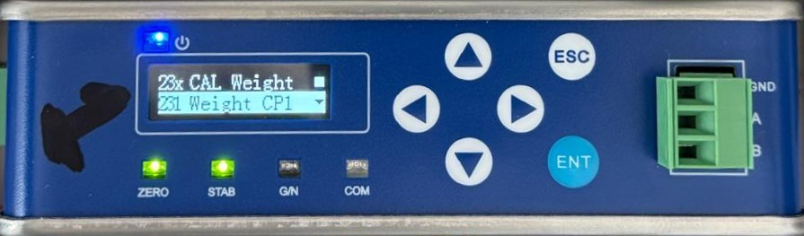{width="550" fig-align="center"}

3.  You will see the millivolts as read by the loadcell displayed at the top of the screen. At the bottom, it will first show 000.000. Put the 1 kg weight on scale 1. You will note that the millivolts have increased. [Note the millivolts may be slightly different than the picture below.]{.underline}

    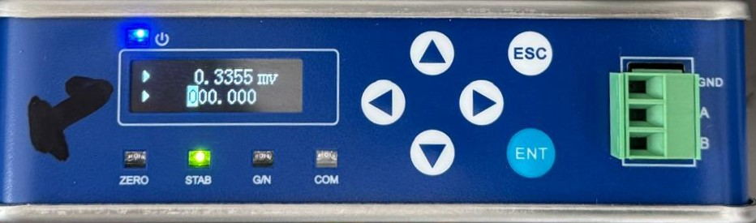{width="550" fig-align="center"}

4.  Use the right arrow to move the cursor to the third 0 and then press the up arrow to adjust it to the weight that's on the scale, i.e., 1 kg.

    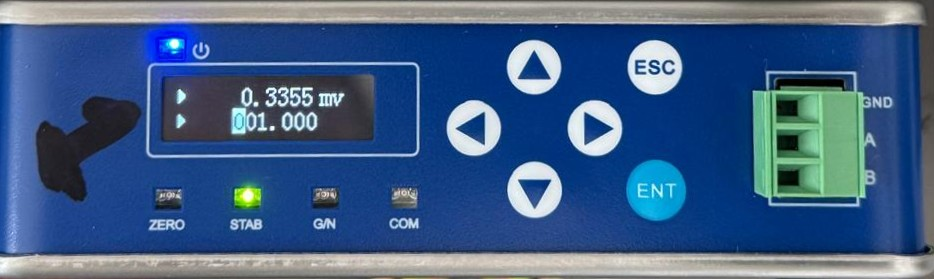{width="550" fig-align="center"}

5.  As soon as you see the green stable weight (**STAB**) light come on, or note a break in the wind, press Enter (**ENT**). It should now read **Set Successfully** on the screen (see Figure 93).

6.  You have now successfully calibrated scale 1 with a 1 kg weight. Repeat the above steps with a 5 kg weight following the steps below.

7.  You should see **231 Weight CP1** displayed on the screen again after you successfully calibrated it in the previous step. Press the down arrow once to show **232 Weight CP2** and press Enter (**ENT**).

    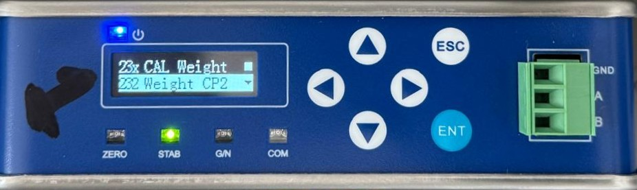{width="550" fig-align="center"}

8.  Again, you will see the millivolts as read by the loadcell displayed at the top of the screen. At the bottom, it will first show 000.000. Put the 5 kg weight on scale 1. Use the right arrow to move the cursor to the third 0 and then press the up arrow to adjust it to the weight that's on the scale, i.e., 5 kg. [Note the millivolts may be slightly different than the picture below.]{.underline}

    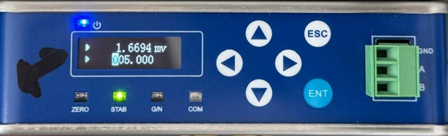{width="550" fig-align="center"}

9.  As soon as you see the green stable weight (**STAB**) light come on, or note a break in the wind, press Enter (**ENT**). It should now read **Set Successfully** on the screen (see Figure 93).

10. You have now successfully calibrated scale 1 with a 1 kg and 5 kg weight. Repeat the above steps with a 6 kg weight (1 kg + 5 kg together) following the steps below.

11. You should see **232 Weight CP2** displayed on the screen again after you successfully calibrated it in the previous step. Press the down arrow once to show **233 Weight CP3** and press Enter (**ENT**).

    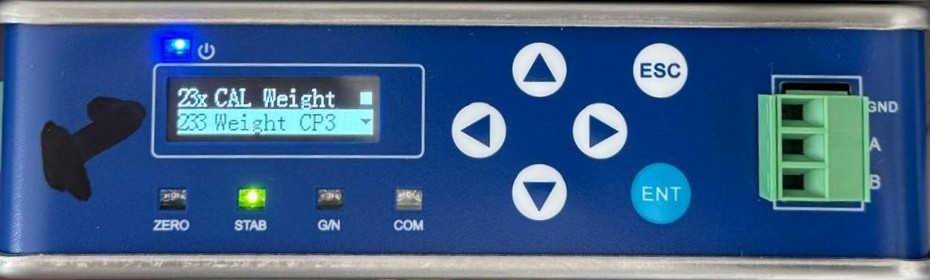{width="550" fig-align="center"}

12. Again, you will see the millivolts as read by the loadcell displayed at the top of the screen. At the bottom, it will first show 000.000. Put the 1 kg and 5 kg weights together on scale 1. Use the right arrow to move the cursor to the third 0 and then press the up arrow to adjust it to the weight that's on the scale, i.e., 6 kg. [Note the millivolts may be slightly different than the picture below.]{.underline}

    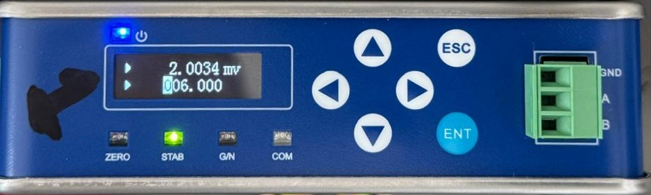{width="550" fig-align="center"}

13. As soon as you see the green stable weight (**STAB**) light come on, or note a break in the wind, press Enter (**ENT**). It should now read **Set Successfully** on the screen (see Figure 93).

14. You have now completed all steps for calibrating scale 1 with 1 kg, 5 kg, and 6 kg. Remove all the weights.

15. Press the Escape button (**ESC**) twice until you get back to the main screen displaying just the weight reading. It should now read 0.000 kg, or be within 5 g of 0.000 kg.

16. If scale 1 is within the 5 g threshold, **repeat the exact same steps for scale 2.** Otherwise, repeat the calibration steps again and check that the scale reads withing 5 g.

#### Record the weight readings after calibration

- Make sure that there are no weights on the scales. Test the accuracy of the calibration with no weight, 1 kg, 5 kg, and 6 kg on the scales. The scales should be within 5 g of the true weight after calibration.

- Start with scale 1 (colony side). Record the weight reading when no weights are on scale 1.

- Place the 1 kg weight on scale 1 and record the reading.

- Place the 5 kg weight on scale 1 and record the reading.

- Place the 6 kg weight (1 kg + 5 kg weights together) on scale 1 and record the reading.

- If any of the above readings is out by more than 5 grams, repeat the calibration for that particular scale starting with 1 kg, then 5 kg, then 6 kg and check again.

- If scale 1 is within the 5 g threshold, **repeat the exact same steps for scale 2.** Otherwise, repeat the calibration steps again and check that the scale reads withing 5 g.

#### Turn on scales scripts and log weight readings

Once you have completed all the steps above to zero and calibrate the scales, remember to turn on the scales service again to start logging any penguins that cross the weighbridge, and if you haven't done so before, log all the weight readings using the log.py script.

```bash
sudo systemctl start scales
sudo systemctl status scales

python3 apms/log.py
```


:::{.callout-note}
- Always follow the exact order: no weight → 1 kg → 5 kg → 6 kg, when taking weight readings before, during and after calibrations.

- Place weights gently in the centre of the scale platform and wait for the reading to settle before recording it.

- If you have already zeroed (tared) and calibrated the scales and the readings are more than 5 grams out, then zero the scales again and calibrate again until the reading is as close to accurate as possible. A maximum of 5 grams is okay.

- Keep test weights clean and dry --- dirt or moisture can cause the weights to corrode and eventually change the physical weight.

- Take care not to drop the weights on the ground (or on the scales) as it can damage them and chip away little pieces which will over time cause it to be inaccurate.
:::


:::{.callout-tip}
The steps below are done once per scale unless noted otherwise:

- Ensure weight logging is switched off `sudo systemctl stop scales` before recording weight readings, taring scales, or calibrating scales..

- Record the BEFORE readings on both scales: no weight, 1 kg, 5 kg, then 6 kg (1 kg + 5 kg together).

- Clean each scale --- remove sand, sticks, and debris from around and under the pan.

- Zero (tare) each scale: **2xx Weight&CAL** → **22x CAL Zero** → **211 Auto Capture**.

- Calibrate each scale:

  - **2xx Weight&CAL** → **23x CAL Weight** → **231 Weight CP1** with 1 kg.

  - **2xx Weight&CAL** → **23x CAL Weight** → **232 Weight CP2** with 5 kg.

  - **2xx Weight&CAL** → **23x CAL Weight** → **233 Weight CP3** with 6 kg.

- Record the AFTER readings on each scale (no weight, 1 kg, 5 kg, 6 kg). If any readings are out by more than 5 g, repeat the calibration for that scale and check again.

- Finish up: start the scales again `sudo systemctl start scales` and log all the weight readings `python3 apms/log.py`.

:::

### Laumas TLB485 Indicators

To check if the system needs to be calibrated, place a 1kg, 5kg and 6kg (5+1) weight on each scale and observe the readings on the scale indicators. If the reading is out by more than 5g, recalibrate. The wind can have a huge influence on the scales and thus [only calibrate on good weather days]{.underline}.

:::: {.columns}

::: {.column width="55%"}
There are 4 buttons on each indicator. They are:

| | |
|:---|:---|
| **ENTER** | {height="0.22in"} |
| **LEFT** | {height="0.22in"} |
| **UP** | {height="0.22in"} |
| **CANCEL/BACK** | {height="0.22in"} |
:::

::: {.column width="45%"}
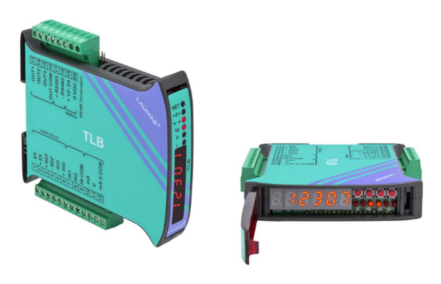{height="1.85in"}
:::

::::

- SSH into the Pi

- Stop the scales process: &nbsp;&nbsp;&nbsp;&nbsp;&nbsp;&nbsp;&nbsp;&nbsp;
```bash
sudo systemctl stop scales
```

- Log the start of the calibration event: &nbsp;&nbsp;&nbsp;&nbsp; 
```bash
python3 ~/apms/log.py
```

  - Log the weight discrepancy for each scale using the 5kg weight.
  - You can run the code below to check that the scripts have indeed stopped:
```bash
systemctl status scales
systemctl status rfid
```

- Remove all weights from scales.

- Tare the scale:
  - Hold in the CANCEL button until it displays: 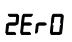{height="0.22in"} Then press ENTER
  - All the Lights should be flashing. Press ENTER again to zero the scale.
  - The weight should read 0. Press CANCEL until you are back at the main weight display.

- Start with Scale 1 (colony side) and then do Scale 2 (ocean side). Start by placing the 5kg weight in the center of the scale. Then proceed to the indicator, and flip open the cover to reveal the buttons as described above (you might need a small flat screwdriver to lift the cover). It can be difficult to see the LED display without looking through the cover, so flip it down to confirm what is displayed if uncertain.

- While pressing and holding the ENTER button, also press the CANCEL button. This should display 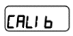{height="0.22in"}

- Press ENTER. Now use {height="0.22in"} to select {height="0.22in"} and press ENTER

- A flashing weight should be displayed. All the lights should be OFF

- Use {height="0.22in"} to adjust the weight until it reads exactly 5.000 kg

  {height="0.22in"} to change value

  {height="0.22in"} to change decimal place holder

- Press ENTER. The new weight should be displayed, and all the lights should be flashing.

- Press ENTER one more time. This should show again. Press CANCEL until you see the weight displayed.

- Check with 1kg, 5kg and 6kg weights again. It should be within 1g. If not, recalibrate.

- Start the APMS processes.
```bash
sudo systemctl start scales
sudo systemctl start rfid
```

- Log the end of the calibration event: &nbsp;&nbsp;&nbsp;&nbsp; 
```bash
python3 ~/apms/log.py
```

## Troubleshooting

There are too many permutations of how things can go wrong to cover it all in this manual. However, some common things to look out for, as well as how to go about getting more information, will be discussed below.

Often, the dashboard will give an indication of something going wrong. A classic example of this would be seeing the solar supply voltage going down and the batteries not fully charging. This is often due to overgrowth and the dashboard should be checked the next day to see if it has improved. The dashboard could also show the system being healthy, but the algorithm shows something is wrong, such as the number of RFID tags dropping to zero for a few days. This could be due to the BioMark system failing, or the RFID antenna shifting out of position.

For diagnosing problems, or just checking in on the system, the Monitor can be used.

If the Monitor has power, it should operate and be able to give information about the system, even if the Main Unit is completely dead. Ensure the SIM card has airtime to be able to reply via SMS.

-   The Monitor will send a SMS to the operator in the event of the following:

    -   If the 4V of the SIM800L is too low/high (only v1.1 of the APMS, v1.2 no longer uses the 4V SIM module)

    -   If the 5V of the Raspberry Pi is too low/high

    -   If the 12V of the scales/router is too low/high

    -   If the 24V solar supply is too low/high

    -   If the ambient temperature is too high. (Warning: 50°C - Danger at 60°C)

    -   If the Raspberry Pi or Monitor reboot

If any of these messages are received, the operator should investigate.

### Monitor Commands

A simple set of commands can be used by the administrator to diagnose system faults via SMS.

To send a command to the Monitor, send a SMS starting with **"CMD:"**

For example, to request a status report, send: 
```bash
CMD:S
```

The monitor should reply, via SMS, with a brief status report. The status report is discussed in \*\*\*

Note the commands are not case sensitive.

The table below shows a list of valid commands.

+------------------+---------------+-----------------------------------+
| **Command Name** | **What to     | **Description**                   |
|                  | send**        |                                   |
+==================+===============+===================================+
| Request Status   | CMD:S         | The Monitor should reply by       |
| Report           |               | sending a status report via SMS   |
+------------------+---------------+-----------------------------------+
| Reboot           | CMD:R         | This power cycles the Raspberry   |
|                  |               | Pi                                |
+------------------+---------------+-----------------------------------+
| Power On/Off     | CMD:P         | This powers the Raspberry Pi on   |
|                  |               | if it was off, and off if it was  |
|                  |               | on                                |
+------------------+---------------+-----------------------------------+
| Update Time      | CMD:U         | This updates the Monitor system   |
|                  |               | time.                             |
+------------------+---------------+-----------------------------------+
| Change Phone     | CMD:M+27\*\*\ | This changes the phone number of  |
| Number of        | *\*\*\*\*\*\* | the operator, saved in the        |
| Operator         |               | non-volatile memory of the        |
|                  |               | Monitor.                          |
+------------------+---------------+-----------------------------------+
| Turn Off SMS     | CMD:X         | To turn off SMS notifications     |
| Notifications    |               | from the Monitor.                 |
+------------------+---------------+-----------------------------------+
| Turn On SMS      | CMD:Y         | To turn on SMS notifications from |
| Notifications    |               | the Monitor                       |
+------------------+---------------+-----------------------------------+
| Send BASH        | CM            | UNTESTED                          |
| command          | D:C\*\*\*\*\* |                                   |
|                  |               | Send a BASH Command for the Pi to |
|                  |               | execute next time it checks in.   |
+------------------+---------------+-----------------------------------+

### Status Report (CMD:S)

An example of a status report as received from the Stony Point Monitor can be seen below. The example will be used to explain the different parameters.

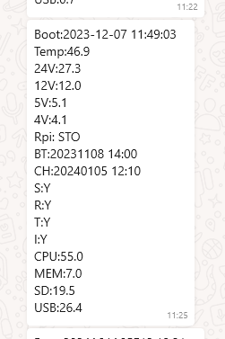{width="600" fig-align="center"}