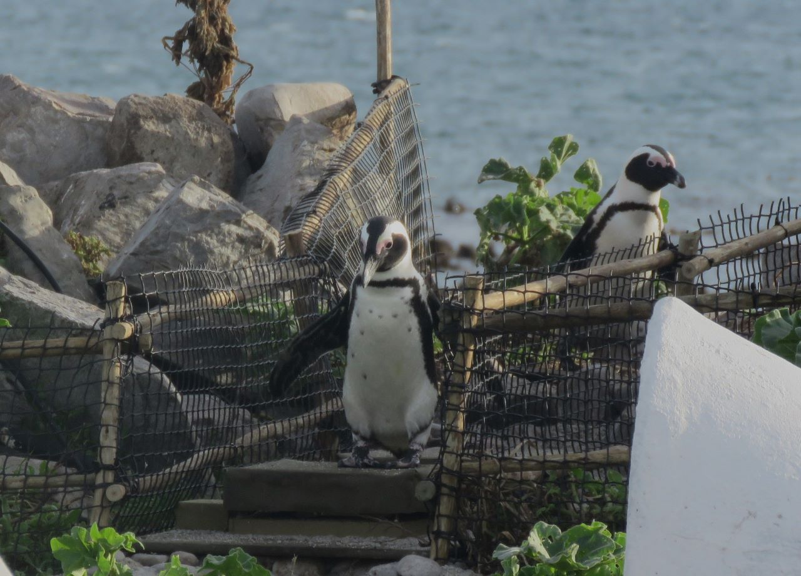

# Introduction {.unnumbered}

This manual provides a comprehensive, step-by-step guide to the installation, configuration, and operation of the Automated Penguin Monitoring System (APMS). Developed by BirdLife South Africa, the APMS supports long-term monitoring of African penguin (*Spheniscus demersus*) colonies by tracking individual birds in the wild without the stress of physical handling.

Utilizing integrated RFID detection and weighbridge technology, the system automatically records a penguin's identity and body mass as it passes over the weighbridge This data is transmitted to cloud storage and processed to generate vital foraging trip metrics and body condition indices—critical data points that directly support ecosystem-based fisheries management.

The APMS comprises both hardware and software components. This document is structured to guide you through building a complete system from the ground up:

1.  **Hardware Installation** — Setting up physical infrastructure, gates, and sensors.

2.  **Software Configuration** — Initializing the core system software and network connections.

3.  **Data Processing & Visualization** — Deploying the data analysis pipelines and custom monitoring dashboard.

4.  **Troubleshooting** — A comprehensive diagnostic guide located at the end of the manual to resolve common field issues.

## How to Use This Manual {.unnumbered}

This manual is organised into three parts:

-   **Hardware** — Construction and installation of all physical components
-   **Software & Configuration** — Operating system setup, firmware, and scripts
-   **Deployment & Operation** — Field commissioning, data processing, and maintenance

Use the left sidebar to navigate between chapters. All chapters are searchable using the search bar at the top of the page.

## Contributing {.unnumbered}

This manual is maintained as an open-source document on GitHub. To suggest corrections or additions, use the **Edit this page** link at the top right of any page, or open an issue on the repository.

## Authors & Acknowledgements {.unnumbered}

Manual written by Pierre Retief for BirdLife South Africa.
